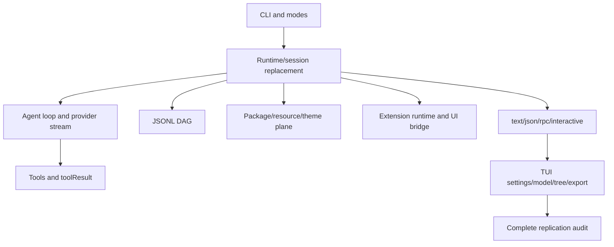

# 24. 一模一样复刻矩阵

## 24.1 本章要解决的问题

前 23 章已经覆盖 Pi 的核心 harness、协议、测试、资源平面和主要产品面。最后还需要一个一比一复刻矩阵：读者照着矩阵逐项验收，才能判断自己是否只是实现了 mini Pi，还是已经接近完整 Pi。

## 24.2 当前 Pi 源码锚点

| 维度 | 当前实现 |
|---|---|
| CLI args | [args.ts#L211](packages/coding-agent/src/cli/args.ts#L211) |
| main interactive theme init | [main.ts#L652](packages/coding-agent/src/main.ts#L652) |
| AgentSession runtime replacement | [agent-session-runtime.ts#L68](packages/coding-agent/src/core/agent-session-runtime.ts#L68) |
| AgentSession event union | [agent-session.ts#L122](packages/coding-agent/src/core/agent-session.ts#L122) |
| package manager | [package-manager.ts#L92](packages/coding-agent/src/core/package-manager.ts#L92) |
| resource loader | [resource-loader.ts#L30](packages/coding-agent/src/core/resource-loader.ts#L30) |
| extension runtime | [types.ts#L300](packages/coding-agent/src/core/extensions/types.ts#L300) |
| RPC command union | [rpc-types.ts#L19](packages/coding-agent/src/modes/rpc/rpc-types.ts#L19) |
| session format | [session-format.md#L1](packages/coding-agent/docs/session-format.md#L1) |
| JSON event docs | [json.md#L9](packages/coding-agent/docs/json.md#L9) |

## 24.3 复刻矩阵总览



## 24.4 P0 核心矩阵

| 能力 | 通过标准 | 证据入口 |
|---|---|---|
| Provider stream | 使用真实 `AssistantMessageEvent` | [types.ts#L347](packages/ai/src/types.ts#L347) |
| Agent event | 输出真实 `AgentEvent`/`AgentSessionEvent` | [types.ts#L403](packages/agent/src/types.ts#L403)、[agent-session.ts#L122](packages/coding-agent/src/core/agent-session.ts#L122) |
| Tool result | 使用 `role: "toolResult"`、`toolName`、content blocks、`isError` | [types.ts#L292](packages/ai/src/types.ts#L292) |
| JSON mode | stdout 每行是 session header 或 `AgentSessionEvent` | [json.md#L58](packages/coding-agent/docs/json.md#L58) |
| RPC mode | stdin/stdout 按 LF JSONL framing | [rpc.md#L19](packages/coding-agent/docs/rpc.md#L19) |
| Session | append-only JSONL DAG | [session-format.md#L1](packages/coding-agent/docs/session-format.md#L1) |

## 24.5 P1 生产矩阵

| 能力 | 通过标准 | 证据入口 |
|---|---|---|
| Runtime replacement | new/resume/fork/switch 后 host rebind session | [agent-session-runtime.ts#L68](packages/coding-agent/src/core/agent-session-runtime.ts#L68) |
| Compaction/retry | overflow、manual、threshold、auto retry 事件可观察 | [agent-session.ts#L122](packages/coding-agent/src/core/agent-session.ts#L122) |
| Extension runner | extension 通过 runtime 注册 tool、command、provider、hook、UI | [types.ts#L300](packages/coding-agent/src/core/extensions/types.ts#L300) |
| Resource loader | skills/prompts/themes/extensions reload 后进入 session | [resource-loader.ts#L321](packages/coding-agent/src/core/resource-loader.ts#L321) |
| stdout guard | JSON/RPC 模式普通 stdout 被隔离 | [output-guard.ts#L45](packages/coding-agent/src/core/output-guard.ts#L45) |

## 24.6 P2 产品矩阵

| 能力 | 通过标准 | 证据入口 |
|---|---|---|
| Package manager | 支持 package/local/user/project 资源解析 | [package-manager.ts#L863](packages/coding-agent/src/core/package-manager.ts#L863) |
| Themes | 支持内置、用户、项目、package theme | [resource-loader.ts#L553](packages/coding-agent/src/core/resource-loader.ts#L553) |
| RPC extension UI | 支持 request/response 与 fire-and-forget UI | [rpc-types.ts#L213](packages/coding-agent/src/modes/rpc/rpc-types.ts#L213) |
| HTML export | 支持 session export 和 custom tool renderer | [index.ts#L236](packages/coding-agent/src/core/export-html/index.ts#L236) |
| Keybindings | 快捷键来自 registry 和用户配置 | [keybindings.ts#L63](packages/coding-agent/src/core/keybindings.ts#L63) |
| Settings UI | interactive settings 能写回 runtime 设置 | [settings-selector.ts#L217](packages/coding-agent/src/modes/interactive/components/settings-selector.ts#L217) |
| Model UI | provider/model 搜索、选择、保存 | [model-selector.ts#L151](packages/coding-agent/src/modes/interactive/components/model-selector.ts#L151) |
| Session tree | branch、label、session_info、filter 可视化 | [tree-selector.ts#L302](packages/coding-agent/src/modes/interactive/components/tree-selector.ts#L302) |

## 24.7 读者最终验收脚本

完整复刻项目应至少有这些离线检查：

```bash
npm run test:mini -- provider-stream
npm run test:mini -- agent-loop-tool-result
npm run test:mini -- session-dag
npm run test:mini -- json-rpc-protocol
npm run test:mini -- package-resources
npm run test:mini -- extension-ui-rpc
npm run test:mini -- html-export
npm run test:mini -- interactive-settings-tree
```

这些命令是读者复刻项目的建议命名，不是当前 Pi 仓库命令。它们对应上面的验收矩阵，目的是防止“能聊天”被误判为“完整复刻”。

## 24.8 与 zen-docs 的差距闭环

课程型材料通常有“收益、目录、实战、测试、结课”。本书现在的对应关系是：

| 课程能力 | 本书位置 |
|---|---|
| 收益说明 | README 的“你将获得” |
| 快速路径 | README 的“快速开始” |
| 连续实战 | 第 1-16 章实现关卡 |
| 汇总项目 | 第 17 章 |
| 协议参考 | 第 18 章 |
| 测试回放 | 第 19 章 |
| 核心审计 | 第 20 章 |
| 完整产品补齐 | 第 21-24 章 |

因此，对比课程型文档，本书的优势是每个真实事实都能追溯到 Pi 源码/docs；仍可继续增强的是课后思考题和更细的练习题库。

## 24.9 验收清单

- 能按 P0/P1/P2 三层说明自己复刻到了哪一层。
- 能把每个产品能力映射到源码入口。
- 能解释 mini 教学协议和真实 Pi 协议的差异。
- 能为完整复刻项目写出离线测试计划。
- 能指出尚未实现的 Pi 产品能力，并给出对应源码锚点。

## 24.10 最终判断

读完第 1-20 章，读者应能复刻 Pi 的核心 harness。继续读第 21-24 章，读者能知道完整 Pi 产品还包含哪些资源、UI、导出和配置面，并能用矩阵逐项补齐。只有 P0、P1、P2 全部通过，才可以声称“一模一样复刻 Pi”。
