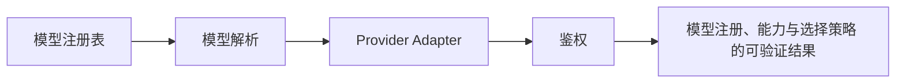

# 24. 模型注册、能力与选择策略

## 24.1 本章解决的问题

模型选择不是在下拉框里挑一个名字。Pi 需要回答这些问题：当前有哪些 provider 有可用凭证？内置模型和 `models.json` 自定义模型如何合并？用户输入的 `--model sonnet:high` 如何解析？`/model` 打开时为什么能看到最新的 `models.json` 修改？Ctrl+P 循环模型时 scoped models 如何生效？扩展注册的 provider 什么时候进入 registry？

`packages/coding-agent/docs/models.md` 说 custom providers and models 通过 `~/.pi/agent/models.json` 添加，`packages/coding-agent/docs/providers.md` 说 Pi knows all available models and the list is updated with every release。第 23 章讲的是 `pi-ai` 如何调用一个已经确定的 `Model`；本章讲 coding-agent 如何构建“可选模型集合”并把用户输入解析成具体 `Model` 加 thinking level。

本章在全书结构中是 provider 系列的收束点。前面已经讲认证、流式协议、settings、extensions、packages、`pi-ai`；这里把它们汇总到一个用户每天都会接触的动作：启动 Pi、切模型、限制模型循环、添加本地模型、覆盖 provider route。

源码入口是 `ModelRegistry`、`model-resolver`、session services。`ModelRegistry` 类在 [model-registry.ts#L335](packages/coding-agent/src/core/model-registry.ts#L335)，默认创建路径在 [model-registry.ts#L350](packages/coding-agent/src/core/model-registry.ts#L350)，session services 创建 registry 并注册 extension provider 的逻辑在 [agent-session-services.ts#L137](packages/coding-agent/src/core/agent-session-services.ts#L137) 到 [agent-session-services.ts#L150](packages/coding-agent/src/core/agent-session-services.ts#L150)。

## 24.2 最小可运行路径

先读 `packages/coding-agent/docs/models.md`、`packages/coding-agent/docs/providers.md`、`packages/coding-agent/docs/usage.md`。

最小使用路径有三条。第一，列模型：`pi --list-models` 或 `pi --list-models sonnet`。`packages/coding-agent/docs/usage.md` 说明 `--list-models [search]` 会列出可用模型。对应 CLI 实现在 [list-models.ts#L29](packages/coding-agent/src/cli/list-models.ts#L29)，它调用 `modelRegistry.getAvailable()` 并按 provider/id 展示。

第二，选择模型：`pi --provider openai --model gpt-4o`、`pi --model openai/gpt-4o`、`pi --model sonnet:high`。usage docs 明确说 `--model <pattern>` 支持 `provider/id` 和 optional `:<thinking>`。解析函数 `parseModelPattern()` 在 [model-resolver.ts#L189](packages/coding-agent/src/core/model-resolver.ts#L189)。

第三，添加本地模型。`packages/coding-agent/docs/models.md` 的 minimal example 用 `~/.pi/agent/models.json` 添加 Ollama provider：`baseUrl`、`api`、`apiKey`、`models`。文档说 `apiKey` 必填但 Ollama 会忽略，所以任意值可用。`/model` 每次打开都会 reload custom models，相关刷新点在 model selector 的 [model-selector.ts#L140](packages/coding-agent/src/modes/interactive/components/model-selector.ts#L140)。

验证时看三个结果：`--list-models` 是否出现模型；`/model` 是否显示模型详情和错误提示；`--model pattern` 是否解析到预期 provider/model/thinking。不要用“模型请求成功”来验证 registry，因为认证、网络、provider payload 是下一层问题。

## 24.3 核心机制

`ModelRegistry` 的第一层是 built-in models。它调用 `@earendil-works/pi-ai` 的 `getModels(provider)`，再应用 provider overrides 和 modelOverrides。加载入口在 [model-registry.ts#L398](packages/coding-agent/src/core/model-registry.ts#L398)，具体遍历 built-in provider 在 [model-registry.ts#L418](packages/coding-agent/src/core/model-registry.ts#L418)。

第二层是 `models.json`。schema 从 [model-registry.ts#L84](packages/coding-agent/src/core/model-registry.ts#L84) 开始描述 thinking、compat、model override 等结构；`loadCustomModels()` 在 [model-registry.ts#L459](packages/coding-agent/src/core/model-registry.ts#L459) 读取和校验文件。如果 schema 错误，registry 会保留 built-in models，并通过 `getLoadError()` 暴露错误；`getAvailable()` 的注释在 [model-registry.ts#L619](packages/coding-agent/src/core/model-registry.ts#L619) 说明 models.json 有错时只返回 built-in models。

第三层是 extension provider。扩展 API 的 `pi.registerProvider()` 类型定义在 [types.ts#L1292](packages/coding-agent/src/core/extensions/types.ts#L1292)。session services 在创建 extension runtime 后，把 queued provider registration 刷进 registry，见 [agent-session-services.ts#L150](packages/coding-agent/src/core/agent-session-services.ts#L150)。这让扩展可以动态注册企业内部 provider、本地代理或 OAuth provider。

第四层是 resolver。`resolveModelScope()` 在 [model-resolver.ts#L255](packages/coding-agent/src/core/model-resolver.ts#L255) 把 `--models` 或 settings 中的 patterns 变成 scoped model list，支持 wildcard 和 thinking suffix。`resolveInitialModel()` 从 [model-resolver.ts#L478](packages/coding-agent/src/core/model-resolver.ts#L478) 开始决定启动时模型：继续会话时优先沿用 session model，否则用 scoped models 第一个，再考虑 default/provider/pattern，最后 fallback 到 availableModels[0]。

第五层是 UI。model selector 刷新 `models.json`、展示 all/scoped scope、切换 scope；scoped models selector 负责保存和重排 Ctrl+P 循环范围。`packages/coding-agent/docs/keybindings.md` 对应 action 包括 `app.model.select`、`app.model.cycleForward`、`app.model.cycleBackward`，以及 scoped selector 里的 `app.models.save`、`app.models.enableAll`、`app.models.reorderUp`。

**生命周期图**

**源码责任表**

| 环节 | 系统责任 | 源码证据 | 读源码时要确认什么 |
|---|---|---|---|
| 模型注册表 | 内置模型 + models.json + extension provider | [model-registry.ts#L335](packages/coding-agent/src/core/model-registry.ts#L335) | 输入从哪里来，输出交给谁，失败由哪一层裁决 |
| 模型解析 | CLI / scoped models / saved defaults | [model-resolver.ts#L340](packages/coding-agent/src/core/model-resolver.ts#L340) | 输入从哪里来，输出交给谁，失败由哪一层裁决 |
| Provider Adapter | 消息、工具、流式事件归一 | [index.ts#L9](packages/ai/src/index.ts#L9) | 输入从哪里来，输出交给谁，失败由哪一层裁决 |
| 鉴权 | API key / OAuth / request headers | [utils/oauth/index.ts#L55](packages/ai/src/utils/oauth/index.ts#L55) | 输入从哪里来，输出交给谁，失败由哪一层裁决 |

**关键代码说明**

读源码时不要只顺着函数名跳转，而要检查四个边界：输入边界、状态边界、裁决边界、输出边界。输入边界回答“谁把数据交进来”；状态边界回答“哪些信息会跨 turn、跨 session 或跨进程保留”；裁决边界回答“谁有权继续、停止、执行或拒绝”；输出边界回答“结果给人看、给模型看，还是给外部系统看”。本章涉及的源码只有放进这四个边界中才有解释力。

## 24.4 为什么这样设计

Pi 把模型 registry 放在 coding-agent 层，而不是只用 `pi-ai` 的 generated registry，是因为 CLI 需要处理用户配置、认证状态、项目策略和扩展。

第一，`pi-ai` 知道模型 metadata，但不知道当前用户是否登录、是否有 API key、是否配置了企业代理。coding-agent 的 `ModelRegistry` 持有 `AuthStorage`，能根据 `auth.json`、env、models.json request auth 判断 provider 是否可用。`packages/coding-agent/docs/providers.md` 的 Resolution Order 是 CLI `--api-key`、`auth.json`、environment variable、custom provider keys。

第二，models.json 是本地覆盖层。它支持 local LLM、proxy、provider override、modelOverrides、compat、thinkingLevelMap。文档说明 built-in models 会保留，custom model 按 `id` upsert，同 id 替换 built-in，新 id 追加。这让用户不用 fork generated model list，也符合仓库规则：不要直接改 `packages/ai/src/models.generated.ts`。

第三，thinking level 是模型选择的一部分。`--model sonnet:high` 不是字符串花样，而是把模型 pattern 和 thinking level 一起解析。`packages/coding-agent/docs/models.md` 的 `thinkingLevelMap` 允许模型隐藏不支持的 levels 或映射成 provider 特定值。这样 UI 不会让用户选择模型根本不支持的 reasoning 级别。

第四，scoped models 把“我愿意在这个项目中循环哪些模型”变成可配置状态。前端工程师可以把它理解成工作区级 model allowlist。它比全局模型列表更贴近真实工作：一个项目可能只允许公司代理模型，另一个项目可以使用本地 Ollama。

**创建者视角的设计不变量**

模型不是字符串，而是带 provider、api、context window、reasoning、headers、auth 和 stream 能力的对象。上层可以统一调用，但不能假设所有 provider 都支持同样的工具、thinking、缓存或图片能力。

**如果省略本章会发生什么**

省略本章，读者会把 模型注册、能力与选择策略 当成单点功能，而不是 Pi 架构中的责任边界。直接后果是：使用时不知道该改配置、写资源、写扩展、接 provider 还是调用 SDK；排查时也会把 provider、工具、TUI、session 和资源加载混为一谈。专家级学习必须把每章能力放回系统生命周期中验证。

## 24.5 常见误解与排查

误解一：`models.json` 会替换所有 built-in models。不同意。文档的 merge semantics 是 built-in models kept，custom models by id upsert。只有同 provider 同 id 的 custom model 会替换那一个 built-in entry。

误解二：`/model` 不显示自定义模型就必须重启。不同意。`packages/coding-agent/docs/models.md` 说文件每次打开 `/model` 都 reload，源码也在 [model-selector.ts#L140](packages/coding-agent/src/modes/interactive/components/model-selector.ts#L140) 刷新 registry。先检查 JSON schema 和 load error。

误解三：模型 pattern 只是模糊搜索。不同意。resolver 支持 exact provider/id、name/id matching、thinking suffix、wildcard scope。`parseModelPattern()` 的注释从 [model-resolver.ts#L177](packages/coding-agent/src/core/model-resolver.ts#L177) 开始解释 suffix 解析顺序。

误解四：provider 有模型就一定能调用。不同意。registry 可列出 metadata，但调用还需要 auth、baseUrl、headers、provider API 兼容。`packages/coding-agent/docs/providers.md` 把 API key、OAuth、cloud provider、custom provider 和 credential resolution 分开讲，就是为了避免把 availability 和 call success 混为一谈。

误解五：自定义 provider 一定要写 extension。不同意。如果 provider speaks supported API，优先用 `models.json`。`packages/coding-agent/docs/providers.md` 写明 Ollama、LM Studio、vLLM 或支持 OpenAI/Anthropic/Google API 的 provider 用 models.json；只有需要 custom API implementation 或 OAuth flow 时才写 extension。

## 24.6 本章训练

第一，写一个 Ollama `models.json`，包含 `baseUrl`、`api: "openai-completions"`、`apiKey: "ollama"`、两个 model id。解释为什么 `apiKey` 仍然要填，为什么 `compat.supportsDeveloperRole` 可能要设为 false。

第二，沿源码解释 `pi --model sonnet:high`：CLI args 得到 pattern，resolver 调用 `parseModelPattern()`，识别 `high` 是 thinking level，再在 available models 中匹配 `sonnet`，返回 model 和 thinkingLevel。要求你能指出 [model-resolver.ts#L189](packages/coding-agent/src/core/model-resolver.ts#L189) 和 [model-resolver.ts#L211](packages/coding-agent/src/core/model-resolver.ts#L211)。

第三，设计一个企业代理覆盖方案：provider 名称仍用 `anthropic`，只在 `models.json` 里覆盖 `baseUrl` 和 headers，不重写全部 models。说明这样可以保留 built-in model metadata、OAuth/API key 流程和模型选择 UI。

第四，说明何时用 package、何时用 models.json、何时用 extension provider。团队只分发模型配置，用 project `.pi/settings.json` 或文档要求用户写 `models.json`；要分发 provider UI、OAuth、动态发现模型，用 extension provider；要连同 skills、prompts、themes 一起分发，用 Pi package。这个训练把第 22、23、24 章的边界合在一起。

**专家验收任务**

完成本章后，读者应该能交付三件东西：一张自己画出的 模型注册、能力与选择策略 数据流图；一份包含源码链接、输入、输出、失败边界的责任表；一个最小实践任务，证明自己能在不改错层级的情况下使用或扩展该能力。若三件事缺一件，就说明还停留在“会用命令”的阶段，没有达到能设计和审计 Pi 方案的水平。

