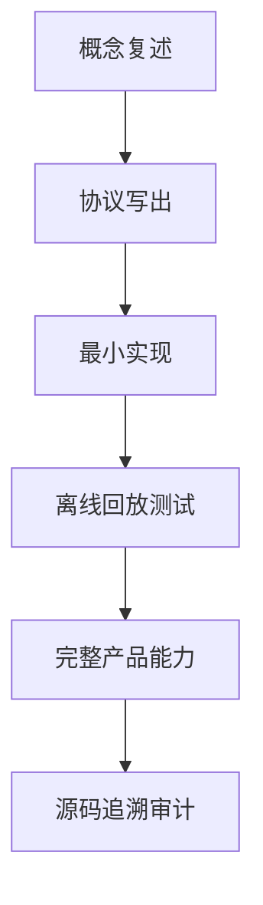

# 25. 结课题库与 FAQ

## 25.1 本章要解决的问题

对比课程型文档，只有目录和实现章节还不够。新人读者需要能自测：我是不是只是看懂了文字，还是已经能复述、实现、调试、审计 Pi。本章把前 24 章变成结课题库和 FAQ，每个答案都回到源码或 docs。

## 25.2 当前 Pi 源码锚点

| 题目范围 | 证据入口 |
|---|---|
| CLI 使用 | [usage.md#L120](packages/coding-agent/docs/usage.md#L120) |
| JSON mode | [json.md#L9](packages/coding-agent/docs/json.md#L9) |
| RPC mode | [rpc.md#L19](packages/coding-agent/docs/rpc.md#L19) |
| Session format | [session-format.md#L1](packages/coding-agent/docs/session-format.md#L1) |
| Assistant stream | [types.ts#L347](packages/ai/src/types.ts#L347) |
| Agent event | [types.ts#L403](packages/agent/src/types.ts#L403) |
| Tool result | [types.ts#L292](packages/ai/src/types.ts#L292) |
| Resource loading | [resource-loader.ts#L321](packages/coding-agent/src/core/resource-loader.ts#L321) |
| Extension UI | [types.ts#L124](packages/coding-agent/src/core/extensions/types.ts#L124) |
| Package resources | [package-manager.ts#L186](packages/coding-agent/src/core/package-manager.ts#L186) |

## 25.3 自测路径

不要跳过“协议写出”。如果写不出真实 Pi JSON/RPC/session/toolResult 形状，说明还没有达到专家级理解。

## 25.4 概念题

| 题目 | 合格答案要点 | 追溯 |
|---|---|---|
| Pi 为什么不是 CLI wrapper？ | CLI 只是入口；核心在 runtime、AgentSession、Agent loop、provider、tool、session、host。 | [agent-session-runtime.ts#L68](packages/coding-agent/src/core/agent-session-runtime.ts#L68) |
| provider 为什么不能执行文件系统动作？ | provider 只接收 `Context` 并输出 `AssistantMessageEvent`；工具执行权在 runtime。 | [types.ts#L327](packages/ai/src/types.ts#L327)、[types.ts#L347](packages/ai/src/types.ts#L347) |
| session 为什么不是 transcript？ | session 有 header、entry、parentId、branch、label、custom、model/thinking 等信息。 | [session-format.md#L1](packages/coding-agent/docs/session-format.md#L1) |
| host adapter 为什么不能拥有业务状态？ | text/json/rpc/interactive 都消费同一个 session facade 和事件。 | [print-mode.ts#L32](packages/coding-agent/src/modes/print-mode.ts#L32) |
| extension 为什么必须走 runner/runtime？ | 扩展拿受控 `ExtensionRuntime` 和 `ExtensionUIContext`，不是裸 `AgentSession`。 | [types.ts#L300](packages/coding-agent/src/core/extensions/types.ts#L300) |

## 25.5 协议题

| 题目 | 必须写出的字段 | 追溯 |
|---|---|---|
| 写一个真实 tool call event | `type:"toolcall_end"`、`contentIndex`、`toolCall`、`partial`，tool args 在 `arguments`。 | [types.ts#L357](packages/ai/src/types.ts#L357) |
| 写一个真实 tool result message | `role:"toolResult"`、`toolCallId`、`toolName`、content blocks、`isError`、`timestamp`。 | [types.ts#L292](packages/ai/src/types.ts#L292) |
| 写一个 JSON mode stream 开头 | 第一行 session header，随后 `AgentSessionEvent`。 | [json.md#L58](packages/coding-agent/docs/json.md#L58) |
| 写一个 RPC prompt command | `{"id":"...","type":"prompt","message":"..."}`，按 LF JSONL framing。 | [rpc.md#L19](packages/coding-agent/docs/rpc.md#L19) |
| 写一个 session message entry | `type:"message"`、`id`、`parentId`、`timestamp`、`message`。 | [session-format.md#L72](packages/coding-agent/docs/session-format.md#L72) |

## 25.6 实现题

| 题目 | 合格实现 | 失败信号 |
|---|---|---|
| 实现 faux provider trajectory | 先发 assistant tool call，再根据 `toolResult` 发最终文本。 | faux provider 直接读文件或直接返回最终答案。 |
| 实现 `read` tool | schema 给模型，executor 在 runtime 读取文件，结果变成 `ToolResultMessage`。 | 模型直接生成 shell/read 行为。 |
| 实现 JSON host | stdout 每行可 JSON parse，普通日志走 stderr。 | warning/debug 混入 stdout。 |
| 实现 session store | append-only JSONL，能按 parent/leaf 重建 context。 | 只保存最终 transcript。 |
| 实现 package resources | `extensions/skills/prompts/themes` 四类平级解析。 | package 只支持 extension。 |

## 25.7 调试题

| 现象 | 应优先检查 | 追溯 |
|---|---|---|
| JSON client 解析失败 | stdout guard、print-mode JSON 写出、是否有日志混入。 | [output-guard.ts#L45](packages/coding-agent/src/core/output-guard.ts#L45)、[print-mode.ts#L102](packages/coding-agent/src/modes/print-mode.ts#L102) |
| resume 后模型变了 | session model/thinking entry、createAgentSession restore、model fallback。 | [sdk.ts#L222](packages/coding-agent/src/core/sdk.ts#L222) |
| extension UI 在 RPC 卡住 | pending `extension_ui_request` 是否收到 matching response。 | [rpc-mode.ts#L91](packages/coding-agent/src/modes/rpc/rpc-mode.ts#L91) |
| theme 没加载 | resource loader theme diagnostics、`--no-themes`、settings theme 名称。 | [resource-loader.ts#L553](packages/coding-agent/src/core/resource-loader.ts#L553)、[args.ts#L244](packages/coding-agent/src/cli/args.ts#L244) |
| session tree 看不到标签 | label entry 是否写入 JSONL，tree filter 是否是 labeled-only/default。 | [tree-selector.ts#L570](packages/coding-agent/src/modes/interactive/components/tree-selector.ts#L570) |

## 25.8 FAQ

| 问题 | 答案 |
|---|---|
| 只读第 1-16 章够吗？ | 不够。第 1-16 章建立边界，第 17-20 章把边界落成 mini 实现、协议、测试、审计。 |
| 只读第 1-20 章能一模一样复刻 Pi 吗？ | 不能。第 1-20 章覆盖核心 harness；第 21-24 章补齐 package/theme/RPC UI/HTML export/TUI 产品面。 |
| mini 教学协议可以直接叫 Pi 协议吗？ | 不可以。真实 Pi 协议必须使用源码/docs 中已有字段。 |
| 为什么本书反复要求源码链接？ | 因为本书目标是复刻当前仓库中的 Pi，不是设计一个相似 agent。 |
| 为什么不用真实 provider 做核心测试？ | 真实 provider 有成本、凭证和不稳定输出；核心 loop 应通过 faux trajectory 离线回放。 |

## 25.9 评分标准

| 分数 | 表现 |
|---|---|
| 60 | 能跑通 text prompt，但没有 toolResult/session/JSONL。 |
| 70 | 能跑通 tool call 和 toolResult 回灌。 |
| 80 | 能实现 JSONL session、JSON host、faux trajectory。 |
| 90 | 能实现 P0/P1：runtime replacement、compaction/retry、extension runner、resource loader。 |
| 100 | 能实现 P2：package resources、themes、RPC extension UI、HTML export、keybindings、settings/model/tree 产品面。 |

## 25.10 验收清单

- 能回答概念题，并说出源码证据。
- 能手写协议题中的 JSON/TypeScript 形状。
- 能完成实现题并写离线测试。
- 能根据调试题定位问题层级。
- 能用评分标准判断自己当前复刻进度。
