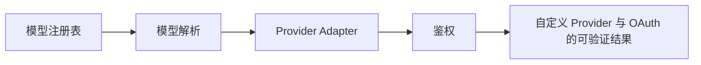

# 25. 自定义 Provider 与 OAuth

## 25.1 本章解决的问题

前端工程师第一次把 Pi Agent 接到公司模型网关时，最容易把它理解成“把 base URL 换掉”。这只覆盖了最浅的一层。真正要接好的，是五件事：模型如何出现在 `/model` 和 `--list-models` 中，凭证如何从 `/login`、`auth.json`、环境变量或 `models.json` 进入请求，流式事件如何被 Pi 的 Agent 循环消费，工具调用和 thinking/cache/image 能力如何按模型声明暴露，以及 provider 的异常如何被上层识别为可重试、可压缩或不可恢复。

`packages/coding-agent/docs/custom-provider.md` 直接说明扩展可以通过 `pi.registerProvider()` 注册 provider，用于 `Proxies`、`Custom endpoints`、`OAuth/SSO` 和 `Custom APIs`。`packages/coding-agent/docs/providers.md` 又说明 Pi 同时支持 subscription-based OAuth provider 和 API key provider。把这两份文档连起来看，本章的核心不是“多接一个模型”，而是理解 Pi 把模型供应商抽象成可注册、可鉴权、可枚举、可流式消费的运行时资源。

这一章放在这里，是因为前面已经讲过模型目录、扩展和基础运行方式；后面会进入 thinking/cache/images、SDK、Runtime、RPC。自定义 provider 是中间的桥：它把外部 LLM 世界接入 Pi 内核，也决定后面所有嵌入式场景能否复用同一套模型能力。

## 25.2 最小可运行路径

最小路径有两种。只需要接入 OpenAI-compatible 网关时，先用 `~/.pi/agent/models.json`，不写扩展：

```json
{
  "providers": {
    "internal-llm": {
      "baseUrl": "https://llm.example.com/v1",
      "api": "openai-completions",
      "apiKey": "INTERNAL_LLM_API_KEY",
      "models": [
        {
          "id": "coder-large",
          "name": "Coder Large",
          "reasoning": true,
          "input": ["text", "image"],
          "contextWindow": 128000,
          "maxTokens": 8192,
          "cost": { "input": 0, "output": 0, "cacheRead": 0, "cacheWrite": 0 }
        }
      ]
    }
  }
}
```

`packages/coding-agent/docs/models.md` 说明 `models.json` 会在打开 `/model` 时重新加载，字段 `apiKey` 和 `headers` 支持 shell command、环境变量和 literal value。对前端工程师来说，这相当于把“环境配置”变成一个用户可维护的 provider 清单，不需要改包，也不需要重新发布。

需要 SSO、动态模型列表或非标准流式协议时，改用扩展里的 `pi.registerProvider()`。`custom-provider.md` 的 Quick Reference 展示了 `name`、`baseUrl`、`apiKey`、`api`、`models`、`oauth` 和 `streamSimple` 的组合。你可以把它理解成一个 provider adapter：启动时注册模型，运行时解析凭证，请求时把上游协议转换成 Pi 的标准 `AssistantMessageEventStream`。

验证时不需要跑构建。读取 `packages/coding-agent/docs/custom-provider.md`、`packages/coding-agent/docs/providers.md`、`packages/coding-agent/docs/models.md` 后，用 `pi --list-models` 或交互模式 `/model` 看模型是否出现，再用一个只读问题确认请求能走通。

## 25.3 核心机制

第一层是模型注册。`ModelRegistry` 会合并内置模型、`models.json`、扩展动态注册的 provider，并负责请求凭证解析：[model-registry.ts#L335](packages/coding-agent/src/core/model-registry.ts#L335)。它的 `registerProvider()` 会校验 provider 配置；有 `oauth` 时注册 OAuth provider，有 `streamSimple` 时注册自定义 API stream，有 `models` 时替换该 provider 的模型列表，没有 `models` 但有 `baseUrl` 或 `headers` 时覆盖已有 provider 的请求目标。

第二层是 OAuth 入口。`@earendil-works/pi-ai/oauth` 从 [utils/oauth/index.ts#L55](packages/ai/src/utils/oauth/index.ts#L55) 导出，`custom-provider.md` 定义的 OAuth 对象包含 `login()`、`refreshToken()`、`getApiKey()` 和可选 `modifyModels()`。`OAuthLoginCallbacks` 把浏览器登录、device code、手动输入和交互选择抽象成 `onAuth`、`onDeviceCode`、`onPrompt`、`onSelect`。这让 `/login corporate-ai` 能在 TUI、SDK 或 RPC 宿主中复用同一套认证逻辑。

第三层是请求执行。SDK 创建 session 时，会让 `Agent` 的 `streamFn` 调用 `modelRegistry.getApiKeyAndHeaders(model)`，再把 `apiKey`、`headers`、重试配置、`sessionId` 传给 `streamSimple()`：[sdk.ts#L64](packages/coding-agent/src/core/sdk.ts#L64)。这意味着 provider 不应该在 UI 层自行拼请求；它应该把鉴权和能力声明交给 registry，把协议转换交给 `streamSimple` 或内置 API adapter。

第四层是模型能力声明。`models.md` 的 `thinkingLevelMap`、`input`、`compat`、`cost`、`contextWindow`、`maxTokens` 不只是显示字段。它们决定 thinking level 是否可选，图片是否会传给模型，缓存标记如何写入 payload，费用如何统计，溢出时是否能触发压缩恢复。


**生命周期图**



**源码责任表**

| 环节 | 系统责任 | 源码证据 | 读源码时要确认什么 |
|---|---|---|---|
| 模型注册表 | 内置模型 + models.json + extension provider | [model-registry.ts#L335](packages/coding-agent/src/core/model-registry.ts#L335) | 输入从哪里来，输出交给谁，失败由哪一层裁决 |
| 模型解析 | CLI / scoped models / saved defaults | [model-resolver.ts#L340](packages/coding-agent/src/core/model-resolver.ts#L340) | 输入从哪里来，输出交给谁，失败由哪一层裁决 |
| Provider Adapter | 消息、工具、流式事件归一 | [index.ts#L9](packages/ai/src/index.ts#L9) | 输入从哪里来，输出交给谁，失败由哪一层裁决 |
| 鉴权 | API key / OAuth / request headers | [utils/oauth/index.ts#L55](packages/ai/src/utils/oauth/index.ts#L55) | 输入从哪里来，输出交给谁，失败由哪一层裁决 |

**关键代码说明**

读源码时不要只顺着函数名跳转，而要检查四个边界：输入边界、状态边界、裁决边界、输出边界。输入边界回答“谁把数据交进来”；状态边界回答“哪些信息会跨 turn、跨 session 或跨进程保留”；裁决边界回答“谁有权继续、停止、执行或拒绝”；输出边界回答“结果给人看、给模型看，还是给外部系统看”。本章涉及的源码只有放进这四个边界中才有解释力。

## 25.4 为什么这样设计

Pi 没有把 provider 写成“全局 switch-case + 一堆 if”。它把 provider 拆成三个边界：模型目录、认证目录、流式协议。这样做的好处是外部系统变化时，只改对应边界。

如果公司只是把 Anthropic 代理到内网，`models.json` 或 `pi.registerProvider("anthropic", { baseUrl })` 就够了，内置模型仍然保留。如果公司有自己的模型 ID 和能力表，就提供 `models`。如果公司 SSO 会按用户权限返回不同 region 或不同模型，则用 `oauth.modifyModels()`。如果上游协议不是 Pi 已支持的 `openai-completions`、`openai-responses`、`anthropic-messages` 等 API，再写 `streamSimple`。

这种设计对前端集成尤其重要。前端应用通常关心“模型列表怎么展示”“登录按钮怎么引导”“流式 token 怎么渲染”“工具调用进度怎么显示”。这些都不应该硬编码某个 provider 的细节。Provider adapter 只负责把上游差异归一化成 Pi 的模型对象、凭证对象和事件流；UI 和 SDK 消费统一事件即可。


**创建者视角的设计不变量**

模型不是字符串，而是带 provider、api、context window、reasoning、headers、auth 和 stream 能力的对象。上层可以统一调用，但不能假设所有 provider 都支持同样的工具、thinking、缓存或图片能力。

**如果省略本章会发生什么**

省略本章，读者会把 自定义 Provider 与 OAuth 当成单点功能，而不是 Pi 架构中的责任边界。直接后果是：使用时不知道该改配置、写资源、写扩展、接 provider 还是调用 SDK；排查时也会把 provider、工具、TUI、session 和资源加载混为一谈。专家级学习必须把每章能力放回系统生命周期中验证。

## 25.5 常见误解与排查

误解一：`baseUrl` 覆盖等于自定义 provider。只改 `baseUrl` 适合代理内置 provider；新 provider 还需要 `api`、`apiKey` 或 `oauth`，以及模型声明。`models.md` 明确说非内置 provider 定义自定义模型时需要 endpoint 和 auth。

误解二：OAuth token 应该在扩展里自己保存。Pi 的设计是 `/login` 后把 OAuth credentials 写入 `~/.pi/agent/auth.json`，刷新由 auth/model registry 路径统一处理。扩展的 `login()` 返回 `OAuthCredentials`，`getApiKey()` 从 credentials 生成请求 token。

误解三：流式实现只要输出文字。`custom-provider.md` 的 Event Types 要求 provider 按顺序发 `start`、内容 delta、`done` 或 `error`，并维护 `partial` 中的当前 `AssistantMessage`。如果工具调用 JSON、thinking block、usage/cost 没有正确归一化，上层 Agent 可能无法执行工具、显示思考内容或做成本统计。

排查顺序：先看 provider 是否出现在 `modelRegistry.getAll()` 或 `/model`；再看 `getProviderAuthStatus()` 对应的来源是 auth file、environment 还是 `models_json_command`；再看模型 `api` 是否匹配上游协议；最后看流式事件是否包含完整的 `usage`、`stopReason`、tool call 和错误信息。

## 25.6 本章训练

给一个内部模型网关设计接入方案：如果它兼容 OpenAI Chat Completions，用 `models.json` 写出 provider；如果它要求企业 SSO，用扩展实现 `oauth.login()`、`refreshToken()`、`getApiKey()`；如果它的流式格式不同，写一个 `streamSimple` 把上游事件映射成 Pi 的 `text_delta`、`thinking_delta`、`toolcall_delta`、`done`。

然后回答三个问题：模型为什么要声明 `input` 和 `thinkingLevelMap`，而不是让 UI 自己猜；为什么认证从 `AuthStorage` 和 `ModelRegistry` 进入，而不是散落在每个调用点；为什么 context overflow 要改写成 Pi 能识别的 `errorMessage`，而不是只在 provider 日志里记录。


**专家验收任务**

完成本章后，读者应该能交付三件东西：一张自己画出的 自定义 Provider 与 OAuth 数据流图；一份包含源码链接、输入、输出、失败边界的责任表；一个最小实践任务，证明自己能在不改错层级的情况下使用或扩展该能力。若三件事缺一件，就说明还停留在“会用命令”的阶段，没有达到能设计和审计 Pi 方案的水平。

