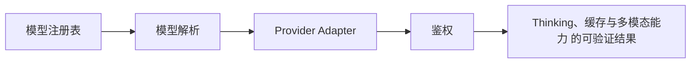

# 26. Thinking、缓存与多模态能力

## 26.1 本章解决的问题

这一章处理的是模型“回答文字”之外的能力：thinking/reasoning、prompt cache、图片输入、图片生成，以及这些能力如何进入 Pi 的 UI、SDK、session 文件和成本统计。前端工程师如果只把 LLM 当成字符串流，会遗漏三个关键事实：assistant 消息是 content blocks，不是单个字符串；usage 里有 `cacheRead` 和 `cacheWrite`，不是只有 input/output；图片既可能是用户输入，也可能是工具结果或独立图片生成 API 的输出。

`packages/ai/README.md` 把这些能力分成 `Image Input`、`Image Generation`、`Thinking/Reasoning`、`Context Serialization`。`packages/coding-agent/docs/models.md` 则说明模型元数据里有 `reasoning`、`thinkingLevelMap`、`input`、`cost.cacheRead`、`cost.cacheWrite` 和 provider `compat`。本章要把这些字段和用户可见行为连起来：为什么有些模型没有 thinking 按钮，为什么图片会被某些模型忽略，为什么同一个长会话第二次请求可能便宜很多，为什么生成图片不用普通 chat stream。

## 26.2 最小可运行路径

先从模型能力判断开始。`packages/ai/README.md` 说明可以用 `model.reasoning` 判断是否支持 thinking，用 `model.input.includes("image")` 判断是否支持图片输入。Pi Coding Agent 的 `packages/coding-agent/docs/models.md` 进一步给出 `thinkingLevelMap`：值为字符串表示映射到 provider 特定档位，值为 `null` 表示该档位不支持且应在 UI 中隐藏或跳过。

一个最小 SDK 输入可以这样理解：

```typescript
await session.prompt("What's in this image?", {
  images: [
    {
      type: "image",
      data: "base64...",
      mimeType: "image/png"
    }
  ]
});
session.setThinkingLevel("medium");
```

这不是两个独立功能。图片进入 `PromptOptions.images`，thinking level 进入 agent state，最终一起影响 provider payload。`packages/coding-agent/docs/sdk.md` 的 `PromptOptions` 写明 `images?: ImageContent[]`、`streamingBehavior?: "steer" | "followUp"` 和 `preflightResult`；`packages/coding-agent/docs/json.md` 和 `packages/coding-agent/docs/rpc.md` 则说明流式事件里会出现 `thinking_delta`、`text_delta`、`toolcall_delta`。

图片生成要走另一条路。`packages/ai/README.md` 明确说使用 `getImageModel()`、`getImageModels()`、`getImageProviders()` 和 `generateImages()`，不要用 `stream()` 或 `complete()`。源码入口在 [images.ts#L14](/source-code/packages/ai/src/images.ts#L14)，它根据 `model.api` 找 image provider，然后返回一次性的 `AssistantImages`。

## 26.3 核心机制

Pi 的消息结构是 block-based。`packages/ai/src/types.ts` 定义 `TextContent`、`ImageContent`、`ThinkingContent`、`ToolCall`，并把 `AssistantMessage.content` 设计成 `(TextContent | ThinkingContent | ToolCall)[]`。阅读入口：[types.ts#L64](/source-code/packages/ai/src/types.ts#L64)。这解释了为什么事件必须带 `contentIndex`：同一个 assistant 消息里可能同时出现文本、thinking 和工具调用，provider 的增量也可能交错到达。

thinking 的统一入口是 `SimpleStreamOptions.reasoning` 和模型 `thinkingLevelMap`。在 OpenAI-compatible provider 中，Pi 会根据 `compat.thinkingFormat` 把 Pi 的档位转换成 `reasoning_effort`、`reasoning: { effort }`、`thinking: { type }`、`enable_thinking` 或 `chat_template_kwargs.enable_thinking`：[openai-completions.ts#L89](/source-code/packages/ai/src/providers/openai-completions.ts#L89)。在 Anthropic provider 中，Pi 区分 adaptive thinking 和 budget-based thinking，并把上游 thinking delta 转成统一的 `thinking_delta`：[anthropic.ts#L39](/source-code/packages/ai/src/providers/anthropic.ts#L39)。

缓存不是前端缓存。它是 provider prompt cache，体现在请求 payload 和 usage 统计里。OpenAI-compatible 路径会设置 `prompt_cache_key` 和 `prompt_cache_retention`，并把 `cached_tokens` 归入 `cacheRead`：[openai-completions.ts#L89](/source-code/packages/ai/src/providers/openai-completions.ts#L89)。缓存 key 还要受 provider 限制，`clampOpenAIPromptCacheKey()` 将 key 限制到 64 个字符：[openai-prompt-cache.ts#L3](/source-code/packages/ai/src/providers/openai-prompt-cache.ts#L3)。Anthropic-compatible 路径则通过 `cache_control` 标记 system prompt、工具定义和最近消息。

Coding Agent 在创建 session 时还提供防御层。`createAgentSession()` 会把 messages 转换给 LLM；如果 settings 打开 block images，就把 `ImageContent` 替换成 `Image reading is disabled.`：[sdk.ts#L64](/source-code/packages/coding-agent/src/core/sdk.ts#L64)。这说明多模态能力不是只看模型支持，还受用户设置和运行时策略控制。


**生命周期图**



**源码责任表**

| 环节 | 系统责任 | 源码证据 | 读源码时要确认什么 |
|---|---|---|---|
| 模型注册表 | 内置模型 + models.json + extension provider | [model-registry.ts#L335](/source-code/packages/coding-agent/src/core/model-registry.ts#L335) | 输入从哪里来，输出交给谁，失败由哪一层裁决 |
| 模型解析 | CLI / scoped models / saved defaults | [model-resolver.ts#L340](/source-code/packages/coding-agent/src/core/model-resolver.ts#L340) | 输入从哪里来，输出交给谁，失败由哪一层裁决 |
| Provider Adapter | 消息、工具、流式事件归一 | [index.ts#L9](/source-code/packages/ai/src/index.ts#L9) | 输入从哪里来，输出交给谁，失败由哪一层裁决 |
| 鉴权 | API key / OAuth / request headers | [utils/oauth/index.ts#L55](/source-code/packages/ai/src/utils/oauth/index.ts#L55) | 输入从哪里来，输出交给谁，失败由哪一层裁决 |

**关键代码说明**

读源码时不要只顺着函数名跳转，而要检查四个边界：输入边界、状态边界、裁决边界、输出边界。输入边界回答“谁把数据交进来”；状态边界回答“哪些信息会跨 turn、跨 session 或跨进程保留”；裁决边界回答“谁有权继续、停止、执行或拒绝”；输出边界回答“结果给人看、给模型看，还是给外部系统看”。本章涉及的源码只有放进这四个边界中才有解释力。

## 26.4 为什么这样设计

Pi 把 thinking、cache、image 都放进模型能力和 message block，而不是放进 UI 特例，是为了让同一段会话能跨 provider、跨 run mode、跨 SDK/RPC 消费。前端可以只订阅 `message_update`，按 `assistantMessageEvent.type` 渲染不同 block：`text_delta` 放正文，`thinking_delta` 放可折叠思考区，`toolcall_delta` 放工具面板，usage 更新放成本栏。

缓存设计也遵循同一原则。用户看到的是成本和速度变化；provider 需要的是 cache key、cache control、session affinity 或 retention；session 需要保存 usage。Pi 让 provider adapter 处理 payload 差异，让标准 `usage.cacheRead/cacheWrite` 向上暴露。这样前端不需要理解 OpenAI、Anthropic、OpenRouter、Cloudflare 的缓存字段差异。

图片生成单独成 API，是因为它不参与工具调用和 agent loop。`generateImages()` 返回最终图片结果，不产生普通 assistant stream，也不执行工具。把它从 chat API 分离，可以避免 UI 误以为图片生成模型能读仓库、调用 bash 或参与多轮 coding session。


**创建者视角的设计不变量**

模型不是字符串，而是带 provider、api、context window、reasoning、headers、auth 和 stream 能力的对象。上层可以统一调用，但不能假设所有 provider 都支持同样的工具、thinking、缓存或图片能力。

**如果省略本章会发生什么**

省略本章，读者会把 Thinking、缓存与多模态能力 当成单点功能，而不是 Pi 架构中的责任边界。直接后果是：使用时不知道该改配置、写资源、写扩展、接 provider 还是调用 SDK；排查时也会把 provider、工具、TUI、session 和资源加载混为一谈。专家级学习必须把每章能力放回系统生命周期中验证。

## 26.5 常见误解与排查

误解一：thinking 是一段可直接展示的完整字符串。实际是 `thinking_start`、`thinking_delta`、`thinking_end`，并且 provider 可能返回 redacted thinking、signature 或 summary。UI 必须按 `contentIndex` 聚合，而不是按事件顺序拼到一个全局字符串。

误解二：图片传给任何模型都有效。`packages/ai/README.md` 明确说如果把图片传给非 vision 模型，它们会被忽略。Coding Agent 还可能因 settings 层的 block images 把图片替换成文字占位。

误解三：prompt cache 是浏览器缓存。它是 provider 侧缓存。要排查 cache 是否生效，看 assistant `usage.cacheRead` 和 `usage.cacheWrite`，再看 provider compat 是否启用了 `cacheControlFormat` 或 prompt cache retention。

误解四：图片生成和图片输入是一回事。图片输入是 chat context 中的 `ImageContent`；图片生成是 `ImagesContext` 到 `AssistantImages` 的一次性 API。前者能配合工具调用和多轮对话，后者当前是独立生成路径。

## 26.6 本章训练

设计一个前端消息渲染器：对 `message_update` 中的 `text_delta`、`thinking_delta`、`toolcall_delta` 使用 `contentIndex` 分块聚合；对 `message_end` 读取 `usage.input`、`usage.output`、`usage.cacheRead`、`usage.cacheWrite`；对用户上传图片，先检查当前模型 `input` 是否包含 `image`。

再解释一个模型配置：为什么 `reasoning: true` 还不够，什么时候要加 `thinkingLevelMap`；为什么 OpenAI-compatible provider 可能需要 `compat.thinkingFormat` 和 `compat.cacheControlFormat`；为什么一个前端按钮“隐藏思考过程”不等于关闭 provider thinking。


**专家验收任务**

完成本章后，读者应该能交付三件东西：一张自己画出的 Thinking、缓存与多模态能力 数据流图；一份包含源码链接、输入、输出、失败边界的责任表；一个最小实践任务，证明自己能在不改错层级的情况下使用或扩展该能力。若三件事缺一件，就说明还停留在“会用命令”的阶段，没有达到能设计和审计 Pi 方案的水平。

