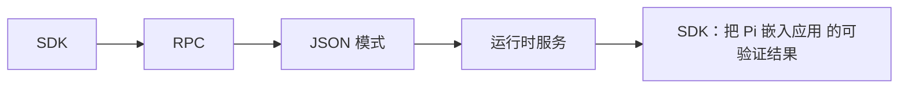

# 27. SDK：把 Pi 嵌入应用

## 27.1 本章解决的问题

SDK 是给“我不想启动 TUI，但想把 Pi Agent 放进自己的产品”这一类需求准备的。前端工程师常见场景包括：在 Web IDE 里接入代码助手，在内部平台里跑仓库分析，在桌面应用里做 agent 面板，在 CI 或自动化服务里驱动一次受控任务。此时你需要的不是命令行输出，而是一个可订阅事件、可控制模型、可注入工具、可管理 session 的编程接口。

`packages/coding-agent/docs/sdk.md` 对 SDK 的定位很明确：`The SDK provides programmatic access to pi's agent capabilities`，核心入口是 `createAgentSession()` 和 `AgentSession`。它还提醒：session replacement API，例如 new-session、resume、fork、import，属于 `AgentSessionRuntime`，不是 `AgentSession`。本章的必要性就在这里：它把前面的模型、provider、工具、扩展、session 文件知识，整理成应用集成时真正要调用的 API。

## 27.2 最小可运行路径

最小 SDK 使用方式是创建 session、订阅事件、发送 prompt：

```typescript
import {
  AuthStorage,
  createAgentSession,
  ModelRegistry,
  SessionManager
} from "@earendil-works/pi-coding-agent";

const authStorage = AuthStorage.create();
const modelRegistry = ModelRegistry.create(authStorage);

const { session } = await createAgentSession({
  sessionManager: SessionManager.inMemory(),
  authStorage,
  modelRegistry
});

session.subscribe((event) => {
  if (event.type === "message_update" && event.assistantMessageEvent.type === "text_delta") {
    process.stdout.write(event.assistantMessageEvent.delta);
  }
});

await session.prompt("What files are in the current directory?");
```

这段来自 `packages/coding-agent/docs/sdk.md` 的结构说明了三个边界。`AuthStorage` 管凭证，`ModelRegistry` 管模型和 provider，`SessionManager` 管会话存储，`AgentSession` 管一次会话的生命周期。前端宿主只需要把事件映射成 UI 状态：agent 是否运行、当前消息增量、工具执行进度、队列变化、压缩和重试状态。

如果应用只是单次请求，使用 `SessionManager.inMemory()`。如果要让用户恢复历史、fork、导出，使用 `SessionManager.create(cwd)` 或 `open()`。如果要固定工具能力，可传 `tools: ["read", "grep", "find", "ls"]` 做只读模式；如果要注入业务工具，使用 `defineTool()` 和 `customTools`。

## 27.3 核心机制

SDK 的主入口在 [sdk.ts#L64](packages/coding-agent/src/core/sdk.ts#L64)。`createAgentSession()` 会解析 `cwd` 和 `agentDir`，创建或复用 `AuthStorage`、`ModelRegistry`、`SettingsManager`、`SessionManager`，加载 `DefaultResourceLoader`，恢复已有 session 的模型和 thinking level，最后构造 `Agent` 与 `AgentSession`。

真正的 agent 执行由 `AgentSession` 包装：[agent-session.ts#L252](packages/coding-agent/src/core/agent-session.ts#L252)。它暴露 `prompt()`、`steer()`、`followUp()`、`subscribe()`、`setModel()`、`setThinkingLevel()`、`compact()`、`abort()`、`executeBash()`、`navigateTree()`、`exportToHtml()` 等能力。内部则处理消息持久化、扩展事件、工具注册、自动压缩、自动重试、bash 结果入上下文和 session tree 导航。

事件是 SDK 的主要输出面。`packages/coding-agent/docs/sdk.md` 列出 `message_update`、`tool_execution_start`、`tool_execution_update`、`tool_execution_end`、`agent_start`、`agent_end`、`turn_start`、`turn_end`、`queue_update`、`compaction_start`、`compaction_end`、`auto_retry_start`、`auto_retry_end`。这些事件与 `packages/coding-agent/docs/json.md` 和 `packages/coding-agent/docs/rpc.md` 的事件形状保持一致，所以同一个 UI 状态机可以服务 SDK、JSON mode 和 RPC mode。

资源加载也是 SDK 的核心。`DefaultResourceLoader` 会按 `cwd` 和 `agentDir` 发现 extensions、skills、prompt templates、themes、AGENTS.md/context files。你传自定义 `ResourceLoader` 时，就接管这些资源；否则 SDK 会按 Pi CLI 的默认规则工作。


**生命周期图**



**源码责任表**

| 环节 | 系统责任 | 源码证据 | 读源码时要确认什么 |
|---|---|---|---|
| SDK | 同进程消费 AgentSession | [agent-session-runtime.ts#L68](packages/coding-agent/src/core/agent-session-runtime.ts#L68) | 输入从哪里来，输出交给谁，失败由哪一层裁决 |
| RPC | JSONL stdin/stdout 跨进程协议 | [rpc-mode.ts#L53](packages/coding-agent/src/modes/rpc/rpc-mode.ts#L53) | 输入从哪里来，输出交给谁，失败由哪一层裁决 |
| JSON 模式 | 结构化事件流输出 | [print-mode.ts#L104](packages/coding-agent/src/modes/print-mode.ts#L104) | 输入从哪里来，输出交给谁，失败由哪一层裁决 |
| 运行时服务 | 统一装配 settings/provider/resource/session | [agent-session-runtime.ts#L393](packages/coding-agent/src/core/agent-session-runtime.ts#L393) | 输入从哪里来，输出交给谁，失败由哪一层裁决 |

**关键代码说明**

读源码时不要只顺着函数名跳转，而要检查四个边界：输入边界、状态边界、裁决边界、输出边界。输入边界回答“谁把数据交进来”；状态边界回答“哪些信息会跨 turn、跨 session 或跨进程保留”；裁决边界回答“谁有权继续、停止、执行或拒绝”；输出边界回答“结果给人看、给模型看，还是给外部系统看”。本章涉及的源码只有放进这四个边界中才有解释力。

## 27.4 为什么这样设计

Pi SDK 没有暴露一个“run(prompt): string”的薄封装，因为 coding agent 不是普通聊天补全。一个 prompt 可能触发多轮 LLM、多个工具调用、用户 steering、follow-up 队列、自动重试、上下文压缩、扩展 UI 请求、session 持久化和模型切换。把这些都压扁成字符串，会让宿主应用无法做可靠 UI。

`AgentSession` 代表“当前会话的外观”。它适合应用里一个 tab、一个 workspace、一个任务面板。它让宿主订阅事件、读状态、发送输入、控制模型。`AgentSessionRuntime` 代表“当前活动 session 可以被替换”。当用户点 New、Resume、Fork、Import 时，旧 session 要 shutdown，新 cwd 绑定服务要重建，扩展也要重新 bind。把替换逻辑放到 runtime，而不是塞进 session，本质上是为了避免一个对象同时代表“当前会话”和“会话容器”。

对前端工程师来说，这个分层让集成更稳定：React/Vue/Svelte 组件可以持有当前 session 的 unsubscribe；runtime 替换后重新订阅即可。模型、auth、settings、resource loader 都在创建阶段注入，减少运行中隐式全局状态。


**创建者视角的设计不变量**

集成接口共享同一会话语义，只改变传输形态。外部系统应该消费结构化事件和稳定 API，而不是解析 TUI 文本或绕过 AgentSession 直接调用内部模块。

**如果省略本章会发生什么**

省略本章，读者会把 SDK：把 Pi 嵌入应用 当成单点功能，而不是 Pi 架构中的责任边界。直接后果是：使用时不知道该改配置、写资源、写扩展、接 provider 还是调用 SDK；排查时也会把 provider、工具、TUI、session 和资源加载混为一谈。专家级学习必须把每章能力放回系统生命周期中验证。

## 27.5 常见误解与排查

误解一：`prompt()` 返回时就能拿到文本。`prompt()` 返回 `Promise<void>`，文本通过事件流到达。要显示内容，订阅 `message_update`；要拿最终消息，监听 `message_end` 或从 `session.messages` 读取。

误解二：streaming 中可以随便再调用 `prompt()`。`sdk.md` 写明 streaming 时必须指定 `streamingBehavior: "steer"` 或 `"followUp"`，否则会报错。`steer()` 会在当前 assistant turn 完成工具调用后插入新指令；`followUp()` 等 agent 停止后再发送。

误解三：自定义工具和内置工具的开关一样。`customTools` 只是注册工具；如果你传了 `tools` allowlist，还要把自定义工具名放进去，例如 `tools: ["read", "bash", "my_tool"]`。

误解四：SDK 自动适合浏览器直连。`packages/ai/README.md` 对 browser usage 有安全警告：把 API key 暴露在前端代码中是危险的。产品级前端通常应通过后端服务使用 SDK，浏览器只消费你自己的后端事件。

## 27.6 本章训练

实现一个最小宿主状态机：`agent_start` 设置 running，`message_update/text_delta` 追加到当前 assistant block，`tool_execution_*` 更新工具面板，`queue_update` 显示 pending steering/follow-up，`agent_end` 清理 running。然后给它加三个控制按钮：`abort()`、`setThinkingLevel("high")`、`compact()`。

再解释为什么同一个应用在“单次自动化任务”中用 `createAgentSession()` 足够，而在“可恢复多会话 IDE 面板”中应使用 `createAgentSessionRuntime()`。答案应该涉及 session 替换、cwd-bound services、扩展重新绑定和事件重新订阅。


**专家验收任务**

完成本章后，读者应该能交付三件东西：一张自己画出的 SDK：把 Pi 嵌入应用 数据流图；一份包含源码链接、输入、输出、失败边界的责任表；一个最小实践任务，证明自己能在不改错层级的情况下使用或扩展该能力。若三件事缺一件，就说明还停留在“会用命令”的阶段，没有达到能设计和审计 Pi 方案的水平。

