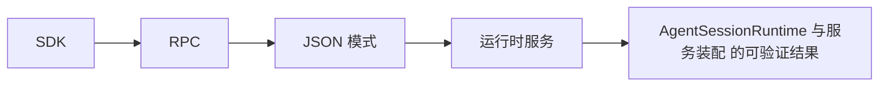

# 28. AgentSessionRuntime 与服务装配

## 28.1 本章解决的问题

上一章讲 SDK 如何创建一个 `AgentSession`。本章继续往下拆：当应用不止有“一个会话跑到底”，而是要支持 `/new`、`/resume`、`/fork`、`/clone`、`/import`、cwd 切换、扩展重新绑定时，谁负责把旧 session 安全关掉、把新 session 和它依赖的服务重新装起来？答案是 `AgentSessionRuntime` 和 `AgentSessionServices`。

`packages/coding-agent/docs/sdk.md` 说得很直接：`createAgentSessionRuntime()` 是 built-in interactive、print、RPC modes 使用的同一层。`AgentSessionRuntime` owns replacement of the active runtime across `newSession()`、`switchSession()`、`fork()`、clone flows 和 `importFromJsonl()`。这章的目标，是让前端工程师理解“session 对象”和“运行时容器”不是同一个概念。

## 28.2 最小可运行路径

Runtime 的最小模式是定义一个 factory，然后把它交给 `createAgentSessionRuntime()`：

```typescript
const createRuntime = async ({ cwd, agentDir, sessionManager, sessionStartEvent }) => {
  const services = await createAgentSessionServices({ cwd, agentDir });
  return {
    ...(await createAgentSessionFromServices({
      services,
      sessionManager,
      sessionStartEvent
    })),
    services,
    diagnostics: services.diagnostics
  };
};

const runtime = await createAgentSessionRuntime(createRuntime, {
  cwd: process.cwd(),
  agentDir: getAgentDir(),
  sessionManager: SessionManager.create(process.cwd())
});
```

这段来自 `packages/coding-agent/docs/sdk.md` 的模式说明了职责划分。`createAgentSessionServices()` 创建 cwd-bound 服务；`createAgentSessionFromServices()` 用这些服务创建当前 session；`createAgentSessionRuntime()` 保存 factory，以便后续 session 替换时重复同样的装配流程。

前端宿主在使用 runtime 时要记住一条规则：`runtime.session` 会变。调用 `runtime.newSession()` 或 `runtime.switchSession()` 后，原来的 `session.subscribe()` 订阅的是旧 session，必须 unsubscribe 并对新的 `runtime.session` 重新 subscribe。`sdk.md` 明确提示：如果使用 extensions，也要对新 session 再次 `bindExtensions(...)`。

## 28.3 核心机制

`AgentSessionServices` 定义在 [agent-session-services.ts#L130](packages/coding-agent/src/core/agent-session-services.ts#L130)。它包含 `cwd`、`agentDir`、`authStorage`、`settingsManager`、`modelRegistry`、`resourceLoader` 和 `diagnostics`。这些都是“绑定到有效 cwd 的运行依赖”：项目本地扩展、skills、prompts、AGENTS.md、settings、models.json 都可能随 cwd 变化而不同。

`createAgentSessionServices()` 会解析 cwd/agentDir，创建默认 `AuthStorage`、`SettingsManager`、`ModelRegistry`，构造 `DefaultResourceLoader` 并 `reload()`。然后它会处理扩展在加载阶段积累的 provider registrations，把 `pendingProviderRegistrations` 应用到 `modelRegistry`。这一步解释了为什么 provider 注册不只是 extension runtime 的事，还要进入模型目录。

`AgentSessionRuntime` 定义在 [agent-session-runtime.ts#L68](packages/coding-agent/src/core/agent-session-runtime.ts#L68)。它持有当前 `_session`、`_services`、`createRuntime`、`_diagnostics` 和 `_modelFallbackMessage`。当 `switchSession()`、`newSession()`、`fork()`、`importFromJsonl()` 发生时，它先触发 extension 的 before hook，再 `teardownCurrent()`，再调用 factory 创建新 runtime result，最后 `apply()` 替换当前 session/services。

`AgentSession` 本身仍然只负责当前会话的行为：[agent-session.ts#L252](packages/coding-agent/src/core/agent-session.ts#L252)。它可以 prompt、compact、execute bash、navigate tree，但不会替宿主管理“另一个 session 文件成为当前活动 session”这件事。


**生命周期图**



**源码责任表**

| 环节 | 系统责任 | 源码证据 | 读源码时要确认什么 |
|---|---|---|---|
| SDK | 同进程消费 AgentSession | [agent-session-runtime.ts#L68](packages/coding-agent/src/core/agent-session-runtime.ts#L68) | 输入从哪里来，输出交给谁，失败由哪一层裁决 |
| RPC | JSONL stdin/stdout 跨进程协议 | [rpc-mode.ts#L53](packages/coding-agent/src/modes/rpc/rpc-mode.ts#L53) | 输入从哪里来，输出交给谁，失败由哪一层裁决 |
| JSON 模式 | 结构化事件流输出 | [print-mode.ts#L104](packages/coding-agent/src/modes/print-mode.ts#L104) | 输入从哪里来，输出交给谁，失败由哪一层裁决 |
| 运行时服务 | 统一装配 settings/provider/resource/session | [agent-session-runtime.ts#L393](packages/coding-agent/src/core/agent-session-runtime.ts#L393) | 输入从哪里来，输出交给谁，失败由哪一层裁决 |

**关键代码说明**

读源码时不要只顺着函数名跳转，而要检查四个边界：输入边界、状态边界、裁决边界、输出边界。输入边界回答“谁把数据交进来”；状态边界回答“哪些信息会跨 turn、跨 session 或跨进程保留”；裁决边界回答“谁有权继续、停止、执行或拒绝”；输出边界回答“结果给人看、给模型看，还是给外部系统看”。本章涉及的源码只有放进这四个边界中才有解释力。

## 28.4 为什么这样设计

Runtime/services 这层解决的是一致性。一个 session 的 cwd 决定工具执行目录、资源发现、settings 合并、session 文件路径和扩展行为。如果用户 resume 一个来自其他项目的 session，继续沿用旧 cwd 的 tools 和 resource loader，就会出现非常难排查的问题：工具读错仓库、AGENTS.md 错位、模型配置没刷新、扩展状态来自旧项目。

因此 Pi 把服务创建设计成可重复的 factory。每次有效 cwd 或 session 目标变化，都重新创建 cwd-bound services，再创建 session。固定的进程级输入，例如 CLI flags、全局 agentDir、宿主自定义工具，可以由 factory closure 捕获；会随 cwd 变化的输入，则在 `createAgentSessionServices()` 内重建。

这也让不同 run mode 共享同一套行为。Interactive mode 的 `/resume`、RPC 的 `switch_session`、SDK 宿主的“打开历史会话”都走 runtime replacement，而不是各自实现一套半相同的切换逻辑。前端应用因此可以把 session replacement 当成一个原子动作：成功则重绑 UI，失败则保留错误给用户。


**创建者视角的设计不变量**

集成接口共享同一会话语义，只改变传输形态。外部系统应该消费结构化事件和稳定 API，而不是解析 TUI 文本或绕过 AgentSession 直接调用内部模块。

**如果省略本章会发生什么**

省略本章，读者会把 AgentSessionRuntime 与服务装配 当成单点功能，而不是 Pi 架构中的责任边界。直接后果是：使用时不知道该改配置、写资源、写扩展、接 provider 还是调用 SDK；排查时也会把 provider、工具、TUI、session 和资源加载混为一谈。专家级学习必须把每章能力放回系统生命周期中验证。

## 28.5 常见误解与排查

误解一：`AgentSessionRuntime` 只是 SDK 示例代码。实际上它是 built-in modes 的公共层。`packages/coding-agent/docs/sdk.md` 的 Run Modes 中，`InteractiveMode`、`runPrintMode`、`runRpcMode` 都接收 runtime。

误解二：runtime 替换后旧订阅还能用。不能。订阅绑定在具体 `AgentSession` 上。`runtime.session` 变化后，旧事件不会代表新会话，扩展 UI context 也可能失效。

误解三：services 可以全局单例。`AgentSessionServices` 是 cwd-bound。尤其是 `DefaultResourceLoader` 和 `SettingsManager`，项目级资源和配置都依赖 cwd。把它们做成全局单例会破坏多项目和 resume/fork 语义。

误解四：diagnostics 应该直接打印。源码里 `AgentSessionRuntimeDiagnostic` 被设计成返回给 caller，类型有 `info`、`warning`、`error`。应用层决定是否展示、如何展示、是否阻止启动。

排查 runtime 问题时，先确认 `runtime.cwd` 和 `runtime.session.sessionManager.getCwd()` 是否符合预期；再看 `runtime.diagnostics`；然后检查切换后是否重新订阅 session event、重新绑定 extension UI、重新读取 `runtime.session`。

## 28.6 本章训练

给一个 Web IDE 集成设计 runtime 生命周期：打开项目时创建 runtime；用户点击 New 调用 `runtime.newSession()`；用户从历史列表选择 session 调用 `runtime.switchSession(path)`；用户点 Fork 调用 `runtime.fork(entryId)`；每次成功后执行统一的 `rebindSession()`：unsubscribe 旧 session、绑定扩展 UI、subscribe 新 session、刷新模型和消息状态。

再回答：为什么 `createAgentSessionServices()` 不直接返回 session；为什么 `createAgentSessionFromServices()` 需要单独存在；为什么 runtime replacement 失败时应该抛给宿主，而不是内部吞掉并保持一个半初始化 session。


**专家验收任务**

完成本章后，读者应该能交付三件东西：一张自己画出的 AgentSessionRuntime 与服务装配 数据流图；一份包含源码链接、输入、输出、失败边界的责任表；一个最小实践任务，证明自己能在不改错层级的情况下使用或扩展该能力。若三件事缺一件，就说明还停留在“会用命令”的阶段，没有达到能设计和审计 Pi 方案的水平。

