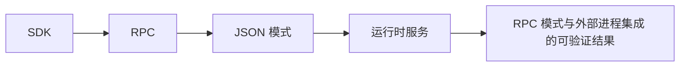

# 29. RPC 模式与外部进程集成

## 29.1 本章解决的问题

RPC mode 解决的是“宿主不在同一个 Node.js 进程里，或者不想直接链接 SDK”的集成问题。典型宿主是 IDE 插件、桌面应用、Python/Go/Rust 服务、受沙箱约束的前端容器。它们可以启动 `pi --mode rpc` 子进程，通过 stdin 发送 JSONL 命令，通过 stdout 接收 response、agent events 和 extension UI requests。

`packages/coding-agent/docs/rpc.md` 定义了这个协议：commands 是一行一个 JSON object，responses 带 `type: "response"`，events 是 agent 运行期间持续输出的 JSON lines。它还提示 Node.js/TypeScript 应用优先考虑直接使用 `AgentSession`；RPC 更适合跨语言、进程隔离、语言无关 client。这章是全书最后的集成章，因为它把前面所有能力压成一个稳定协议面：provider、thinking、images、session、runtime、extensions、tools 都能通过 JSON 命令和事件访问。

## 29.2 最小可运行路径

启动方式：

```bash
pi --mode rpc --no-session
```

发送一个 prompt：

```json
{"id":"req-1","type":"prompt","message":"Hello"}
```

你会先收到一次确认：

```json
{"id":"req-1","type":"response","command":"prompt","success":true}
```

然后继续收到 `agent_start`、`turn_start`、`message_start`、多条 `message_update`、`message_end`、`turn_end`、`agent_end`。`packages/coding-agent/docs/rpc.md` 明确说 `success: true` 只表示 prompt 被接受、排队或立即处理；接受之后的失败会通过普通事件流报告，不会为同一个 request id 再发第二个 response。

带图片时，`prompt`、`steer`、`follow_up` 都接受 `images`，格式是 `ImageContent`：`{"type":"image","data":"base64-encoded-data","mimeType":"image/png"}`。streaming 中再发 prompt 时，必须指定 `streamingBehavior: "steer"` 或 `"followUp"`；否则返回错误。这个规则与 SDK 的 `PromptOptions.streamingBehavior` 一致。

## 29.3 核心机制

协议类型定义在 [rpc-types.ts#L16](/source-code/packages/coding-agent/src/modes/rpc/rpc-types.ts#L16)。`RpcCommand` 覆盖 prompting、state、model、thinking、queue modes、compaction、retry、bash、session、messages、commands。`RpcResponse` 为每个 command 定义成功响应形状，也允许任意 command 返回 `success: false` 和 `error`。

运行入口在 [rpc-mode.ts#L53](/source-code/packages/coding-agent/src/modes/rpc/rpc-mode.ts#L53)。`runRpcMode(runtimeHost)` 接收 `AgentSessionRuntime`，接管 stdout，绑定当前 session 的扩展 UI context，订阅 session events 并把事件序列化到 stdout。命令处理器把 `prompt` 映射到 `session.prompt()`，把 `new_session`、`switch_session`、`fork`、`clone` 映射到 runtime replacement，把 `get_available_models` 映射到 `session.modelRegistry.getAvailable()`。

JSONL framing 是协议的一部分，不是实现细节。`rpc.md` 要求只用 LF (`\n`) 分隔记录，客户端可接受 CRLF 但要去掉尾部 `\r`，不要用会把 Unicode separators 当换行的通用 line reader。源码里的 `attachJsonlLineReader()` 也刻意不用 Node `readline`：[jsonl.ts#L9](/source-code/packages/coding-agent/src/modes/rpc/jsonl.ts#L9)。

RPC 复用的是同一套 session event。事件类型来自 [agent-session.ts#L252](/source-code/packages/coding-agent/src/core/agent-session.ts#L252)，所以外部进程看到的 `message_update.assistantMessageEvent.type` 与 SDK 中一致：`text_delta`、`thinking_delta`、`toolcall_delta`、`done`、`error` 等。


**生命周期图**



**源码责任表**

| 环节 | 系统责任 | 源码证据 | 读源码时要确认什么 |
|---|---|---|---|
| SDK | 同进程消费 AgentSession | [agent-session-runtime.ts#L68](/source-code/packages/coding-agent/src/core/agent-session-runtime.ts#L68) | 输入从哪里来，输出交给谁，失败由哪一层裁决 |
| RPC | JSONL stdin/stdout 跨进程协议 | [rpc-mode.ts#L53](/source-code/packages/coding-agent/src/modes/rpc/rpc-mode.ts#L53) | 输入从哪里来，输出交给谁，失败由哪一层裁决 |
| JSON 模式 | 结构化事件流输出 | [print-mode.ts#L104](/source-code/packages/coding-agent/src/modes/print-mode.ts#L104) | 输入从哪里来，输出交给谁，失败由哪一层裁决 |
| 运行时服务 | 统一装配 settings/provider/resource/session | [agent-session-runtime.ts#L393](/source-code/packages/coding-agent/src/core/agent-session-runtime.ts#L393) | 输入从哪里来，输出交给谁，失败由哪一层裁决 |

**关键代码说明**

读源码时不要只顺着函数名跳转，而要检查四个边界：输入边界、状态边界、裁决边界、输出边界。输入边界回答“谁把数据交进来”；状态边界回答“哪些信息会跨 turn、跨 session 或跨进程保留”；裁决边界回答“谁有权继续、停止、执行或拒绝”；输出边界回答“结果给人看、给模型看，还是给外部系统看”。本章涉及的源码只有放进这四个边界中才有解释力。

## 29.4 为什么这样设计

RPC 选择 JSONL 而不是 HTTP server，是为了让 Pi 保持 CLI/子进程集成模型。宿主只需要管理一个进程、stdin、stdout、stderr，不需要端口分配、鉴权 server、CORS 或生命周期守护。对 IDE 插件和桌面应用来说，这比嵌入一个长期 HTTP 服务简单，也更容易随项目启动和关闭。

命令 response 与 agent events 分离，是为了表达异步 agent 的真实形态。`prompt` 的 response 只确认“输入被接收”；真正的工作通过 events 发生。这样客户端可以同时处理长时间工具执行、用户 abort、队列变化、extension UI dialog 和最终消息，而不是阻塞等待一个巨大 response。

把 extension UI 也做成子协议，是为了让扩展继续使用 `ctx.ui.select()`、`ctx.ui.confirm()`、`ctx.ui.input()`、`ctx.ui.editor()` 这类语义。RPC mode 会输出 `extension_ui_request`，客户端用 `extension_ui_response` 回答。不能在 headless 环境中实现的 TUI 专属能力，则降级为 no-op 或固定返回值。


**创建者视角的设计不变量**

集成接口共享同一会话语义，只改变传输形态。外部系统应该消费结构化事件和稳定 API，而不是解析 TUI 文本或绕过 AgentSession 直接调用内部模块。

**如果省略本章会发生什么**

省略本章，读者会把 RPC 模式与外部进程集成 当成单点功能，而不是 Pi 架构中的责任边界。直接后果是：使用时不知道该改配置、写资源、写扩展、接 provider 还是调用 SDK；排查时也会把 provider、工具、TUI、session 和资源加载混为一谈。专家级学习必须把每章能力放回系统生命周期中验证。

## 29.5 常见误解与排查

误解一：可以用普通 line reader。`rpc.md` 明确指出 Node `readline` 不符合 RPC framing，因为它会额外按 `U+2028`、`U+2029` 分割。外部客户端应像 `jsonl.ts` 一样只找 `\n`。

误解二：收到 prompt response 就代表任务完成。它只代表 accepted。前端状态应该等 `agent_end` 或用户 abort 后再认为 run 结束；错误要从 `message_end` 的 assistant `stopReason: "error"`、`auto_retry_*`、`compaction_end.errorMessage` 或 command error 中读取。

误解三：RPC mode 能完整复刻 TUI。`rpc.md` 的 Extension UI Protocol 列出一批降级项：`custom()` 返回 `undefined`，`setFooter()`、`setHeader()`、`setEditorComponent()`、`setToolsExpanded()` 等是 no-op，theme 查询也不可用。RPC 宿主应实现自己的 UI，而不是期待 Pi TUI 组件跨进程渲染。

误解四：`bash` command 等同于 LLM 工具调用。RPC 的 `bash` 命令立即执行 shell，并把 `BashExecutionMessage` 放进下一次 prompt 的 LLM context；它不会发普通 tool execution event。LLM 自己调用 bash 工具时，才会有 `tool_execution_start/update/end`。

## 29.6 本章训练

写一个 RPC client 状态机：stdin 写 command 时带 `id`；stdout reader 只按 LF 切行；收到 `response` 时 resolve 对应 request；收到 `message_update/text_delta` 时更新 assistant 文本；收到 `extension_ui_request/select` 时弹出宿主选择框并写回 `extension_ui_response`；收到 `agent_end` 时标记当前 run 完成。

再解释三种集成选择：同进程 TypeScript 应用用 SDK，因为有类型和直接状态访问；跨语言宿主用 RPC，因为协议稳定且进程隔离；只想把一次任务输出给脚本时用 JSON mode，因为它只输出事件流，不需要双向命令协议。


**专家验收任务**

完成本章后，读者应该能交付三件东西：一张自己画出的 RPC 模式与外部进程集成 数据流图；一份包含源码链接、输入、输出、失败边界的责任表；一个最小实践任务，证明自己能在不改错层级的情况下使用或扩展该能力。若三件事缺一件，就说明还停留在“会用命令”的阶段，没有达到能设计和审计 Pi 方案的水平。

