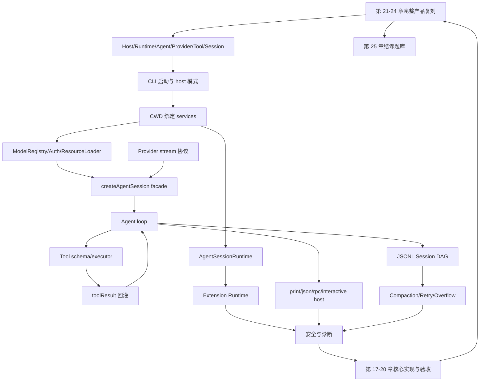

# Pi Agent 复刻指南大纲

本大纲按 [rewrite.md](rewrite.md) 的最终方案组织：正文 16 章负责源码边界，新增 4 章负责贯穿实现、协议、测试和审计，再新增 5 章补齐完整产品复刻面和结课题库。目标是让读者不依赖外部材料也能复刻一个 mini Pi-like coding agent，并知道如何继续补齐一模一样的 Pi。所有真实 Pi 行为必须能追溯到当前仓库中的源码或 docs；mini 教学协议必须和真实 Pi 协议分开标注。

## 全书主线

## 25 章目录

| 章 | 标题 | 必须回答的问题 | 复刻产物 |
|---|---|---|---|
| 1 | Pi 的依赖 DAG 与 Harness 边界 | Pi 为什么不是 CLI wrapper，六个核心边界如何协作。 | 六个接口和最小数据流。 |
| 2 | 启动链路：CLI、模式选择、CWD 与诊断 | 命令行如何变成 runtime 和 host mode。 | CLI 骨架。 |
| 3 | CWD 绑定服务：Settings、Auth、ModelRegistry、ResourceLoader | 为什么服务必须绑定 cwd/session 创建。 | 服务装配器。 |
| 4 | AgentSessionRuntime：new、resume、fork、import、reload | 会话替换为什么要重建服务和扩展上下文。 | runtime session replacement。 |
| 5 | pi-ai：消息类型、模型类型与流事件协议 | provider stream 如何与 Agent loop 解耦。 | faux provider + stream event。 |
| 6 | 模型选择、鉴权与 Provider 注册 | model、provider、api、auth source 如何解析。 | provider registry。 |
| 7 | SDK 创建 AgentSession：服务如何变成可运行 Agent | services、provider、tools、session 在哪里汇合。 | `createAgentSession()` facade。 |
| 8 | Agent Core Loop：turn、stream、tool-use、steer 与 follow-up | user -> model -> tool -> toolResult -> model 如何闭环。 | 最小 agent loop。 |
| 9 | 工具系统：内置工具、active tools、校验与结果回灌 | 模型为什么只能提出 tool call，不能直接执行。 | 基础工具集。 |
| 10 | System Prompt 与资源注入：AGENTS、skills、templates、tool snippets | 运行时资源如何进入模型行为契约。 | context builder。 |
| 11 | Session DAG 与 JSONL 持久化 | session 为什么是事件 DAG，不是 transcript。 | JSONL repo。 |
| 12 | 压缩、分支摘要、重试与 Overflow 恢复 | 长任务如何在窗口和 provider 错误下继续。 | compaction pipeline。 |
| 13 | Extension Runtime：加载、注册、hook、命令、工具、UI bridge | extension 如何扩展能力但不侵入 Agent loop。 | extension runner。 |
| 14 | Host Adapters：print、json、rpc、interactive 共享同一 session | host 为什么只是外壳。 | print/json/rpc adapters。 |
| 15 | Interactive TUI：编辑器、渲染、快捷键、队列与扩展 UI | TUI 如何消费事件并调度输入。 | 最小 TUI。 |
| 16 | 安全、诊断与生产化不变量 | 本地执行型 agent 需要哪些信任边界和质量门禁。 | 安全策略、诊断、审计清单。 |
| 17 | 从零实现 mini Pi-like Agent | 如何把前 16 章产物组装成可运行项目。 | mini agent 目录、核心代码、运行命令。 |
| 18 | 协议与数据结构总表 | 真实 Pi 协议和 mini 教学协议分别长什么样，哪些字段不能简化。 | 可追溯协议参考。 |
| 19 | Faux Provider、测试与回放验收 | 如何在无真实模型成本下验证 agent loop。 | golden trajectory 测试。 |
| 20 | 最终复刻路线与生产审计 | 如何判断复刻已经达标，哪些能力可以继续增强。 | 分阶段路线和 P0/P1 审计表。 |
| 21 | Package Manager、资源发现与 Theme | 完整 Pi 的 package/resource/theme 平面如何复刻。 | 资源解析与 theme 复刻任务。 |
| 22 | RPC Extension UI 与 HTML Export | headless host 如何承载 extension UI 和导出审计产物。 | RPC UI 与 HTML export 复刻任务。 |
| 23 | Interactive 产品面 | keybindings、settings、model selector、session tree 如何补齐。 | TUI 产品面复刻任务。 |
| 24 | 一模一样复刻矩阵 | 如何按 P0/P1/P2 判断是否完整复刻 Pi。 | 完整复刻矩阵。 |
| 25 | 结课题库与 FAQ | 如何自测是否达到专家级理解和完整复刻能力。 | 概念题、协议题、实现题、调试题。 |

## 每章新增实现关卡

第 1-16 章末尾新增 `N.10 本章实现关卡`，统一说明：

1. 本章新增到 mini 项目的文件。
2. 本章新增接口或数据结构。
3. 本章可运行观察命令。
4. 本章失败样例。
5. 下一章消费的产物。

## 附录化原则

第 17-25 章虽然以章节形式进入 EPUB，但写法是复刻附录。它们不再引入新的 Pi 概念，而是把前文概念落实为：

- 完整 mini 实现切片。
- 真实 Pi 协议和 mini 教学协议的映射。
- 测试和回放。
- 审计和路线图。
- package/resource/theme、RPC UI、HTML export、interactive 产品面的完整复刻矩阵。
- 结课题库、FAQ、调试题和评分标准。

## 事实追溯原则

- 真实 Pi 字段名、事件名、命令名、entry 类型必须使用当前源码或 docs 中已经存在的名称。
- 如果 mini 版为了教学缩短字段或合并事件，必须写明它不是 Pi 的真实协议，并在同一小节给出真实 Pi 对照。
- JSON/RPC/session/provider 这些机器协议不得只给“概念样例”；必须至少给一个可追溯到源码或 docs 的真实样例入口。
