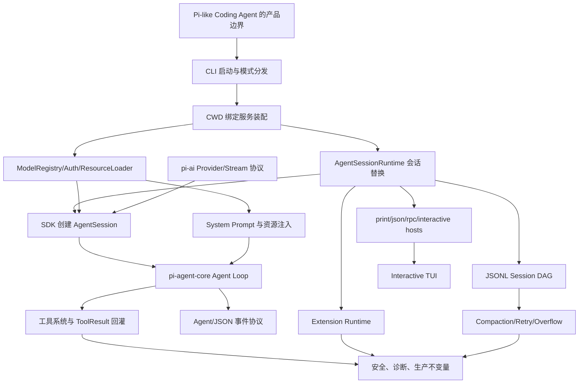

# Pi Agent 复刻指南大纲

本大纲按 [rewrite.md](rewrite.md) 第 19 节的最终结论收敛：旧的 40 章功能百科废弃，正文改为 16 章。每章都必须解释一个稳定源码边界，并产出一个可复刻部件。

## 全书主线

## 16 章目录

| 章 | 标题 | 必须回答的问题 | 复刻产物 |
|---|---|---|---|
| 1 | Pi 的依赖 DAG 与 Harness 边界 | Pi 为什么不是 CLI wrapper，六个核心边界如何协作。 | 六个接口和最小数据流。 |
| 2 | 启动链路：CLI、模式选择、CWD 与诊断 | 命令行如何变成 runtime 和 host mode。 | CLI 骨架。 |
| 3 | CWD 绑定服务：Settings、Auth、ModelRegistry、ResourceLoader | 为什么服务必须绑定 cwd/session 创建。 | 服务装配器。 |
| 4 | AgentSessionRuntime：new、resume、fork、import、reload | 会话替换为什么要重建服务和扩展上下文。 | runtime session replacement。 |
| 5 | pi-ai：消息类型、模型类型与流事件协议 | provider stream 如何与 Agent loop 解耦。 | faux provider + stream event。 |
| 6 | 模型选择、鉴权与 Provider 注册 | model、provider、api、auth source 如何解析。 | provider registry。 |
| 7 | SDK 创建 AgentSession：服务如何变成可运行 Agent | services、provider、tools、session 在哪里汇合。 | `createAgentSession()` facade。 |
| 8 | Agent Core Loop：turn、stream、tool-use、steer 与 follow-up | user -> model -> tool -> toolResult -> model 如何闭环。 | 最小 agent loop。 |
| 9 | 工具系统：内置工具、active tools、校验与结果回灌 | 模型为什么只能提出 tool call，不能直接执行。 | 基础工具集。 |
| 10 | System Prompt 与资源注入：AGENTS、skills、templates、tool snippets | 运行时资源如何进入模型行为契约。 | context builder。 |
| 11 | Session DAG 与 JSONL 持久化 | session 为什么是事件 DAG，不是 transcript。 | JSONL repo。 |
| 12 | 压缩、分支摘要、重试与 Overflow 恢复 | 长任务如何在窗口和 provider 错误下继续。 | compaction pipeline。 |
| 13 | Extension Runtime：加载、注册、hook、命令、工具、UI bridge | extension 如何扩展能力但不侵入 Agent loop。 | extension runner。 |
| 14 | Host Adapters：print、json、rpc、interactive 共享同一 session | host 为什么只是外壳。 | print/json/rpc adapters。 |
| 15 | Interactive TUI：编辑器、渲染、快捷键、队列与扩展 UI | TUI 如何消费事件并调度输入。 | 最小 TUI。 |
| 16 | 安全、诊断与生产化不变量 | 本地执行型 agent 需要哪些信任边界和质量门禁。 | 安全策略、诊断、审计清单。 |

## 章节写作模板

每章必须包含：

1. 问题场景。
2. 用户如何使用。
3. 源码定位。
4. Mermaid 生命周期图。
5. 关键代码片段与详细说明。
6. 机制拆解。
7. 设计不变量。
8. 失败模式与最小复刻任务。
9. 验收清单。

源码链接必须使用当前仓库相对路径和行号，格式如 [agent-loop.ts#L95](packages/agent/src/agent-loop.ts#L95)。代码片段必须来自当前实现，并在片段前后提供源码链接定位。
