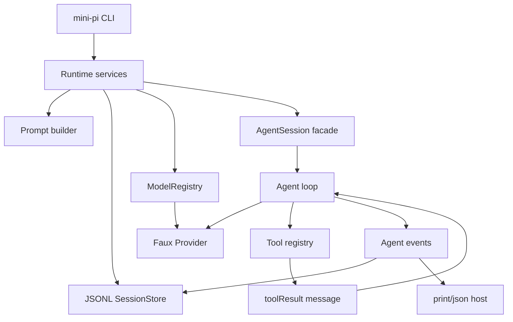

# Pi Agent 复刻书重写方案

## 1. 目标判断

本书的目标不是“讲懂 Pi 的源码”，而是让一个完全不了解 Pi、但具备工程基础的读者，只读本书就能：

1. 理解 Pi 的核心概念：`Host / Runtime / AgentSession / Agent / Provider / Tool / Session / Resource / Extension`。
2. 掌握 Pi 的核心使用方式：interactive、print、json、rpc、session resume/fork、tool mode、model/provider、resources、extensions。
3. 解释 Pi 的核心原理：模型流、工具调用、toolResult 回灌、JSONL session DAG、资源注入、host adapter、安全与诊断。
4. 从零复刻一个 mini Pi-like coding agent：CLI、provider stream、agent loop、tool executor、JSONL session、prompt builder、print/json host、简化 runtime、安全检查和 faux provider 测试。

边界要求：书中的事实只能来自当前仓库源码和 docs。真实 Pi 协议必须使用真实字段名和事件名；mini 教学实现可以简化，但必须和真实 Pi 协议并列说明，不能把教学字段伪装成 Pi 当前实现。

当前 16 章已经覆盖源码边界，但仍偏“源码导读”。重写后的书必须补上连续工程主线：每章都说明本章给 mini 实现新增什么，最后新增 4 章把接口、协议、测试、审计完整收束。

## 2. 从 zen-docs 借鉴的写作模式

对 `/d/chengle/code/github/zen-docs` 中项目实战、框架、编程语言、架构、中间件类书籍的分析结论：

- 成熟书先给最终产物，再拆内部机制。Go 项目书先展示 IAM 系统，Web 框架书先说明框架为业务提效，编程语言书先跑最小语言。
- 复刻型书必须从最小闭环开始。先能运行，再补边界、配置、测试、部署和生产化。
- 每章只扩一个能力。上一章产物必须成为下一章输入，不能写成功能菜单。
- 概念必须由失败压力引出。没有路由会怎样，没有 AST 会怎样，没有 session DAG 会怎样。
- 验收要可观察。成熟书常用运行命令、截图、测试、期末题；Pi 书必须升级为命令、JSONL 片段、faux provider trajectory、失败样例。
- 架构书的强项是不变量。Pi 书必须反复强调：provider 不执行工具，模型不碰文件系统，toolResult 必须回灌，session 必须 append-only，host 不拥有业务状态。

因此，新书写法是：**问题压力 -> 用户观察 -> 源码边界 -> mini 实现 -> 数据样例 -> 失败模式 -> 验收命令**。

## 3. 新书结构

保留 16 章源码边界，新增 4 章贯穿实现和验收。章节数量变为 20：

| 章 | 标题 | 作用 |
|---|---|---|
| 1 | Pi 的依赖 DAG 与 Harness 边界 | 建立六个核心边界和禁止依赖。 |
| 2 | 启动链路：CLI、模式选择、CWD 与诊断 | 把命令变成 runtime 和 host。 |
| 3 | CWD 绑定服务：Settings、Auth、ModelRegistry、ResourceLoader | 解释 cwd/session 绑定服务。 |
| 4 | AgentSessionRuntime：new、resume、fork、import、reload | 解释会话替换和服务重建。 |
| 5 | pi-ai：消息类型、模型类型与流事件协议 | 统一 provider stream。 |
| 6 | 模型选择、鉴权与 Provider 注册 | 解析 model/provider/api/auth。 |
| 7 | SDK 创建 AgentSession：服务如何变成可运行 Agent | 汇合 services、provider、session、tools。 |
| 8 | Agent Core Loop：turn、stream、tool-use、steer 与 follow-up | 讲清 agent 闭环。 |
| 9 | 工具系统：内置工具、active tools、校验与结果回灌 | 讲工具执行权和安全边界。 |
| 10 | System Prompt 与资源注入 | 讲 AGENTS、skills、templates、tool snippets。 |
| 11 | Session DAG 与 JSONL 持久化 | 讲 append-only session tree。 |
| 12 | 压缩、分支摘要、重试与 Overflow 恢复 | 讲长任务恢复。 |
| 13 | Extension Runtime | 讲扩展如何进入 runtime。 |
| 14 | Host Adapters | 讲 print/json/rpc/interactive 共享 session。 |
| 15 | Interactive TUI | 讲 TUI 是事件视图和输入调度器。 |
| 16 | 安全、诊断与生产化不变量 | 收束本地执行型 agent 的风险边界。 |
| 17 | 从零实现 mini Pi-like Agent | 给出连续可运行实现路径。 |
| 18 | 协议与数据结构总表 | 汇总接口、事件、JSONL、toolResult、RPC。 |
| 19 | Faux Provider、测试与回放验收 | 给出最小测试策略和 golden trajectory。 |
| 20 | 最终复刻路线与生产审计 | 给出完成标准、阶段路线和 P0/P1 审计表。 |

## 4. 统一章节模板

第 1-16 章保留当前模板，并追加 `N.10 本章实现关卡`：

- 本章新增到 mini 实现的文件。
- 本章新增接口或数据结构。
- 本章可运行观察命令。
- 本章失败样例。
- 下一章消费的产物。

第 17-20 章使用“贯穿实现”模板：

1. 本章目标。
2. 当前 Pi 源码锚点。
3. mini 实现目录或协议。
4. 完整示例代码或完整 JSON 样例。
5. 运行命令与期望输出。
6. 常见错误。
7. 验收清单。

## 5. 最小实现主线

mini 版必须先实现：

1. `Provider.stream(context)` 输出标准事件。
2. `Tool.execute(args)` 在 runtime 执行并返回 `ToolResultMessage`。
3. `Agent.runTurn()` 完成 user -> assistant -> tool -> toolResult -> assistant。
4. `SessionStore.append()` 保存 JSONL entry。
5. `Host.run()` 订阅事件并输出 text/json。

增强版再加：

- cwd-bound settings/resource loader。
- model registry/auth source。
- session resume/fork。
- compaction summary。
- extension runner。
- interactive TUI。

## 6. 必须补齐的数据样例

正文或第 18 章必须包含：

- `CoreInterfaces` TypeScript 总表。
- 真实 Pi `AssistantMessageEvent` 示例流，并标注 mini 可简化子集。
- 真实 Pi `AgentSessionEvent`/`AgentEvent` 示例流，并标注 mini host event 子集。
- 真实 Pi `ToolDefinition` 与 `ToolResultMessage` 示例，并标注 mini tool result adapter。
- 真实 Pi JSONL session header/message/model_change/compaction/custom/label/session_info 示例。
- print/json/RPC 真实输出样例和 mini 输出样例。
- system prompt 最小结构。
- 安全策略矩阵。

## 7. 最终验收标准

书稿只有同时满足以下条件才合格：

- 读者不打开 Pi 源码，也能根据本书写出 mini Pi-like agent。
- 读者打开 Pi 源码时，能把每个 mini 接口映射到当前仓库的真实实现。
- 读者能区分“真实 Pi 协议”和“mini 教学协议”，不会把 mini 字段误认为当前 Pi 兼容字段。
- 每章都能回答“不讲这个边界，复刻会在哪里失败”。
- 每章都有 Mermaid 图、源码锚点、实现关卡、失败模式、验收标准。
- 第 17-20 章提供完整实现路径、协议表、测试轨迹和生产审计。
- `node book/validate.js` 通过。
