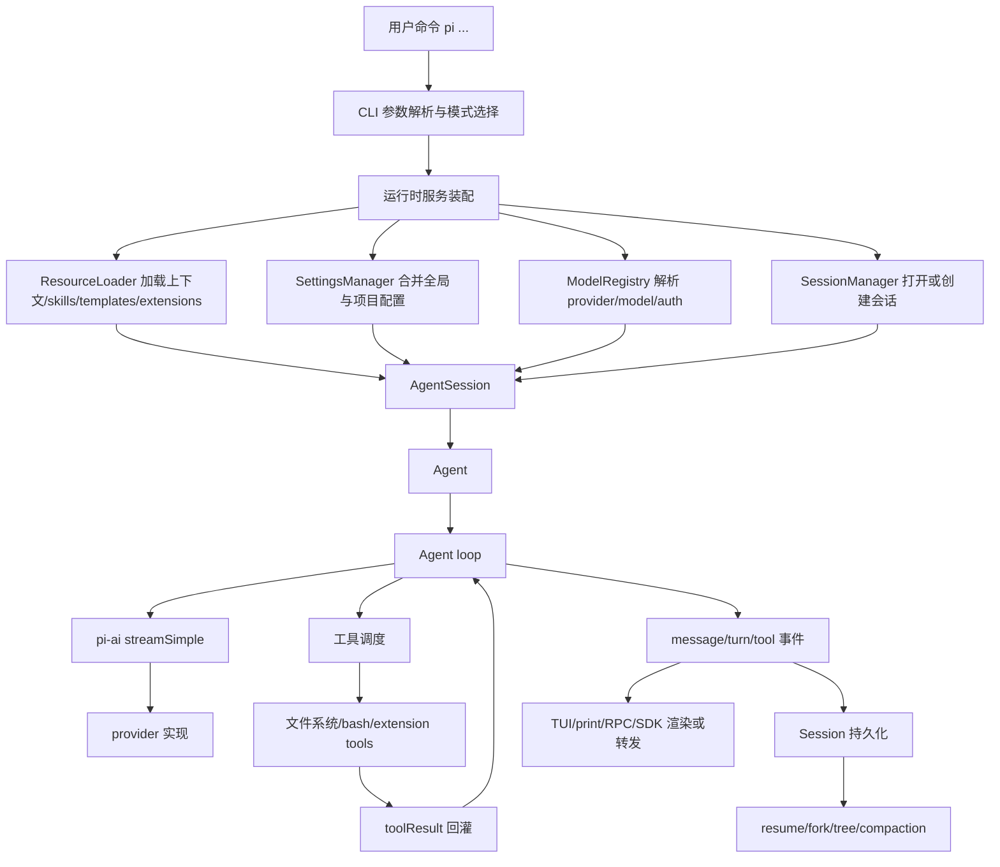
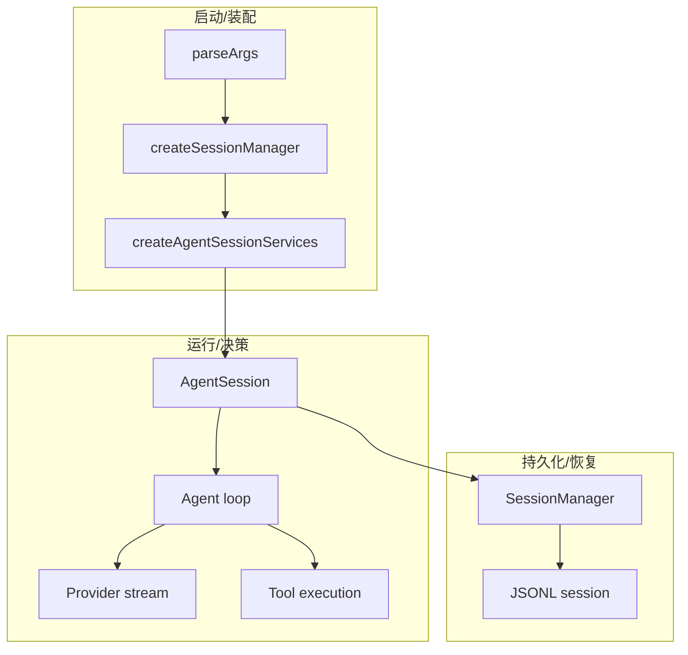
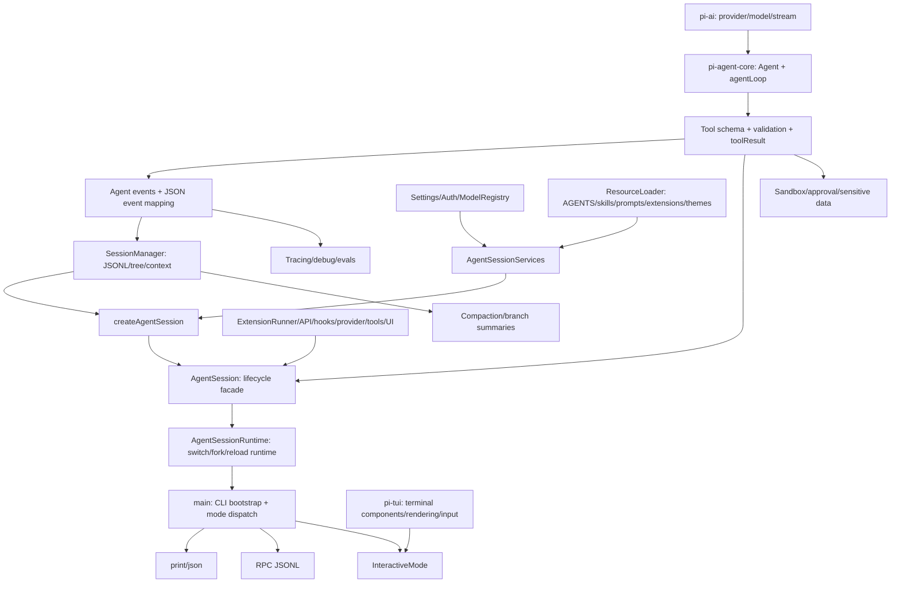
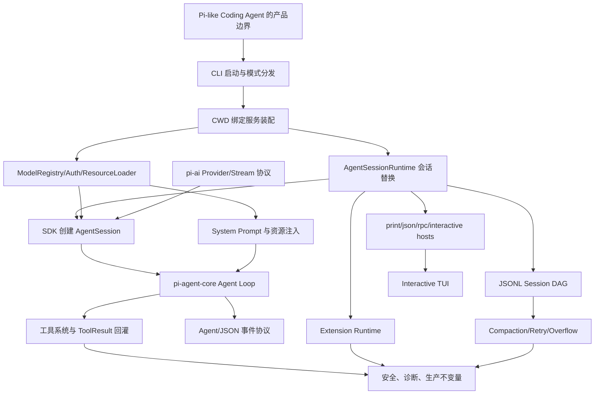

# Pi Agent 书籍重写计划

## 1. 重写目标

本计划用于指导后续 agent 重写 `book/chapters/*.md`，目标不是润色现有书稿，而是把它改造成一本“只读此书即可复刻 Pi 核心功能”的源码分析与实现教材。

完成后的书必须让一个完全不懂 Pi、但具备工程基础的读者能够做到：

1. 准确说明 Pi 的核心概念：CLI、TUI、AgentSession、Agent、Agent loop、tool、provider、model、session、compaction、resource、skill、prompt template、extension、package、RPC、SDK。
2. 独立使用 Pi 的核心能力：安装启动、交互模式、print/json 模式、provider 配置、模型选择、文件读写、工具调用、中断、恢复、分支、导出、settings、skills、extensions、packages。
3. 解释 Pi 的核心原理：启动链路、运行时服务装配、Agent loop、流式响应、工具调度、事件回灌、会话持久化、上下文压缩、provider 抽象、TUI 渲染、extension 生命周期、安全边界。
4. 按阶段复刻 Pi：最小 CLI agent、tool calling、session 保存恢复、compaction、最小 TUI、provider 接入、extension 系统、RPC/SDK 集成。

## 2. 不可违反的约束

- 只改 `book/` 内书稿与必要的书籍元数据；不要修改 `packages/**`、`scripts/**`、根配置、锁文件或源码。
- 所有源码引用必须用当前仓库相对路径和行号，例如 [agent-loop.ts#L95](packages/agent/src/agent-loop.ts#L95)，不能写裸路径、不能包在反引号里、不能链接到 GitHub URL。
- 每章必须至少包含 1 个 Mermaid 图；除非 Mermaid 无法表达，才使用 Codex 生成解释图片，并把图片生成说明写入章节。
- 每章必须包含关键代码片段。片段必须来自当前实现，片段前后都要有源码链接定位到最新实现细节。
- 每章必须严格遵守 `book/AGENTS.md` 的标题编号规则：H1 为 `# N. 标题`，H2 为 `## N.x 标题`，H3 为 `### N.x 标题`。
- 每章必须严格遵守统一模板，不能变成随笔、功能列表或营销文档。
- 重写后必须运行 `node book/validate.js`。如果改动测试脚本或书籍构建脚本，才考虑更广验证；默认不改源码。

## 3. 统一章节模板

每个 `book/chapters/chapter-XX-*.md` 必须使用下面结构。章节可以增加小节，但不能删掉这些核心小节。

```md
# X. 章节标题

## X.1 本章要解决的问题

说明如果没有此模块，Pi 或一个可复刻 agent 会遇到什么不可接受的问题。必须回答“为什么需要它”，不能只说“它是什么”。

## X.2 用户如何使用

给出最小可执行流程、命令或配置。使用方式章节必须说明输入、输出、失败状态和用户下一步。

## X.3 生命周期图

使用 Mermaid 画出启动时加载什么、运行时触发什么、谁持有执行权、结果如何回灌。

## X.4 当前实现的关键代码

列出 2 到 4 个源码片段。每个片段必须遵守：

源码位置：[file.ts#Lx](packages/.../file.ts#Lx)

```ts
// 只摘关键几行，避免长复制
```

解释：
- 输入是什么
- 输出是什么
- 这个片段承担什么系统责任
- 如果复刻，最小实现可以保留什么、暂缓什么

## X.5 机制拆解

把源码片段串成完整机制。必须区分：
- 模型能看到什么
- Pi runtime 私下保留什么
- 用户输入在哪里进入
- 工具/文件系统/外部进程在哪里执行
- 错误和中断如何传播

## X.6 设计不变量

列出 3 到 6 条设计不变量。格式：
- 不变量：...
  原因：...
  违反后果：...
  复刻建议：...

## X.7 最小复刻任务

给出可实现任务，必须分为：
- 最小可用版
- 接近 Pi 的增强版
- 生产级暂缓项

## X.8 验收清单

列出读者完成本章后必须能回答或实现的事项。
```

## 4. 全书架构叙事

重写时必须把全书讲成一条递进链，而不是 40 篇孤立文章。



全书必须反复强化这条主线：

- `main()` 负责把命令行变成模式和运行时服务。
- `AgentSession` 是产品层 orchestrator，连接 settings、resources、models、session、extensions、tools、compaction。
- `Agent` 和 `runAgentLoop()` 是通用 agent 内核，负责消息循环、流式响应、工具调用、事件。
- `pi-ai` 只负责 provider 抽象和流式协议适配，不负责文件系统、会话或 TUI。
- TUI/print/RPC/SDK 是不同外壳，核心都围绕同一个 session/runtime/agent 事件流工作。

## 5. 当前实现核心锚点

后续 agent 必须优先使用这些源码锚点。写章前可以用 `nl -ba <file> | sed -n 'start,endp'` 重新确认行号；如果行号变了，必须更新链接。

### 5.1 启动与模式选择

- CLI 入口：[main.ts#L477](packages/coding-agent/src/main.ts#L477)
- 参数解析：[args.ts#L62](packages/coding-agent/src/cli/args.ts#L62)
- 初始消息构建：[initial-message.ts#L20](packages/coding-agent/src/cli/initial-message.ts#L20)
- print 模式：[print-mode.ts#L32](packages/coding-agent/src/modes/print-mode.ts#L32)
- interactive 模式：[interactive-mode.ts#L205](packages/coding-agent/src/modes/interactive/interactive-mode.ts#L205)
- RPC 模式：[rpc-mode.ts#L53](packages/coding-agent/src/modes/rpc/rpc-mode.ts#L53)

必须解释的关键片段：

```ts
const parsed = parseArgs(args);
let appMode = resolveAppMode(parsed, process.stdin.isTTY);
const shouldTakeOverStdout = appMode !== "interactive";
```

来源：[main.ts#L497](packages/coding-agent/src/main.ts#L497)、[main.ts#L508](packages/coding-agent/src/main.ts#L508)、[main.ts#L509](packages/coding-agent/src/main.ts#L509)

解释要求：模式不是 UI 细节，而是 stdout 控制、输入来源、事件渲染和进程生命周期的分叉点。

### 5.2 运行时服务装配

- 服务工厂调用：[main.ts#L589](packages/coding-agent/src/main.ts#L589)
- `createAgentSessionServices()`：[agent-session-services.ts#L21](packages/coding-agent/src/core/agent-session-services.ts#L21)
- runtime 类型：[agent-session-runtime.ts#L18](packages/coding-agent/src/core/agent-session-runtime.ts#L18)
- `AgentSession` 类：[agent-session.ts#L254](packages/coding-agent/src/core/agent-session.ts#L254)

必须解释的关键片段：

```ts
const services = await createAgentSessionServices({
  cwd,
  agentDir,
  authStorage,
  resourceLoaderOptions: { ... }
});
```

来源：[main.ts#L595](packages/coding-agent/src/main.ts#L595)

解释要求：运行时服务是 Pi 的依赖注入层。复刻时不要让 CLI、TUI、provider、session 互相直接依赖。

### 5.3 Agent loop

- `runAgentLoop()`：[agent-loop.ts#L95](packages/agent/src/agent-loop.ts#L95)
- `runAgentLoopContinue()`：[agent-loop.ts#L120](packages/agent/src/agent-loop.ts#L120)
- 主循环 `runLoop()`：[agent-loop.ts#L155](packages/agent/src/agent-loop.ts#L155)
- 流式响应：[agent-loop.ts#L275](packages/agent/src/agent-loop.ts#L275)
- 工具调度：[agent-loop.ts#L373](packages/agent/src/agent-loop.ts#L373)
- 工具准备：[agent-loop.ts#L562](packages/agent/src/agent-loop.ts#L562)
- 工具执行：[agent-loop.ts#L628](packages/agent/src/agent-loop.ts#L628)

必须解释的关键片段：

```ts
while (true) {
  let hasMoreToolCalls = true;
  while (hasMoreToolCalls || pendingMessages.length > 0) {
    const message = await streamAssistantResponse(...);
    const toolCalls = message.content.filter((c) => c.type === "toolCall");
    if (toolCalls.length > 0) {
      const executedToolBatch = await executeToolCalls(...);
      hasMoreToolCalls = !executedToolBatch.terminate;
    }
  }
}
```

来源：[agent-loop.ts#L169](packages/agent/src/agent-loop.ts#L169)、[agent-loop.ts#L174](packages/agent/src/agent-loop.ts#L174)、[agent-loop.ts#L193](packages/agent/src/agent-loop.ts#L193)、[agent-loop.ts#L203](packages/agent/src/agent-loop.ts#L203)、[agent-loop.ts#L208](packages/agent/src/agent-loop.ts#L208)

解释要求：Agent loop 是“模型决策 -> runtime 执行 -> toolResult 回灌 -> 再让模型决策”的闭环，不是一次 chat completion。

### 5.4 工具系统

- 工具类型：[types.ts#L47](packages/agent/src/types.ts#L47)
- 内置工具聚合：[index.ts#L1](packages/coding-agent/src/core/tools/index.ts#L1)
- bash 工具：[bash.ts#L29](packages/coding-agent/src/core/tools/bash.ts#L29)
- read 工具：[read.ts#L26](packages/coding-agent/src/core/tools/read.ts#L26)
- write 工具：[write.ts#L19](packages/coding-agent/src/core/tools/write.ts#L19)
- edit 工具：[edit.ts#L55](packages/coding-agent/src/core/tools/edit.ts#L55)
- grep/find/ls 工具：[grep.ts#L38](packages/coding-agent/src/core/tools/grep.ts#L38)、[find.ts#L28](packages/coding-agent/src/core/tools/find.ts#L28)、[ls.ts#L19](packages/coding-agent/src/core/tools/ls.ts#L19)
- 文件写入串行化：[file-mutation-queue.ts#L32](packages/coding-agent/src/core/tools/file-mutation-queue.ts#L32)
- bash executor：[bash-executor.ts#L22](packages/coding-agent/src/core/bash-executor.ts#L22)

必须解释：tool schema 给模型看，tool execute 在 runtime 里跑；模型不能直接读文件或执行 shell。

### 5.5 资源、配置、系统提示词

- `Settings` 类型：[settings-manager.ts#L77](packages/coding-agent/src/core/settings-manager.ts#L77)
- settings 合并：[settings-manager.ts#L118](packages/coding-agent/src/core/settings-manager.ts#L118)
- `SettingsManager`：[settings-manager.ts#L257](packages/coding-agent/src/core/settings-manager.ts#L257)
- `ResourceLoader` 接口：[resource-loader.ts#L28](packages/coding-agent/src/core/resource-loader.ts#L28)
- AGENTS/CLAUDE 上下文加载：[resource-loader.ts#L57](packages/coding-agent/src/core/resource-loader.ts#L57)
- 项目祖先上下文加载：[resource-loader.ts#L75](packages/coding-agent/src/core/resource-loader.ts#L75)
- 系统提示词：[system-prompt.ts#L8](packages/coding-agent/src/core/system-prompt.ts#L8)
- harness 系统提示词：[system-prompt.ts#L3](packages/agent/src/harness/system-prompt.ts#L3)
- prompt templates：[prompt-templates.ts#L11](packages/coding-agent/src/core/prompt-templates.ts#L11)
- skills：[skills.ts#L67](packages/coding-agent/src/core/skills.ts#L67)

必须解释：ResourceLoader 是“用户、项目、包、CLI flag、extension factory”进入运行时的边界。

### 5.6 Provider、模型与鉴权

- ModelRegistry 类：[model-registry.ts#L405](packages/coding-agent/src/core/model-registry.ts#L405)
- built-in/custom model 合并：[model-registry.ts#L454](packages/coding-agent/src/core/model-registry.ts#L454)
- API provider registry：[api-registry.ts#L66](packages/ai/src/api-registry.ts#L66)
- provider stream 分发：[stream.ts#L40](packages/ai/src/stream.ts#L40)
- `streamSimple()`：[stream.ts#L58](packages/ai/src/stream.ts#L58)
- 内置 provider 注册：[register-builtins.ts#L125](packages/ai/src/providers/register-builtins.ts#L125)
- OAuth storage：[auth-storage.ts#L24](packages/coding-agent/src/core/auth-storage.ts#L24)
- OpenAI Codex OAuth：[openai-codex.ts#L42](packages/ai/src/utils/oauth/openai-codex.ts#L42)
- Device code OAuth：[device-code.ts#L16](packages/ai/src/utils/oauth/device-code.ts#L16)

必须解释：`model.api` 决定协议适配器，`model.provider` 决定显示、鉴权、配置来源。

### 5.7 会话、恢复、分支、压缩

- SessionManager：[session-manager.ts#L757](packages/coding-agent/src/core/session-manager.ts#L757)
- 新会话 header：[session-manager.ts#L824](packages/coding-agent/src/core/session-manager.ts#L824)
- session context 构建：[session.ts#L22](packages/agent/src/harness/session/session.ts#L22)
- session message append：[session.ts#L132](packages/agent/src/harness/session/session.ts#L132)
- JSONL repo：[jsonl-repo.ts#L38](packages/agent/src/harness/session/jsonl-repo.ts#L38)
- JSONL fork：[jsonl-repo.ts#L133](packages/agent/src/harness/session/jsonl-repo.ts#L133)
- compaction defaults：[compaction.ts#L121](packages/coding-agent/src/core/compaction/compaction.ts#L121)
- compaction result：[compaction.ts#L102](packages/coding-agent/src/core/compaction/compaction.ts#L102)
- harness compaction result：[compaction.ts#L89](packages/agent/src/harness/compaction/compaction.ts#L89)
- export HTML：[index.ts#L15](packages/coding-agent/src/core/export-html/index.ts#L15)

必须解释：会话文件不是 chat transcript 的平铺文本，而是可形成树的事件/entry 日志；compaction 是“未来 context 的替身”，不是删除历史。

### 5.8 TUI、输入、显示

- interactive mode：[interactive-mode.ts#L205](packages/coding-agent/src/modes/interactive/interactive-mode.ts#L205)
- TUI 根：[tui.ts#L39](packages/tui/src/tui.ts#L39)
- terminal 抽象：[terminal.ts#L20](packages/tui/src/terminal.ts#L20)
- input 组件：[input.ts#L19](packages/tui/src/components/input.ts#L19)
- editor 组件：[editor.ts#L90](packages/tui/src/components/editor.ts#L90)
- markdown 渲染：[markdown.ts#L34](packages/tui/src/components/markdown.ts#L34)
- keybindings：[keybindings.ts#L13](packages/coding-agent/src/core/keybindings.ts#L13)

必须解释：TUI 不应成为 agent 内核的一部分；它只是订阅事件、管理输入、渲染状态、把用户意图交给 AgentSession。

### 5.9 Extensions、packages、SDK、RPC

- extension 类型：[types.ts#L79](packages/coding-agent/src/core/extensions/types.ts#L79)
- extension runner：[runner.ts#L224](packages/coding-agent/src/core/extensions/runner.ts#L224)
- extension loader：[loader.ts#L23](packages/coding-agent/src/core/extensions/loader.ts#L23)
- package manager：[package-manager.ts#L47](packages/coding-agent/src/core/package-manager.ts#L47)
- SDK：[sdk.ts#L34](packages/coding-agent/src/core/sdk.ts#L34)
- RPC mode：[rpc-mode.ts#L53](packages/coding-agent/src/modes/rpc/rpc-mode.ts#L53)
- RPC types：[rpc-types.ts#L19](packages/coding-agent/src/modes/rpc/rpc-types.ts#L19)
- JSONL RPC framing：[jsonl.ts#L10](packages/coding-agent/src/modes/rpc/jsonl.ts#L10)

必须解释：extension 能扩展工具、命令、UI、provider、事件处理，但必须通过 runner/runtime 边界进入系统，不能直接侵入 Agent loop。

## 6. 章节重写蓝图

### 6.1 第 0 部分：建立产品心智

#### Chapter 00. Pi 是什么

目标：建立 Pi 的系统身份。必须让读者知道 Pi 是一个本地 coding agent runtime，不是单纯聊天壳。

必须覆盖：
- Pi 的四层：CLI/TUI 外壳、AgentSession 产品编排层、Agent loop 内核、pi-ai provider 层。
- 用户、模型、runtime、文件系统之间的权限边界。
- 一个请求从 `pi "fix bug"` 到文件修改的完整路径。

必须图示：
- 全局架构图，使用本计划第 4 节主图。

必须代码：
- [main.ts#L477](packages/coding-agent/src/main.ts#L477)
- [agent-session.ts#L254](packages/coding-agent/src/core/agent-session.ts#L254)
- [agent-loop.ts#L95](packages/agent/src/agent-loop.ts#L95)
- [stream.ts#L58](packages/ai/src/stream.ts#L58)

复刻任务：画出最小 Pi-like 架构图，并定义 `Runtime -> Agent -> Provider -> Tool` 四个接口。

#### Chapter 01. 小内核与可组合边界

目标：解释为什么 Pi 把通用 agent loop、产品 session、provider、TUI 拆开。

必须覆盖：
- `packages/agent` 与 `packages/coding-agent` 的职责差异。
- 为什么 tool execution 不写在 provider 层。
- 为什么 TUI 不能拥有业务状态。

必须代码：
- [agent-loop.ts#L155](packages/agent/src/agent-loop.ts#L155)
- [agent-session.ts#L322](packages/coding-agent/src/core/agent-session.ts#L322)
- [api-registry.ts#L66](packages/ai/src/api-registry.ts#L66)

复刻任务：写一个 4 层目录结构，不写实现，只定义每层公开接口和禁止依赖。

### 6.2 第 1 部分：成为熟练用户

#### Chapter 02. 安装、启动与第一次对话

目标：让读者从命令进入 `main()` 的真实流程。

必须覆盖：
- CLI 参数解析、版本/导出/配置/package 命令提前返回。
- `interactive` 和 `print` 的模式选择依据。
- session cwd 的决定为什么早于 runtime 创建。

必须代码：
- [main.ts#L489](packages/coding-agent/src/main.ts#L489)
- [main.ts#L497](packages/coding-agent/src/main.ts#L497)
- [main.ts#L508](packages/coding-agent/src/main.ts#L508)
- [main.ts#L550](packages/coding-agent/src/main.ts#L550)

必须图示：启动决策 flowchart。

复刻任务：实现 `parseArgs -> resolveMode -> createRuntime -> runMode` 的最小 CLI。

#### Chapter 03. Provider、账号与鉴权

目标：让读者能配置 provider，并理解鉴权为什么在请求前解析。

必须覆盖：
- model/provider/api 三个概念。
- API key 和 OAuth 的差异。
- `models.json`、built-in models、provider overrides 的关系。
- token 过期时为什么每次请求前取 key。

必须代码：
- [model-registry.ts#L405](packages/coding-agent/src/core/model-registry.ts#L405)
- [model-registry.ts#L454](packages/coding-agent/src/core/model-registry.ts#L454)
- [agent-loop.ts#L300](packages/agent/src/agent-loop.ts#L300)
- [stream.ts#L40](packages/ai/src/stream.ts#L40)

必须图示：provider 解析和 stream 分发 sequenceDiagram。

复刻任务：实现一个 faux provider registry，支持 `provider+modelId` 选择和 `api` 分发。

#### Chapter 04. 交互模式与 TUI 心智模型

目标：解释 TUI 是事件视图，不是 agent 内核。

必须覆盖：
- interactive mode 创建 UI、绑定 session、订阅事件。
- 输入框、键盘、markdown、终端抽象的职责。
- 用户输入如何变成 prompt/steer/follow-up。

必须代码：
- [interactive-mode.ts#L205](packages/coding-agent/src/modes/interactive/interactive-mode.ts#L205)
- [tui.ts#L39](packages/tui/src/tui.ts#L39)
- [input.ts#L19](packages/tui/src/components/input.ts#L19)
- [editor.ts#L90](packages/tui/src/components/editor.ts#L90)

必须图示：用户按键到 AgentSession 调用的数据流。

复刻任务：实现一个最小终端 UI，只显示事件日志和单行输入，不实现复杂布局。

#### Chapter 05. 输入队列、中断与连续协作

目标：解释 steer、follow-up、abort 的差异。

必须覆盖：
- 正在运行时用户输入不能简单追加到 transcript。
- steering 消息在下一次 assistant response 前注入。
- follow-up 在当前任务结束后开始新轮。
- abort 必须通过 signal 影响 provider stream 和工具执行。

必须代码：
- [agent-loop.ts#L166](packages/agent/src/agent-loop.ts#L166)
- [agent-loop.ts#L181](packages/agent/src/agent-loop.ts#L181)
- [agent-loop.ts#L241](packages/agent/src/agent-loop.ts#L241)
- [agent-loop.ts#L628](packages/agent/src/agent-loop.ts#L628)

必须图示：steer/follow-up/abort 状态图。

复刻任务：给最小 agent 添加两个队列和一个 AbortController。

#### Chapter 06. CLI、Print 模式与 JSON 模式

目标：让读者理解非交互模式如何复用同一个 runtime。

必须覆盖：
- print 模式一次性输入输出。
- JSON/RPC 输出是事件协议，不是另一个 agent。
- stdout 接管的原因。

必须代码：
- [print-mode.ts#L32](packages/coding-agent/src/modes/print-mode.ts#L32)
- [rpc-mode.ts#L53](packages/coding-agent/src/modes/rpc/rpc-mode.ts#L53)
- [jsonl.ts#L10](packages/coding-agent/src/modes/rpc/jsonl.ts#L10)
- [main.ts#L509](packages/coding-agent/src/main.ts#L509)

必须图示：interactive/print/rpc 三模式对比图。

复刻任务：让最小 agent 支持 `--json`，逐行输出 `{type,event}`。

### 6.3 第 2 部分：理解 Agent 内核

#### Chapter 07. 内置工具与文件系统动作

目标：解释模型如何通过 tool 间接操作本地环境。

必须覆盖：
- 工具 schema、参数验证、执行函数。
- read/write/edit/grep/find/ls/bash 的职责边界。
- 文件写入为什么要串行化。
- bash 输出截断和安全边界。

必须代码：
- [types.ts#L47](packages/agent/src/types.ts#L47)
- [read.ts#L26](packages/coding-agent/src/core/tools/read.ts#L26)
- [edit.ts#L55](packages/coding-agent/src/core/tools/edit.ts#L55)
- [bash.ts#L29](packages/coding-agent/src/core/tools/bash.ts#L29)
- [file-mutation-queue.ts#L32](packages/coding-agent/src/core/tools/file-mutation-queue.ts#L32)

必须图示：tool schema -> model toolCall -> runtime execute -> toolResult。

复刻任务：实现 `read_file`、`write_file`、`run_command` 三个工具，所有写操作排队。

#### Chapter 08. Agent Loop 的运行原理

目标：核心章。读者必须能自己实现 loop。

必须覆盖：
- `runAgentLoop()` 和 `runAgentLoopContinue()` 的区别。
- outer loop、inner loop、pendingMessages、toolCalls。
- stream event 到 partial assistant message 的更新。
- tool result 如何追加进 context。
- `prepareNextTurn` 如何允许 model/thinking/context 调整。

必须代码：
- [agent-loop.ts#L95](packages/agent/src/agent-loop.ts#L95)
- [agent-loop.ts#L155](packages/agent/src/agent-loop.ts#L155)
- [agent-loop.ts#L193](packages/agent/src/agent-loop.ts#L193)
- [agent-loop.ts#L208](packages/agent/src/agent-loop.ts#L208)
- [agent-loop.ts#L226](packages/agent/src/agent-loop.ts#L226)

必须图示：完整 stateDiagram-v2。

复刻任务：实现 `while toolCalls or pendingMessages` 的最小 loop，必须能跑两轮 tool calling。

#### Chapter 09. 系统提示词与行为契约

目标：说明 Pi 如何把产品规则、上下文文件、工具规则变成模型可见契约。

必须覆盖：
- base system prompt。
- AGENTS/CLAUDE 上下文。
- tool prompt snippets/guidelines。
- 模型可见规则与 runtime 私有规则的区别。

必须代码：
- [system-prompt.ts#L8](packages/coding-agent/src/core/system-prompt.ts#L8)
- [resource-loader.ts#L57](packages/coding-agent/src/core/resource-loader.ts#L57)
- [resource-loader.ts#L75](packages/coding-agent/src/core/resource-loader.ts#L75)
- [agent-session.ts#L318](packages/coding-agent/src/core/agent-session.ts#L318)

必须图示：system prompt assembly 图。

复刻任务：实现 `buildSystemPrompt({base, contextFiles, toolRules})`。

#### Chapter 10. Settings 与可配置行为

目标：解释设置如何影响启动、模型、资源和交互行为。

必须覆盖：
- global/project settings。
- deep merge 规则。
- settings load error 诊断。
- 为什么 runtime cwd 影响 settings。

必须代码：
- [settings-manager.ts#L77](packages/coding-agent/src/core/settings-manager.ts#L77)
- [settings-manager.ts#L118](packages/coding-agent/src/core/settings-manager.ts#L118)
- [settings-manager.ts#L257](packages/coding-agent/src/core/settings-manager.ts#L257)
- [main.ts#L550](packages/coding-agent/src/main.ts#L550)

必须图示：settings precedence flowchart。

复刻任务：实现 global/project JSON settings 合并，数组和 primitive 覆盖，object 浅合并。

### 6.4 第 3 部分：掌握会话与记忆

#### Chapter 11. Session 格式与事件历史

目标：让读者理解 session 是可重放、可索引、可分支的日志。

必须覆盖：
- session header。
- message/custom/label/model/thinking/tool/compaction entries。
- leafId 和 parentId。
- 为什么 JSONL 适合增量写入。

必须代码：
- [session-manager.ts#L824](packages/coding-agent/src/core/session-manager.ts#L824)
- [session-manager.ts#L851](packages/coding-agent/src/core/session-manager.ts#L851)
- [session.ts#L132](packages/agent/src/harness/session/session.ts#L132)
- [jsonl-repo.ts#L75](packages/agent/src/harness/session/jsonl-repo.ts#L75)

必须图示：session tree graph。

复刻任务：实现 append-only JSONL session，支持 `parentId`。

#### Chapter 12. 恢复、分支与会话树

目标：解释 resume/fork/tree 如何从日志构建上下文。

必须覆盖：
- `setSessionFile()` 读取、迁移、建索引。
- `getBranch()` 从 leaf 到 root。
- fork 复制一段路径而不是复制进程状态。
- branch summary 的意义。

必须代码：
- [session-manager.ts#L792](packages/coding-agent/src/core/session-manager.ts#L792)
- [session.ts#L109](packages/agent/src/harness/session/session.ts#L109)
- [jsonl-repo.ts#L133](packages/agent/src/harness/session/jsonl-repo.ts#L133)
- [branch-summarization.ts#L33](packages/coding-agent/src/core/compaction/branch-summarization.ts#L33)

必须图示：fork before/at 的树形图。

复刻任务：实现从任意 entry fork 新 session。

#### Chapter 13. 上下文压缩与长期任务

目标：解释 compaction 为什么是长期任务的核心能力。

必须覆盖：
- token 估算。
- summary、firstKeptEntryId、tokensBefore。
- compaction entry 如何影响未来 `buildSessionContext()`。
- 文件操作提取为什么进入 summary details。

必须代码：
- [compaction.ts#L121](packages/coding-agent/src/core/compaction/compaction.ts#L121)
- [compaction.ts#L186](packages/coding-agent/src/core/compaction/compaction.ts#L186)
- [compaction.ts#L102](packages/coding-agent/src/core/compaction/compaction.ts#L102)
- [session.ts#L61](packages/agent/src/harness/session/session.ts#L61)

必须图示：压缩前后上下文替换图。

复刻任务：实现 `compact(messages) -> summary + keepRecentMessages`，并用新 summary 继续对话。

#### Chapter 14. 导出、审计与会话共享

目标：解释 session 如何变成人类可审计产物。

必须覆盖：
- export 入口。
- HTML 渲染与 tool renderer。
- 敏感信息审计边界。
- 为什么导出不能改变 session。

必须代码：
- [main.ts#L519](packages/coding-agent/src/main.ts#L519)
- [index.ts#L15](packages/coding-agent/src/core/export-html/index.ts#L15)
- [tool-renderer.ts#L1](packages/coding-agent/src/core/export-html/tool-renderer.ts#L1)

必须图示：session JSONL -> render model -> HTML。

复刻任务：实现只读 JSONL 到 HTML/Markdown 的导出器。

### 6.5 第 4 部分：资源与扩展系统

#### Chapter 15. ResourceLoader 与资源优先级

目标：解释所有外部可扩展资源如何进入 runtime。

必须覆盖：
- extensions/skills/prompts/themes/context files。
- CLI additional paths 与 settings packages。
- reload/extendResources。
- diagnostics 和 collision。

必须代码：
- [resource-loader.ts#L28](packages/coding-agent/src/core/resource-loader.ts#L28)
- [resource-loader.ts#L115](packages/coding-agent/src/core/resource-loader.ts#L115)
- [resource-loader.ts#L152](packages/coding-agent/src/core/resource-loader.ts#L152)
- [package-manager.ts#L47](packages/coding-agent/src/core/package-manager.ts#L47)

必须图示：resource loading priority 图。

复刻任务：实现资源加载器，支持项目目录、全局目录、CLI path 三种来源。

#### Chapter 16. Prompt Templates 与可复用任务

目标：说明 prompt template 如何把重复任务标准化。

必须覆盖：
- template 文件结构。
- 参数替换和调用入口。
- 与 slash command/skill 的区别。

必须代码：
- [prompt-templates.ts#L11](packages/coding-agent/src/core/prompt-templates.ts#L11)
- [prompt-templates.ts#L4](packages/agent/src/harness/prompt-templates.ts#L4)
- [slash-commands.ts#L4](packages/coding-agent/src/core/slash-commands.ts#L4)

必须图示：template discovery -> command -> user prompt。

复刻任务：实现一个 `/template name key=value` 命令。

#### Chapter 17. Skills 与模型行为注入

目标：解释 skill 是给模型的任务说明，不是 runtime plugin。

必须覆盖：
- skill 文件发现。
- progressive disclosure。
- skill 与 AGENTS.md、prompt template 的关系。
- skill 命令注册。

必须代码：
- [skills.ts#L67](packages/coding-agent/src/core/skills.ts#L67)
- [skills.ts#L11](packages/agent/src/harness/skills.ts#L11)
- [resource-loader.ts#L18](packages/coding-agent/src/core/resource-loader.ts#L18)

必须图示：skill selection 到 system/user context 注入。

复刻任务：实现读取 `SKILL.md` 并把摘要加入 prompt。

#### Chapter 18. Extensions 的能力边界

目标：解释 extension 是代码级扩展，但仍受 runtime 边界约束。

必须覆盖：
- extension load、runtime、runner。
- extension 能注册工具、命令、UI、provider、事件。
- extension 不能绕过 session/agent loop 的核心边界。

必须代码：
- [loader.ts#L23](packages/coding-agent/src/core/extensions/loader.ts#L23)
- [types.ts#L79](packages/coding-agent/src/core/extensions/types.ts#L79)
- [runner.ts#L224](packages/coding-agent/src/core/extensions/runner.ts#L224)

必须图示：extension capability boundary 图。

复刻任务：实现一个 extension runner，支持 `onSessionStart` 和 `tools`。

#### Chapter 19. 扩展事件与生命周期

目标：说明 extension 如何响应 session/turn/tool/shutdown。

必须覆盖：
- handler 注册。
- session_shutdown。
- error listener。
- reload 与 stale state。

必须代码：
- [runner.ts#L149](packages/coding-agent/src/core/extensions/runner.ts#L149)
- [runner.ts#L180](packages/coding-agent/src/core/extensions/runner.ts#L180)
- [runner.ts#L224](packages/coding-agent/src/core/extensions/runner.ts#L224)

必须图示：extension lifecycle stateDiagram。

复刻任务：实现事件总线和 extension handler 调用顺序。

#### Chapter 20. 自定义工具、命令与快捷入口

目标：解释 extension 如何给模型和用户增加操作入口。

必须覆盖：
- custom tools 进入 tool registry。
- slash commands。
- keybindings/shortcuts。
- 工具名称冲突和 active tools。

必须代码：
- [tool-definition-wrapper.ts#L5](packages/coding-agent/src/core/tools/tool-definition-wrapper.ts#L5)
- [agent-session.ts#L312](packages/coding-agent/src/core/agent-session.ts#L312)
- [keybindings.ts#L13](packages/coding-agent/src/core/keybindings.ts#L13)
- [slash-commands.ts#L4](packages/coding-agent/src/core/slash-commands.ts#L4)

必须图示：extension command/tool registration 图。

复刻任务：实现 extension 自定义工具加入模型 tool list。

#### Chapter 21. 扩展 UI、主题与终端体验

目标：说明 extension UI 是 TUI adapter 能力，不是 core agent 能力。

必须覆盖：
- ExtensionUIContext。
- select/confirm/input/notify/status/widget/footer/header/editor。
- print/RPC 中 no-op UI 的意义。

必须代码：
- [types.ts#L124](packages/coding-agent/src/core/extensions/types.ts#L124)
- [runner.ts#L191](packages/coding-agent/src/core/extensions/runner.ts#L191)
- [interactive-mode.ts#L205](packages/coding-agent/src/modes/interactive/interactive-mode.ts#L205)

必须图示：extension UI request 到 TUI component。

复刻任务：实现 no-op UI context 和 interactive UI context 两套 adapter。

#### Chapter 22. Pi Packages 与分发复用

目标：解释 packages 如何分发多类资源。

必须覆盖：
- package source。
- npm/git/local 路径。
- 包内 extensions/skills/prompts/themes。
- 安全边界：安装和执行不是同一件事。

必须代码：
- [package-manager.ts#L47](packages/coding-agent/src/core/package-manager.ts#L47)
- [settings-manager.ts#L96](packages/coding-agent/src/core/settings-manager.ts#L96)
- [resource-loader.ts#L14](packages/coding-agent/src/core/resource-loader.ts#L14)

必须图示：package -> resources -> runtime。

复刻任务：实现从本地 package 目录加载 resources。

### 6.6 第 5 部分：模型与 Provider

#### Chapter 23. pi-ai 的模型抽象

目标：说明 `pi-ai` 提供统一 stream 协议。

必须覆盖：
- Model、Context、Message、Tool、AssistantMessageEventStream。
- `stream` 与 `streamSimple` 的区别。
- provider 如何把厂商事件转成 Pi 事件。

必须代码：
- [types.ts#L63](packages/ai/src/types.ts#L63)
- [api-registry.ts#L23](packages/ai/src/api-registry.ts#L23)
- [stream.ts#L40](packages/ai/src/stream.ts#L40)
- [stream.ts#L58](packages/ai/src/stream.ts#L58)

必须图示：vendor stream -> Pi stream event。

复刻任务：定义统一 `StreamEvent` 类型，并写 faux provider。

#### Chapter 24. 模型注册、能力与选择策略

目标：解释模型列表、能力、thinking、enabledModels 的选择逻辑。

必须覆盖：
- built-in models。
- custom models。
- provider/model overrides。
- selected model 如何进入 AgentSession。

必须代码：
- [models.generated.ts#L1](packages/ai/src/models.generated.ts#L1)
- [model-registry.ts#L482](packages/coding-agent/src/core/model-registry.ts#L482)
- [model-resolver.ts#L14](packages/coding-agent/src/core/model-resolver.ts#L14)
- [settings-manager.ts#L104](packages/coding-agent/src/core/settings-manager.ts#L104)

必须图示：model resolution decision tree。

复刻任务：实现 model registry，支持 enabled pattern 和 fallback。

#### Chapter 25. 自定义 Provider 与 OAuth

目标：让读者能接入私有 provider。

必须覆盖：
- registerApiProvider。
- registerOAuthProvider。
- custom provider extension 的加载位置。
- API key/OAuth/headers/baseUrl。

必须代码：
- [api-registry.ts#L66](packages/ai/src/api-registry.ts#L66)
- [auth-storage.ts#L24](packages/coding-agent/src/core/auth-storage.ts#L24)
- [openai-codex.ts#L42](packages/ai/src/utils/oauth/openai-codex.ts#L42)
- [custom-provider.md#L1](packages/coding-agent/docs/custom-provider.md#L1)

必须图示：custom provider registration sequence。

复刻任务：实现一个 OpenAI-compatible 私有 provider adapter。

#### Chapter 26. Thinking、缓存与多模态能力

目标：解释高级模型能力如何跨 provider 归一化。

必须覆盖：
- thinking level 与 provider-specific 参数。
- cache read/write usage。
- images/tool result images。
- capability 不一致时的降级。

必须代码：
- [types.ts#L63](packages/ai/src/types.ts#L63)
- [openai-responses-shared.ts#L1](packages/ai/src/providers/openai-responses-shared.ts#L1)
- [anthropic.ts#L1](packages/ai/src/providers/anthropic.ts#L1)
- [images.ts#L1](packages/ai/src/images.ts#L1)

必须图示：capability normalization matrix。

复刻任务：给 model 添加 `capabilities`，在 provider adapter 中降级 unsupported feature。

### 6.7 第 6 部分：集成接口

#### Chapter 27. SDK：把 Pi 嵌入应用

目标：解释如何把 AgentSession 作为库使用。

必须覆盖：
- SDK 创建 session/runtime。
- 事件订阅。
- prompt/abort/wait。
- 与 CLI 的差异。

必须代码：
- [sdk.ts#L34](packages/coding-agent/src/core/sdk.ts#L34)
- [agent-session-runtime.ts#L18](packages/coding-agent/src/core/agent-session-runtime.ts#L18)
- [agent-session.ts#L254](packages/coding-agent/src/core/agent-session.ts#L254)

必须图示：host app -> SDK -> AgentSession。

复刻任务：封装 `createAgent({cwd, model})`。

#### Chapter 28. AgentSessionRuntime 与服务装配

目标：解释 runtime 是可替换外壳的共同依赖。

必须覆盖：
- Runtime 包含什么服务。
- sessionStartEvent。
- resource reload。
- diagnostics。

必须代码：
- [agent-session-runtime.ts#L18](packages/coding-agent/src/core/agent-session-runtime.ts#L18)
- [agent-session-services.ts#L21](packages/coding-agent/src/core/agent-session-services.ts#L21)
- [main.ts#L589](packages/coding-agent/src/main.ts#L589)

必须图示：runtime object composition。

复刻任务：实现 `createRuntime()`，返回 `{session, settings, resources, models}`。

#### Chapter 29. RPC 模式与外部进程集成

目标：说明 RPC 如何把 Pi 暴露给外部进程。

必须覆盖：
- JSONL frame。
- request/response/event。
- session command。
- 外部进程如何接收 agent 事件。

必须代码：
- [rpc-mode.ts#L53](packages/coding-agent/src/modes/rpc/rpc-mode.ts#L53)
- [rpc-types.ts#L19](packages/coding-agent/src/modes/rpc/rpc-types.ts#L19)
- [jsonl.ts#L10](packages/coding-agent/src/modes/rpc/jsonl.ts#L10)

必须图示：client/server JSONL sequence。

复刻任务：实现 stdin/stdout JSONL RPC server，支持 `prompt` 和 `abort`。

#### Chapter 30. JSON 事件流与机器可读输出

目标：解释 JSON output 是 agent event 的稳定映射。

必须覆盖：
- message_start/update/end。
- tool_execution_start/update/end。
- turn_start/end。
- agent_end。
- 错误事件。

必须代码：
- [agent-loop.ts#L109](packages/agent/src/agent-loop.ts#L109)
- [agent-loop.ts#L319](packages/agent/src/agent-loop.ts#L319)
- [agent-loop.ts#L334](packages/agent/src/agent-loop.ts#L334)
- [agent-loop.ts#L407](packages/agent/src/agent-loop.ts#L407)

必须图示：AgentEvent 到 JSON event mapping。

复刻任务：为最小 loop 添加 event emitter 和 JSON serializer。

### 6.8 第 7 部分：安全、调试与协作

#### Chapter 31. 安全模型与信任边界

目标：明确 Pi 的安全边界和不可自动化决策。

必须覆盖：
- 模型不可直接执行。
- 工具执行在本机进程，受 runtime 控制。
- 文件/命令/网络/敏感信息风险。
- settings/packages/extensions 的信任边界。

必须代码：
- [prepareToolCall](packages/agent/src/agent-loop.ts#L562)
- [executePreparedToolCall](packages/agent/src/agent-loop.ts#L628)
- [output-guard.ts#L45](packages/coding-agent/src/core/output-guard.ts#L45)
- [package-manager.ts#L47](packages/coding-agent/src/core/package-manager.ts#L47)

必须图示：trust boundary diagram。

复刻任务：为工具执行添加 allow/deny hook 和敏感输出拦截。

#### Chapter 32. 调试 Pi：从现象到层级定位

目标：给读者一套定位方法。

必须覆盖：
- CLI 层、runtime 层、agent loop 层、provider 层、tool 层、TUI 层。
- diagnostics。
- telemetry/timings。
- faux provider 测试。

必须代码：
- [diagnostics.ts#L1](packages/coding-agent/src/core/diagnostics.ts#L1)
- [telemetry.ts#L8](packages/coding-agent/src/core/telemetry.ts#L8)
- [timings.ts#L1](packages/coding-agent/src/core/timings.ts#L1)
- [faux.ts#L1](packages/ai/src/providers/faux.ts#L1)

必须图示：debug decision tree。

复刻任务：给最小 agent 加 trace 日志和 faux provider。

#### Chapter 33. 平台差异与终端环境

目标：说明终端不是透明管道。

必须覆盖：
- stdout takeover。
- terminal keys。
- image rendering。
- Windows/Termux/tmux 差异。

必须代码：
- [main.ts#L509](packages/coding-agent/src/main.ts#L509)
- [terminal.ts#L20](packages/tui/src/terminal.ts#L20)
- [keys.ts#L715](packages/tui/src/keys.ts#L715)
- [terminal-image.ts#L1](packages/tui/src/terminal-image.ts#L1)

必须图示：terminal capability detection。

复刻任务：实现最小 key parser 和 resize-aware renderer。

#### Chapter 34. 本地开发、贡献与质量门禁

目标：说明如何安全改 Pi，以及书中复刻项目如何验证。

必须覆盖：
- package boundaries。
- check/test 策略。
- generated files。
- lockfile/security。

必须代码：
- [package.json#L1](package.json#L1) 不能用于章节链接校验，章节内不要链接根 package；改用文案引用。
- [tsconfig.base.json#L1](tsconfig.base.json#L1) 也不要链接根文件；如必须说明，用非源码引用文案。
- 可链接 package 内 tsconfig：[tsconfig.build.json#L1](packages/agent/tsconfig.build.json#L1)

必须图示：change validation pipeline。

复刻任务：给最小 agent 项目定义 lint/type/test/check 四个命令。

### 6.9 第 8 部分：专家级综合项目

#### Chapter 35. 项目一：实现最小 Pi-like Agent

目标：给出从零实现的第一个完整项目。

必须包含：
- 文件结构。
- `Provider`、`Tool`、`AgentLoop`、`EventEmitter` 类型。
- 一个 faux provider。
- 一个 read tool。
- 一次 tool calling 回灌。

必须引用：
- [agent-loop.ts#L95](packages/agent/src/agent-loop.ts#L95)
- [types.ts#L47](packages/agent/src/types.ts#L47)
- [stream.ts#L58](packages/ai/src/stream.ts#L58)

必须图示：最小实现 sequence。

验收：读者能运行 `node mini-agent.js "read package"`，看到 provider 请求工具、runtime 执行、provider 收到 toolResult。

#### Chapter 36. 项目二：构建团队 Pi Package

目标：让读者复刻资源分发机制。

必须包含：
- package 目录结构。
- skill、prompt、extension、theme 四类资源。
- ResourceLoader 如何加载。
- 冲突与诊断。

必须引用：
- [package-manager.ts#L47](packages/coding-agent/src/core/package-manager.ts#L47)
- [resource-loader.ts#L28](packages/coding-agent/src/core/resource-loader.ts#L28)
- [settings-manager.ts#L96](packages/coding-agent/src/core/settings-manager.ts#L96)

必须图示：package install/load/use。

验收：读者能创建本地 package 并被最小 agent 加载。

#### Chapter 37. 项目三：接入私有模型 Provider

目标：实现一个可工作的 provider adapter。

必须包含：
- provider registry。
- model registry。
- apiKey/header/baseUrl。
- SSE/JSON stream 转换。
- tool call 转换。

必须引用：
- [api-registry.ts#L66](packages/ai/src/api-registry.ts#L66)
- [stream.ts#L40](packages/ai/src/stream.ts#L40)
- [model-registry.ts#L454](packages/coding-agent/src/core/model-registry.ts#L454)

必须图示：private provider adapter。

验收：读者能把 OpenAI-compatible endpoint 接入最小 agent。

#### Chapter 38. 项目四：定制交互 UI 与工作流

目标：实现最小 TUI + extension UI。

必须包含：
- terminal renderer。
- input editor。
- event log。
- extension status/widget。
- abort/steer/follow-up。

必须引用：
- [interactive-mode.ts#L205](packages/coding-agent/src/modes/interactive/interactive-mode.ts#L205)
- [tui.ts#L39](packages/tui/src/tui.ts#L39)
- [types.ts#L124](packages/coding-agent/src/core/extensions/types.ts#L124)

必须图示：TUI event rendering loop。

验收：读者能在终端输入 prompt、看到流式输出、触发 abort。

#### Chapter 39. 专家级审计清单

目标：把全书收束为架构审计能力。

必须包含：
- 核心概念 20 问。
- 使用能力 20 问。
- 原理能力 20 问。
- 复刻能力 20 问。
- 安全审计 20 问。

必须引用：
- [agent-loop.ts#L155](packages/agent/src/agent-loop.ts#L155)
- [agent-session.ts#L254](packages/coding-agent/src/core/agent-session.ts#L254)
- [resource-loader.ts#L28](packages/coding-agent/src/core/resource-loader.ts#L28)
- [model-registry.ts#L405](packages/coding-agent/src/core/model-registry.ts#L405)
- [session-manager.ts#L757](packages/coding-agent/src/core/session-manager.ts#L757)

必须图示：复刻成熟度雷达图用 Mermaid `mindmap` 或 `quadrantChart` 表达；如果 Mermaid 效果不够，再生成解释图片。

验收：读者能用清单审计自己的 Pi-like 实现，明确哪些能力达到 Pi 水平，哪些只是演示级。

## 7. Mermaid 图规范

每章至少一个 Mermaid 图。优先类型：

- 架构关系：`flowchart TD`
- 请求链路：`sequenceDiagram`
- 状态迁移：`stateDiagram-v2`
- 决策树：`flowchart TD`
- 项目结构：`mindmap`
- 对比矩阵：普通 Markdown 表格，不要强行 Mermaid

图必须显式标注阶段边界，例如：



如果 Mermaid 无法表达，比如需要解释 UI 布局、终端区域、视觉层级，章节中写：

```md
> 图片生成要求：用 Codex image generation 生成一张 16:9 信息图，展示 TUI 的 header、message stream、tool status、editor、footer 区域，并用箭头标出事件流。风格为清晰技术图，不使用装饰性背景。
```

## 8. 代码片段规范

每个代码片段必须短，只摘足以说明机制的核心行。格式固定：

```md
源码位置：[agent-loop.ts#L275](packages/agent/src/agent-loop.ts#L275)

```ts
const llmContext: Context = {
  systemPrompt: context.systemPrompt,
  messages: llmMessages,
  tools: context.tools,
};
```

这段代码说明三件事：
1. 模型收到的是转换后的 LLM messages，不一定等于 session 原始 entries。
2. tools schema 在 provider 请求中暴露给模型。
3. system prompt 是 runtime 装配后的结果，而不是 provider 自己生成的内容。
```

禁止：
- 大段复制整函数。
- 只贴代码不解释。
- 贴伪代码伪装成 Pi 实现。
- 链接无行号。
- 链接根目录文件，因为 `book/validate.js` 只校验 `packages|scripts|book|.github` 链接，根文件容易漏检。

## 9. 执行顺序

后续 agent 按这个顺序执行：

1. 运行 `git status --short --branch`，确认工作区没有用户未提交改动；如有，只改 `book/`，不要碰其他文件。
2. 重新运行 `/tmp/pi-anchors.mjs` 类似脚本或用 `rg`/`nl` 确认本计划中的核心行号仍有效。
3. 先重写 Chapter 00、01、08、11、13、23、35。这 7 章形成主干，必须最先完成。
4. 再重写使用侧 Chapter 02-07、09-10。
5. 再重写资源/扩展 Chapter 15-22。
6. 再重写集成/安全/项目 Chapter 24-34、36-39。
7. 每写完 5 章运行 `node book/validate.js`，修复标题和链接。
8. 全部完成后运行：
   - `node book/validate.js`
   - 如未改源码，不需要 `npm run check`；如改了任何 JS 构建脚本或 package 元数据，按仓库规则运行 `npm run check`。

## 10. 完成验收标准

重写完成后，用以下标准判断是否达标。任一 P0/P1 未满足都不能说完成。

### P0：复刻能力

- 读者能只看书实现最小 CLI agent。
- 读者能只看书实现 provider registry 和 faux provider。
- 读者能只看书实现 tool calling 闭环。
- 读者能只看书实现 JSONL session 保存、恢复和 fork。
- 读者能只看书实现 compaction summary 替换旧上下文。
- 读者能只看书实现最小 TUI 事件渲染。
- 读者能只看书实现 extension runner 的最小事件和工具注册。

### P1：核心原理

- 读者能说明 `main()` 到 `AgentSession` 到 `Agent` 到 `pi-ai` 的调用链。
- 读者能说明 model/provider/api/key/OAuth 的区别。
- 读者能说明模型能看到 tool schema，但不能直接执行工具。
- 读者能说明 session entry、message、toolResult、compaction entry 的区别。
- 读者能说明 TUI、print、RPC、SDK 为什么共享 runtime。
- 读者能说明 ResourceLoader 和 SettingsManager 的边界。

### P2：书籍质量

- 每章有 Mermaid 图。
- 每章有当前源码链接和行号。
- 每章有关键代码片段和逐条解释。
- 每章有最小复刻任务和验收清单。
- 所有章节标题编号通过 `node book/validate.js`。

### P3：表达质量

- 语言直接、技术化，不写宣传语。
- 不把源码列表当作解释。
- 不重复大段概念。
- 不出现“读者应该自行查看源码”这种逃避式表述。

## 11. 最终审计提示词

重写完成后，用下面提示词让另一个 agent 审计：

```md
请深度评审 `book/`，判断它是否满足：一个完全不懂 Pi、但有工程基础的人，只阅读此书就能复刻 Pi 的核心功能。

必须检查：
1. 每章是否有当前源码链接和行号。
2. 每章是否有关键代码片段和机制解释。
3. 每章是否有 Mermaid 图。
4. 全书是否覆盖核心概念、核心使用方式、核心原理、如何设计。
5. Chapter 35-38 是否足以让读者分阶段复刻 Pi-like agent。

输出 P0/P1/P2/P3 问题清单。P0/P1 必须给出具体章节、缺口、修改建议、完成标准。
```

## 12. 反空洞写作硬规则

本节优先级高于前文所有章节蓝图。后续 agent 如果发现第 6 节蓝图与本节冲突，以本节为准。

每章除统一模板外，必须额外满足以下可验收要求：

1. 本章必须声明一个“验收产物”：可运行命令、最小源码文件、JSON/JSONL fixture、配置文件、事件表、测试用例或答案 key 至少一种。
2. 每章必须包含一个 concrete scenario，格式为：
   - 输入：具体命令、prompt、配置或 fixture。
   - 链路：经过哪些函数、类型、事件或文件。
   - 输出：用户可见输出、模型可见消息、runtime 私有状态或磁盘副作用。
   - 失败：至少一个失败状态和排查入口。
3. 每章必须有 6 到 10 个自测题，并在题后提供答案要点。至少 2 题必须是反例题，例如“为什么这个实现是错的”。
4. 分析章必须包含 3 到 5 个当前源码片段：
   - 至少 1 个类型或数据结构。
   - 至少 1 个入口或调度函数。
   - 至少 1 个关键分支或状态迁移。
   - 至少 1 个错误、中断、持久化或外部副作用路径。
5. 项目章必须包含完整文件树、核心文件代码、运行命令、预期输出、失败样例和验收测试。默认使用 faux provider，不得要求真实 API key 才能完成验收。
6. 禁止把以下内容作为唯一解释或唯一验收：
   - “读者自行查看源码”。
   - “理解该机制”。
   - “画出流程图”。
   - “实现一个最小版本”。
   - 只有源码链接、没有输入/输出/责任解释。
7. 教学代码禁止 `any`、`as any`、省略号伪字段和不可运行占位。必须写伪代码时，代码块标题写明“伪代码”，且不得冒充 Pi 当前实现。
8. Mermaid 图必须使用具体函数、事件、类型、文件名或协议字段；不得只出现“加载”“处理”“结果”等泛名节点。每张图至少 70% 的节点必须是可在源码、docs 或章节中定位的具体名词。
9. 章节完成前必须自查：如果删除所有形容词和抽象名词后，本章是否仍留下可运行命令、可检查输出、源码片段、fixture、答案 key。若没有，则章节不合格。
10. 用户流程章必须给 exact command、输入文件、预期 stdout/stderr、失败输出和清理步骤。
11. 原理章必须给 before/after 数据结构，例如 message list、session JSONL、tool call/result、provider event、context array。
12. 设计章必须给取舍表：Pi 当前选择、替代方案、为什么不用替代方案、复刻时的最小实现、生产级补强。

## 13. 源码与 Docs 缺口补强清单

本节来自对子任务源码审计、docs 审计和同类 coding agent 架构资料的综合结论。后续 agent 重写章节时必须逐项消化，不得只保留文件名。

### 13.1 Agent 状态封装

上一版蓝图讲了 `runAgentLoop()`，但没有充分说明 `Agent` 才是有状态运行器。必须补入 Chapter 05、08、30、35。

必须覆盖：
- active run 如何阻止并发 prompt。
- steering/follow-up/next-turn 队列如何影响下一次 safe point。
- abort controller 如何传播到 provider stream 和 tool execution。
- listener await 和 agent_end 如何共同决定“真正 idle”。

必须引用：
- [agent.ts#L166](packages/agent/src/agent.ts#L166)
- [agent.ts#L325](packages/agent/src/agent.ts#L325)
- [agent.ts#L386](packages/agent/src/agent.ts#L386)
- [agent.ts#L451](packages/agent/src/agent.ts#L451)
- [agent.ts#L509](packages/agent/src/agent.ts#L509)

必须给出的验收产物：
- 一个状态表：`idle | running | aborting | draining listeners`。
- 一个失败反例：直接并发调用 `prompt()` 为什么会破坏 transcript 顺序。

### 13.2 AgentSession 事件桥接、落库与扩展拦截

上一版蓝图把 `AgentSession` 当作 orchestrator，但没有要求讲清楚事件如何从 low-level agent 变成 UI、extension 和 session entry。必须补入 Chapter 01、08、11、18、19、30。

必须覆盖：
- agent event 进入 `AgentSession` 后，哪些事件会落库，哪些只用于 UI。
- extension hook/handler 如何观察、拦截或替换行为。
- session append 与 UI listener 的顺序为什么影响恢复和审计。
- 模型上下文不是 loop 自动持久化出来的，产品层必须明确决定什么进入 session。

必须引用：
- [agent-session.ts#L254](packages/coding-agent/src/core/agent-session.ts#L254)
- [agent-session.ts#L400](packages/coding-agent/src/core/agent-session.ts#L400)
- [agent-session.ts#L473](packages/coding-agent/src/core/agent-session.ts#L473)
- [agent-session.ts#L599](packages/coding-agent/src/core/agent-session.ts#L599)
- [agent-session.ts#L983](packages/coding-agent/src/core/agent-session.ts#L983)

必须给出的验收产物：
- 一张 sequenceDiagram：`AgentEvent -> AgentSession -> ExtensionRunner -> SessionManager -> UI/RPC JSON`。
- 一个 JSONL fixture：同一次 turn 中 user、assistant、toolResult、compaction 或 custom entry 的相对顺序。

### 13.3 AgentHarness 与通用 Harness 设计

上一版蓝图几乎没有纳入 `packages/agent/src/harness`。这是公开导出的通用 harness，不是历史边角料。必须补入 Chapter 01、27、28、35、39。

必须覆盖：
- `AgentHarness` 与 `coding-agent` 的 `AgentSession` 的关系：前者是通用 harness，后者是 Pi 产品层 runtime。
- harness config、turn snapshot、session、pending writes、resources、tools、hooks 的边界。
- busy mutation、save point 和 turn snapshot 的不变量：当前 provider request 不被突变，下一轮可见新配置。
- 哪些状态可以持久化，哪些必须由 host app 在恢复时重新提供。

必须引用：
- [index.ts#L5](packages/agent/src/index.ts#L5)
- [agent-harness.ts#L174](packages/agent/src/harness/agent-harness.ts#L174)
- [agent-harness.ts#L331](packages/agent/src/harness/agent-harness.ts#L331)
- [agent-harness.ts#L421](packages/agent/src/harness/agent-harness.ts#L421)
- [agent-harness.ts#L630](packages/agent/src/harness/agent-harness.ts#L630)
- `packages/agent/docs/agent-harness.md`
- `packages/agent/docs/durable-harness.md`
- `packages/agent/docs/hooks.md`

必须给出的验收产物：
- 一张表：`Agent`、`AgentHarness`、`AgentSession`、`AgentSessionRuntime` 的职责、输入、输出、可替换性。
- 一个复刻接口草案：`HarnessConfig`、`TurnSnapshot`、`SessionFacade`、`HookRegistry`。

### 13.4 Message 转换边界

上一版蓝图提到 session/message，但没有要求讲清楚“session 里的 entry/message 不等于 provider 可见 message”。必须补入 Chapter 09、11、13、16、17、30。

必须覆盖：
- `custom_message`、branch summary、compaction summary 如何进入模型上下文。
- bash/custom/internal display 信息何时只给 UI，何时给模型。
- provider 消息转换前后的数据结构差异。
- 为什么 session file 是审计日志，不是直接发送给 LLM 的 prompt。

必须引用：
- [messages.ts#L29](packages/coding-agent/src/core/messages.ts#L29)
- [messages.ts#L62](packages/coding-agent/src/core/messages.ts#L62)
- [messages.ts#L148](packages/coding-agent/src/core/messages.ts#L148)
- [session.ts#L22](packages/agent/src/harness/session/session.ts#L22)
- [agent-loop.ts#L282](packages/agent/src/agent-loop.ts#L282)
- [agent-loop.ts#L289](packages/agent/src/agent-loop.ts#L289)

必须给出的验收产物：
- 一个 before/after 表：`SessionEntry[] -> AgentMessage[] -> provider Message[]`。
- 一个反例：把 JSONL 文件逐行直接发给模型为什么错误。

### 13.5 Provider Stream 错误协议

上一版蓝图讲了 provider registry，但没有充分要求解释 provider stream 的事件容器、lazy load 失败和错误消息归一化。必须补入 Chapter 23、25、26、32。

必须覆盖：
- provider adapter 应把厂商事件转成 Pi 的 assistant message event stream。
- provider 调用失败应编码进 stream/final assistant message，而不是直接破坏 loop。
- lazy provider 加载失败、context overflow、rate limit、abort 分别如何映射。
- `stream()` 与 `streamSimple()` 的失败行为和 env key 注入。

必须引用：
- [event-stream.ts#L4](packages/ai/src/utils/event-stream.ts#L4)
- [event-stream.ts#L69](packages/ai/src/utils/event-stream.ts#L69)
- [register-builtins.ts#L162](packages/ai/src/providers/register-builtins.ts#L162)
- [stream.ts#L40](packages/ai/src/stream.ts#L40)
- [stream.ts#L58](packages/ai/src/stream.ts#L58)
- [overflow.ts#L125](packages/ai/src/utils/overflow.ts#L125)

必须给出的验收产物：
- 一个 provider event fixture：`start -> text_delta -> toolcall_delta -> done`。
- 一个 error fixture：context overflow 触发 compaction retry，rate limit 触发 retry/backoff，不得混淆。

### 13.6 Tool Validation、Active Tools 与 Edit Robustness

上一版蓝图提到工具，但还不够复刻文件编辑工具。必须补入 Chapter 07、20、31、35、38。

必须覆盖：
- tool 参数验证、prepareArguments、beforeToolCall、afterToolCall。
- parallel/sequential execution 和 per-file mutation queue。
- active tools 如何影响模型看到的工具列表和 tool prompt。
- edit-diff 的可靠性：精确匹配、重复匹配、重叠编辑、行尾/BOM、preview、失败恢复。
- 自定义工具覆盖 built-in tool 时，renderer/result shape 必须保持兼容。

必须引用：
- [validation.ts#L292](packages/ai/src/utils/validation.ts#L292)
- [agent-loop.ts#L373](packages/agent/src/agent-loop.ts#L373)
- [agent-loop.ts#L451](packages/agent/src/agent-loop.ts#L451)
- [agent-loop.ts#L562](packages/agent/src/agent-loop.ts#L562)
- [agent-loop.ts#L628](packages/agent/src/agent-loop.ts#L628)
- [edit-diff.ts#L1](packages/coding-agent/src/core/tools/edit-diff.ts#L1)
- [file-mutation-queue.ts#L32](packages/coding-agent/src/core/tools/file-mutation-queue.ts#L32)
- [agent-session.ts#L798](packages/coding-agent/src/core/agent-session.ts#L798)
- [agent-session.ts#L2275](packages/coding-agent/src/core/agent-session.ts#L2275)

必须给出的验收产物：
- 一个最小 edit fixture：原文件、模型 edit 请求、应用后文件、失败 case。
- 一个并行写入反例：两个工具同时改同一文件为什么必须排队。

### 13.7 Runtime 替换、CWD 绑定与 Session Replacement

上一版蓝图讲 session resume/fork，但没有要求讲 runtime 重建。必须补入 Chapter 12、27、28、29。

必须覆盖：
- `/resume`、`/new`、`/fork`、import 为什么要 teardown 旧 session 并重建 cwd-bound services。
- session cwd 缺失时如何处理。
- runtime replacement 后哪些对象失效：settingsManager、resourceLoader、extension context、UI bindings。
- SDK/RPC 客户端如何理解 session replacement 事件。

必须引用：
- [agent-session-runtime.ts#L68](packages/coding-agent/src/core/agent-session-runtime.ts#L68)
- [agent-session-runtime.ts#L187](packages/coding-agent/src/core/agent-session-runtime.ts#L187)
- [agent-session-runtime.ts#L246](packages/coding-agent/src/core/agent-session-runtime.ts#L246)
- [session-cwd.ts#L54](packages/coding-agent/src/core/session-cwd.ts#L54)
- `packages/coding-agent/docs/extensions.md` 的 “Session replacement lifecycle and footguns”
- `packages/coding-agent/docs/sdk.md` 的 session/runtime sections

必须给出的验收产物：
- 一张 lifecycle 图：old runtime shutdown -> new session manager -> resources reload -> extensions rebind -> UI/RPC notify。
- 一个反例：extension 持有旧 ctx 继续写 session 为什么错误。

### 13.8 Stdout Guard、JSON/RPC 协议边界

上一版蓝图提到 JSON/RPC，但没有充分说明 stdout 是机器协议通道。必须补入 Chapter 06、29、30、31。

必须覆盖：
- 非交互模式为什么接管 stdout。
- 普通 `console.log` 如何被导向 stderr，避免破坏 JSON/RPC。
- raw stdout 写入的顺序和背压。
- RPC 中 request response 与 async events 的关系。
- extension UI 子协议如何在 RPC 中往返。

必须引用：
- [output-guard.ts#L45](packages/coding-agent/src/core/output-guard.ts#L45)
- [output-guard.ts#L85](packages/coding-agent/src/core/output-guard.ts#L85)
- [print-mode.ts#L103](packages/coding-agent/src/modes/print-mode.ts#L103)
- [rpc-mode.ts#L53](packages/coding-agent/src/modes/rpc/rpc-mode.ts#L53)
- [rpc-types.ts#L19](packages/coding-agent/src/modes/rpc/rpc-types.ts#L19)
- `packages/coding-agent/docs/rpc.md`
- `packages/coding-agent/docs/json.md`

必须给出的验收产物：
- JSONL frame fixture：请求、同步响应、异步事件、错误响应。
- 一个失败反例：在 RPC 模式里直接 `console.log("debug")` 会如何破坏客户端解析。

### 13.9 TUI 渲染引擎与终端协议

上一版蓝图列了 TUI 组件名，但不足以复刻。必须补入 Chapter 04、21、33、38。

必须覆盖：
- render diff、overlay composition、cursor marker、width guard。
- raw mode、bracketed paste、Kitty keyboard negotiation。
- Component/Focusable 接口、IME 光标定位、line width invariant。
- overlay lifecycle、invalidate/theme cache、性能缓存、常用组件模式。
- themes token 模型、truecolor/256 色兼容。

必须引用：
- [tui.ts#L39](packages/tui/src/tui.ts#L39)
- [tui.ts#L239](packages/tui/src/tui.ts#L239)
- [tui.ts#L925](packages/tui/src/tui.ts#L925)
- [tui.ts#L1170](packages/tui/src/tui.ts#L1170)
- [terminal.ts#L134](packages/tui/src/terminal.ts#L134)
- [keys.ts#L715](packages/tui/src/keys.ts#L715)
- `packages/coding-agent/docs/tui.md`
- `packages/coding-agent/docs/keybindings.md`
- `packages/coding-agent/docs/themes.md`
- `packages/coding-agent/docs/terminal-setup.md`
- `packages/coding-agent/docs/tmux.md`
- `packages/coding-agent/docs/termux.md`
- `packages/coding-agent/docs/windows.md`

必须给出的验收产物：
- 一张终端区域图：message stream、tool status、editor、footer、overlay。
- 一个最小 renderer 测试：输入旧 frame 和新 frame，输出最小改写或整屏重绘策略。

### 13.10 Model Resolver、Retry、Overflow 与 Auto-Compaction

上一版蓝图讲了模型列表和 compaction，但没有把错误恢复联动讲清楚。必须补入 Chapter 03、13、24、25、31、32。

必须覆盖：
- provider/model shorthand、glob scope、thinking suffix、custom fallback、resume restore fallback。
- provider retry、agent retry、tool timeout、malformed tool call、schema validation、rate limit、context overflow、用户中断的分类。
- context overflow 如何触发 compaction/retry；rate limit 为什么不能被误判为 overflow。
- silent overflow 和 provider-specific overflow message normalization。

必须引用：
- [model-resolver.ts#L73](packages/coding-agent/src/core/model-resolver.ts#L73)
- [model-resolver.ts#L255](packages/coding-agent/src/core/model-resolver.ts#L255)
- [model-resolver.ts#L337](packages/coding-agent/src/core/model-resolver.ts#L337)
- [model-resolver.ts#L483](packages/coding-agent/src/core/model-resolver.ts#L483)
- [overflow.ts#L125](packages/ai/src/utils/overflow.ts#L125)
- [agent-session.ts#L944](packages/coding-agent/src/core/agent-session.ts#L944)
- [agent-session.ts#L1873](packages/coding-agent/src/core/agent-session.ts#L1873)
- `packages/coding-agent/docs/models.md`
- `packages/coding-agent/docs/providers.md`
- `packages/coding-agent/docs/custom-provider.md`
- `packages/coding-agent/docs/settings.md`

必须给出的验收产物：
- 一个 failure taxonomy 表：错误来源、用户可见表现、是否 retry、是否 compact、是否落库。
- 一个 provider adapter 测试：overflow error 被归一化，rate limit 不被归一化。

### 13.11 Observability、Evals 与 Trajectory Replay

上一版蓝图只提 diagnostics/telemetry，缺少可观测性和评测。必须补入 Chapter 31、32、34、39。

必须覆盖：
- 稳定 trace/span/event 合约。
- async context 和 runtime adapter 边界。
- tool call correlation、token/cost、latency、retry count。
- redaction：默认不记录 prompt、tool output、文件内容、凭据。
- trajectory replay、faux provider、golden event stream、fixture repo、失败分类。
- observability listener 是被动的，不能影响 agent 执行；hooks 是控制面，能影响执行。

必须引用：
- `packages/agent/docs/observability.md`
- [diagnostics.ts#L1](packages/coding-agent/src/core/diagnostics.ts#L1)
- [telemetry.ts#L8](packages/coding-agent/src/core/telemetry.ts#L8)
- [timings.ts#L1](packages/coding-agent/src/core/timings.ts#L1)
- [faux.ts#L1](packages/ai/src/providers/faux.ts#L1)

必须给出的验收产物：
- trace event schema 示例。
- golden trajectory fixture：输入、期望事件序列、期望最终文件。
- redaction checklist。

### 13.12 Security、Sandbox、Approval 与 Supply Chain

上一版蓝图的安全章太粗。必须补入 Chapter 00、01、18、20、22、31、34、39。

必须覆盖：
- 读、写、执行命令、网络、安装 package、加载 extension 分别由谁控制。
- interactive 与 non-interactive 如何 fail closed。
- Pi 当前哪些是 core 能力，哪些是 extension/example，哪些不是目标。
- prompt injection、tool output trust、敏感信息泄漏、package/extension supply chain、MCP/外部工具信任、导出/trace 脱敏。
- sandbox/approval 的设计矩阵：本机进程、Docker/process/remote sandbox、手动审批、策略审批、只读模式。

必须引用：
- [prepareToolCall](packages/agent/src/agent-loop.ts#L562)
- [executePreparedToolCall](packages/agent/src/agent-loop.ts#L628)
- [output-guard.ts#L45](packages/coding-agent/src/core/output-guard.ts#L45)
- [package-manager.ts#L47](packages/coding-agent/src/core/package-manager.ts#L47)
- `packages/coding-agent/docs/packages.md`
- `packages/coding-agent/docs/extensions.md`

必须给出的验收产物：
- trust boundary diagram。
- security policy matrix：operation、default、interactive approval、non-interactive behavior、logs/redaction、復刻建议。

### 13.13 Planner、HITL 与 Plan Mode

同类 coding agent 文档通常会讲 plan/approval/HITL。Pi 不一定把它做成 core，但书必须说明它在 Pi 架构里应属于 extension/workflow，而不是 agent loop 内核。必须补入 Chapter 00、01、05、18、38、39。

必须覆盖：
- `explore -> propose plan -> approve/refine -> execute -> track -> abort/resume` 状态机。
- plan mode 与 steer/follow-up/abort 的关系。
- 为什么 planner 不应绕过 tool approval 和 session logging。
- 哪些能力属于 core，哪些属于 extension 示例。

必须给出的验收产物：
- 一个 plan/HITL stateDiagram。
- 一个最小 extension workflow：拦截用户任务、生成计划、等待确认、再发送执行 prompt。

### 13.14 Context Selection 与 Repo Understanding

上一版蓝图有 ResourceLoader 和 compaction，但缺“不能把所有文本塞进 prompt”的设计说明。必须补入 Chapter 09、13、15、32、39。

必须覆盖：
- 固定上下文：system prompt、AGENTS、skills、prompt templates。
- 动态上下文：read/grep/find/ls、session recent messages、branch summary、compaction summary。
- token budget、过期上下文清理、tool result 截断。
- Pi 是否实现 repo map；如果没有，明确这是设计取舍，不要编造。
- 对比通用 agent 的 repo map/index 设计，作为复刻增强项。

必须给出的验收产物：
- context budget 表：来源、是否模型可见、刷新时机、token 风险、复刻优先级。
- 一个反例：把整个仓库塞进 prompt 为什么失败。

## 14. Docs 覆盖矩阵

后续 agent 重写前必须读以下 docs，并把它们映射到对应章节。不能只看标题。

| Docs | 必须落入章节 | 必须吸收的内容 |
|---|---|---|
| `packages/coding-agent/docs/quickstart.md` | Ch02、Ch03、Ch04、Ch06 | 安装、认证、首次会话、项目指令、常见命令、非交互模式。 |
| `packages/coding-agent/docs/usage.md` | Ch02、Ch04、Ch05、Ch06、Ch12、Ch15 | interactive、slash commands、message queue、sessions、context files、CLI reference、设计原则。 |
| `packages/coding-agent/docs/providers.md` | Ch03、Ch24、Ch25、Ch31 | subscription、API key resolution、cloud providers、custom providers、resolution order。 |
| `packages/coding-agent/docs/models.md` | Ch03、Ch24、Ch25、Ch26 | custom models、value resolution、headers、thinking map、overrides、compat flags。 |
| `packages/coding-agent/docs/custom-provider.md` | Ch25、Ch26、Ch31、Ch32 | provider override/new provider、OAuth、custom stream、tool calls、usage/cost、overflow normalization、tests。 |
| `packages/coding-agent/docs/session-format.md` | Ch11、Ch12、Ch13、Ch14、Ch30 | file location、message/content blocks、entry types、tree structure、context building、SessionManager API。 |
| `packages/coding-agent/docs/sessions.md` | Ch04、Ch11、Ch12、Ch14 | storage、commands、resume/delete/name、tree controls、fork/clone/tree、branch summaries。 |
| `packages/coding-agent/docs/compaction.md` | Ch12、Ch13、Ch19、Ch32 | trigger、split turns、cut point rules、serialization、tool result truncation、custom hooks、settings。 |
| `packages/coding-agent/docs/settings.md` | Ch05、Ch10、Ch22、Ch31、Ch33 | all settings、retry、telemetry/offline、warnings、message delivery、terminal/images、shell/npmCommand、sessionDir、resources。 |
| `packages/coding-agent/docs/prompt-templates.md` | Ch16 | locations、format、argument hints、usage、loading rules。 |
| `packages/coding-agent/docs/skills.md` | Ch17 | locations、progressive disclosure、commands、structure、frontmatter、validation、repositories。 |
| `packages/coding-agent/docs/extensions.md` | Ch18、Ch19、Ch20、Ch21、Ch25、Ch29、Ch31、Ch38 | locations、imports、events、contexts、API methods、state management、custom tools、remote execution、output truncation、custom UI、mode behavior、errors。 |
| `packages/coding-agent/docs/packages.md` | Ch15、Ch22、Ch31、Ch34、Ch36 | install/manage、source types、package structure、dependencies、filtering、enable/disable, dedup/scope。 |
| `packages/coding-agent/docs/sdk.md` | Ch27、Ch28、Ch29 | createAgentSession、runtime、prompting/queues、events、options、custom tools/extensions/skills/context files/slash commands/session/settings/run modes。 |
| `packages/coding-agent/docs/rpc.md` | Ch29、Ch30、Ch21 | framing、commands、queue modes、compaction/retry/bash/session/model/thinking、events、extension UI protocol、errors。 |
| `packages/coding-agent/docs/json.md` | Ch06、Ch30 | JSON event types、message types、output format、machine-readable examples。 |
| `packages/coding-agent/docs/tui.md` | Ch04、Ch21、Ch33、Ch38 | component/focusable interfaces、overlays、built-ins、keyboard input、line width、theming、debug logging、performance、invalidate、patterns、rules。 |
| `packages/coding-agent/docs/keybindings.md` | Ch04、Ch20、Ch33 | key format、actions taxonomy、sessions、models/thinking、tree navigation、scoped selector、custom config。 |
| `packages/coding-agent/docs/themes.md` | Ch21、Ch33、Ch38 | theme locations、selection、format、tokens、terminal compatibility、HTML export colors。 |
| `packages/coding-agent/docs/terminal-setup.md` | Ch33 | terminal-specific keyboard setup and tradeoffs。 |
| `packages/coding-agent/docs/tmux.md` | Ch33 | CSI-u, tmux key protocol issues。 |
| `packages/coding-agent/docs/termux.md` | Ch33 | Android/Termux constraints, clipboard, URLs, storage permissions。 |
| `packages/coding-agent/docs/windows.md` | Ch33 | Windows shell path and terminal behavior。 |
| `packages/coding-agent/docs/development.md` | Ch32、Ch34 | setup、fork/rebrand、path resolution、debug command、testing、project structure。 |
| `packages/agent/docs/agent-harness.md` | Ch01、Ch08、Ch27、Ch28、Ch39 | lifecycle goal、state model、turn snapshot、save points、hooks/events、abort、compaction/tree、pending writes。 |
| `packages/agent/docs/durable-harness.md` | Ch11、Ch12、Ch28、Ch39 | session as durable state、runtime restore、recovery model, queues, pending writes, unfinished operations/tool calls。 |
| `packages/agent/docs/hooks.md` | Ch18、Ch19、Ch28 | typed hooks, observer vs mutation, reducer semantics, context facade, error policy, source metadata。 |
| `packages/agent/docs/observability.md` | Ch31、Ch32、Ch34、Ch39 | stable events, async context, runtime adapters, instrumentation points, redaction, listener isolation。 |

## 15. 逐章验收产物矩阵

后续 agent 写每章时，必须在章节末尾显式列出本章验收产物。建议采用下表。

| 章节 | 必须产物 |
|---|---|
| Ch00 | 全局架构图；Pi core/extension/non-goal 能力边界表；一次请求的端到端调用链答案。 |
| Ch01 | 包边界依赖图；`Agent`/`AgentHarness`/`AgentSession`/`Runtime` 职责表；替代架构取舍表。 |
| Ch02 | exact install/start commands；首次会话输入/输出；启动失败排查表。 |
| Ch03 | provider/model/api/auth 决策树；API key/OAuth fixture；认证失败输出。 |
| Ch04 | TUI 数据流图；按键到 prompt/steer/follow-up 的事件表；最小 UI scaffold。 |
| Ch05 | queue/abort/plan/HITL stateDiagram；并发 prompt 反例；AbortSignal 传播测试。 |
| Ch06 | print/json/rpc 三模式对比；JSON stdout fixture；stdout 破坏反例。 |
| Ch07 | tool call lifecycle fixture；edit diff before/after；并行写文件反例。 |
| Ch08 | 可运行两轮 tool-calling loop；event sequence；turn snapshot/save point 解释。 |
| Ch09 | system prompt assembly before/after；message conversion table；上下文污染反例。 |
| Ch10 | settings merge matrix；global/project fixture；offline/telemetry/retry/settings 影响表。 |
| Ch11 | JSONL session fixture；entry tree 图；context build before/after。 |
| Ch12 | resume/fork/tree 操作 fixture；runtime replacement lifecycle；session deletion/name/label 策略。 |
| Ch13 | compaction before/after context；cut point rules；overflow retry fixture。 |
| Ch14 | export input/output fixture；审计/脱敏 checklist；导出不变性说明。 |
| Ch15 | resource priority table；package/resource discovery fixture；context budget 表。 |
| Ch16 | prompt template 文件、命令、渲染后 prompt；参数错误样例。 |
| Ch17 | skill discovery fixture；progressive disclosure trace；反例：把 skill 当 runtime plugin。 |
| Ch18 | extension boundary diagram；hook vs event vs registry 表；mode 降级表。 |
| Ch19 | extension lifecycle stateDiagram；handler order table；reload/session replacement footgun。 |
| Ch20 | custom command/tool registration fixture；active tools table；tool collision/error case。 |
| Ch21 | UI context adapter 表；no-op vs interactive behavior；terminal region 图。 |
| Ch22 | Pi package 目录树；source/filter/deps 表；supply-chain 风险清单。 |
| Ch23 | provider stream event fixture；Context/Message/Tool 类型映射；错误协议说明。 |
| Ch24 | model resolution fixture；thinking suffix/glob/fallback 表；custom override case。 |
| Ch25 | custom provider adapter scaffold；OAuth/API key flow；overflow normalization test。 |
| Ch26 | capability matrix；unsupported feature 降级案例；multi-modal/tool-result image fixture。 |
| Ch27 | SDK minimal app；event subscription output；auth/settings/resource override fixture。 |
| Ch28 | runtime composition object；turn snapshot/save point diagram；restore limitations table。 |
| Ch29 | JSONL RPC client/server fixture；extension UI subprotocol；session replacement event case。 |
| Ch30 | AgentEvent -> JSON mapping table；complete event stream fixture；malformed client case。 |
| Ch31 | trust boundary diagram；sandbox/approval matrix；prompt injection and secret leakage scenarios。 |
| Ch32 | debug decision tree；trace schema；golden trajectory/replay example；redaction rules。 |
| Ch33 | terminal capability matrix；key parser fixture；renderer width/cursor test。 |
| Ch34 | quality gate checklist；faux provider eval harness；fixture repo benchmark case。 |
| Ch35 | complete mini agent file tree；faux provider; two-round tool calling; failure tests。 |
| Ch36 | local Pi package scaffold；load/disable/filter tests；resource collision case。 |
| Ch37 | private provider scaffold；stream/tool call conversion tests；auth and overflow tests。 |
| Ch38 | minimal TUI + extension UI scaffold；plan/approval workflow；abort/steer/follow-up test。 |
| Ch39 | 100-question audit with answer key；maturity rubric；P0/P1 failure examples。 |

## 16. 外部架构参考如何使用

本书是 Pi 源码书，外部资料只能用于提醒通用设计维度，不能覆盖 Pi 源码事实。可参考但不得照抄的主题：

- OpenAI Agents SDK：用 `Agent + Runner` 解释 turns、tools、guardrails、handoffs、sessions 的编排层。
- OpenHands：sandbox/runtime、事件日志、可恢复 agent 的设计维度。
- Codex CLI / Claude Code：权限模式、默认只读、写入/命令/网络审批、prompt injection 防护、OpenTelemetry usage/tool activity。
- LangGraph：checkpoint、time travel、human-in-the-loop、fault tolerance。
- SWE-agent / Aider：history processor、repo map、edit formats、trajectory/benchmark。

写入章节时必须明确：

- “Pi 当前实现”：只以本仓库源码和 docs 为准。
- “行业对比”：只用于解释设计取舍。
- “复刻增强”：可以作为读者后续扩展，但不能冒充 Pi 已实现。

## 17. 后续 Agent 执行 Checklist

后续 agent 开始重写前，必须逐项确认：

1. 已阅读 `book/AGENTS.md`、`book/rewrite.md`、`book/README.md`、`book/metadata.yaml`。
2. 已重新确认本计划中的源码行号仍有效；无效时先更新 `rewrite.md` 中的锚点。
3. 已阅读第 14 节 docs 覆盖矩阵中对应章节的 docs。
4. 已把第 13 节缺口映射到具体章节。
5. 每章写前先列出本章：
   - concrete scenario。
   - 3 到 5 个源码片段。
   - Mermaid 图类型。
   - 验收产物。
   - 6 到 10 个自测题和答案要点。
6. 每写完 5 章运行 `node book/validate.js`。
7. 写完全部章节后，用第 11 节最终审计提示词另开 reviewer 审计。

## 18. 最理想章节组织原则

本节是对前文 40 章蓝图的结构性修正。后续 agent 不应机械沿用第 6 节旧顺序；必须按本节的依赖顺序重排书稿。原因：当前主题覆盖面基本够，但组织方式仍偏百科。目标读者要“复刻 Pi”，学习路径必须先跑通垂直闭环，再逐层补生产能力。

### 18.1 组织判断

当前旧顺序的问题不是少主题，而是主干依赖顺序错位：

- `AgentSessionRuntime` 放得太晚。源码里 runtime 服务装配发生在 CLI 分流后、进入模式前，是 interactive、print、RPC、SDK 共享骨架。若不先讲 runtime，读者会让每个模式各自创建服务，导致 cwd/session 切换、reload、diagnostics、extensions 无法统一。
- `AgentSession` 没有独立主线章。`AgentSession` 是产品层 orchestrator，连接 agent loop、session persistence、extensions、compaction、tools、models、UI listeners。若不讲它，读者会把状态散落在 UI、tool、session、provider 中。
- `ResourceLoader` 应早于 system prompt。AGENTS、skills、prompt templates、extensions、append system prompt 都来自资源加载。若先讲 system prompt，读者会误以为 prompt 是静态字符串。
- `pi-ai` stream 协议应早于 Agent loop。Agent loop 依赖统一 provider stream。如果先讲 loop 后讲 provider，读者会误以为 loop 是某个厂商 API 的包装。
- JSON event model 应紧跟 loop。它是 TUI、print、RPC、SDK 的共同事件协议，不应只作为后期集成章节。
- 安全边界不能等到末尾。本地 coding agent 的核心事实是“模型只能提出 tool call，runtime 执行工具”。工具章、loop 章、extension 章都必须回指安全章。
- 最小复刻项目不能放到最后。读者应在理解 `provider -> Agent -> tool -> event` 后马上实现一个可运行 vertical slice，再继续加 session、TUI、extension、provider。

### 18.2 概念依赖 DAG

后续 agent 应把此 DAG 作为全书主线：



### 18.3 推荐 40 章新结构

保留 40 章规模，但按复刻依赖重排。章节标题可以微调，核心顺序不要变。

#### 第 0 部分：产品心智与边界

1. **00. Pi 是什么：本地 Coding Agent Runtime**  
   目标：区分聊天、IDE 插件、agent harness、coding CLI。必须说明执行权在 runtime，不在模型。

2. **01. 小内核、包边界与信任模型**  
   目标：讲清 `pi-ai`、`pi-agent-core`、`pi-tui`、`pi-coding-agent` 职责；列出 core、extension、non-goal 能力边界。

3. **02. 安装、首次运行与目录状态**  
   目标：让读者从用户侧看到 `~/.pi/agent`、settings、auth、sessions、packages 的落点。

#### 第 1 部分：启动链路与运行时骨架

4. **03. CLI 参数、模式选择、stdout 接管、cwd/session 决策**  
   目标：复刻 `parseArgs -> resolve mode -> cwd/session selection -> mode dispatch`。

5. **04. Settings、Auth 与配置优先级**  
   目标：复刻 global/project settings、env、CLI flags、offline/telemetry/retry/sessionDir 优先级。

6. **05. ResourceLoader：AGENTS、Skills、Prompts、Extensions、Packages**  
   目标：先讲资源发现和优先级，再进入 system prompt。

7. **06. ModelRegistry、Provider、Auth 与初始模型选择**  
   目标：复刻 provider/model/api/auth 解析；讲 API key/OAuth、custom models、thinking suffix、fallback。

8. **07. AgentSessionRuntime 与服务装配**  
   目标：讲 runtime 为什么是所有模式共享的依赖容器。

9. **08. AgentSession：产品层 Orchestrator**  
   目标：讲清状态所有权：event bridge、session append、extension interception、tools、compaction、model switching、UI listeners。

#### 第 2 部分：Agent 内核与事件闭环

10. **09. pi-ai Stream 协议与 Faux Provider**  
    目标：先建立 provider-agnostic event stream，再讲 loop。

11. **10. Message、Context 与模型可见边界**  
    目标：区分 `SessionEntry[] -> AgentMessage[] -> provider Message[]`，讲 custom/branch/compaction/bash 如何转换。

12. **11. Tool 接口、Schema、Validation 与 ToolResult**  
    目标：讲模型只看 schema，runtime 执行工具并回灌 toolResult。

13. **12. 文件系统工具与 Edit Robustness**  
    目标：单独讲 read/grep/ls/write/edit/bash，尤其 edit-diff、并发写入、截断、失败恢复。

14. **13. Agent Loop 状态机**  
    目标：复刻 `stream -> assistant message -> tool calls -> tool results -> next turn`。

15. **14. Agent Events 与 JSON Event Mapping**  
    目标：把 loop 事件变成 TUI/print/RPC/SDK/session 共用协议。

16. **15. Steering、Follow-up、Abort、Retry 与 HITL**  
    目标：讲长任务协作、plan/approval 状态机、AbortSignal、retry/overflow 分类。

17. **16. 工具执行安全、Output Guard、Approval Policy**  
    目标：安全边界前置。读者必须知道读、写、shell、network、package、extension 各由谁控制。

18. **17. 项目一：最小 CLI Pi-like Agent**  
    目标：立即复刻 vertical slice：faux provider、tool schema、两轮 tool calling、事件输出、失败测试。

#### 第 3 部分：会话、记忆与长期任务

19. **18. JSONL Session 格式与 Append-only Tree**  
    目标：session 不是 chat export，而是可恢复、可审计、可分支日志。

20. **19. Resume、Fork、Tree 与 Runtime Replacement**  
    目标：讲 leaf/context、fork/clone/tree、cwd-bound services 重建、extension ctx 失效。

21. **20. Compaction、Branch Summary 与 Context Selection**  
    目标：讲 token budget、cut point、tool result 完整性、summary 替换、repo map 作为可选增强。

22. **21. Export、Audit 与只读共享**  
    目标：讲导出是视图，不改变 session；包含敏感信息和 trace redaction 检查。

#### 第 4 部分：外壳与宿主接口

23. **22. Print/JSON Mode：非交互的一次性外壳**  
    目标：讲 stdout 机器协议、stderr 诊断、raw stdout 顺序。

24. **23. InteractiveMode：TUI 是事件视图**  
    目标：讲 TUI 不拥有业务状态，业务状态在 AgentSession/runtime。

25. **24. Terminal Input、Rendering 与平台差异**  
    目标：讲 raw mode、bracketed paste、Kitty keyboard、IME cursor、width guard、tmux/Windows/Termux。

26. **25. SDK 嵌入：把同一 Runtime 放进应用**  
    目标：讲 SDK 不是 CLI wrapper，而是同一服务装配入口。

27. **26. RPC JSONL Server 与 Extension UI 子协议**  
    目标：讲 request/response/event 分离、session replacement event、UI dialog request/response。

#### 第 5 部分：用户空间扩展系统

28. **27. Prompt Templates：复用任务输入**  
    目标：讲模板不是 skill，也不是 runtime plugin。

29. **28. Skills：模型行为注入**  
    目标：讲 skill 是给模型的任务说明，不是执行代码。

30. **29. Extension Loader、API、Runner 与 Hook 边界**  
    目标：讲 extension 如何进入 runtime，observer/mutation hook 与 registry 能力差异。

31. **30. Extension Lifecycle、Events 与 Session Replacement Footguns**  
    目标：讲完整事件顺序、reload/new/fork 后旧 ctx 失效。

32. **31. Extension Tools、Commands、Keybindings 与 Active Tools**  
    目标：讲自定义工具/命令/快捷键如何进入模型和用户入口。

33. **32. Extension UI、Themes、No-op Adapter**  
    目标：讲 interactive/RPC/print 下 UI 能力差异。

34. **33. Packages 与资源分发**  
    目标：讲 npm/git/local source、filter、deps、dedup、supply-chain 边界。

35. **34. 项目二：团队 Pi Package**  
    目标：复刻 package scaffold、resource discovery、collision、disable/filter。

#### 第 6 部分：模型与 Provider 进阶

36. **35. Model Capabilities、Thinking、Cache、Images**  
    目标：讲能力归一化与降级，不罗列厂商。

37. **36. Custom Provider、OAuth 与 Overflow Normalization**  
    目标：复刻 provider adapter、OAuth/API key、stream/tool call conversion、overflow vs rate-limit。

38. **37. 项目三：私有 Provider Adapter**  
    目标：用 faux/openai-compatible endpoint 跑通 provider tests。

#### 第 7 部分：工程化、调试与最终验收

39. **38. Observability、Diagnostics、Evals 与 Trajectory Replay**  
    目标：讲 trace/span/event、redaction、faux provider、golden trajectory、fixture repo。

40. **39. 本地开发、质量门禁、项目四与专家审计清单**  
    目标：收束为 custom UI + production harness + 100 问审计。这里可以包含项目四，但必须有 answer key 和 P0/P1 failure examples。

### 18.4 核心/增强/附录分层

后续 agent 写作时，必须区分三类内容，避免所有主题同等权重：

| 分类 | 主题 | 写法 |
|---|---|---|
| 核心主线 | `pi-ai` stream、Agent/loop、Tool 协议、SessionManager、Settings/Auth/ModelRegistry、ResourceLoader、AgentSessionServices、AgentSession、AgentSessionRuntime、main mode dispatch | 必须在前半本书讲透，必须配可运行 fixture。 |
| 生产增强 | TUI、input queue、compaction/retry、bash execution、model cycling、skills/templates、extensions、RPC、export/share、custom provider | 必须回扣核心主线，不得写成独立菜单说明。 |
| 附录/审计 | terminal compatibility、themes、package gallery、release/dev workflow、advanced multi-agent/handoff、外部行业对比 | 只在能帮助复刻取舍时展开，不得喧宾夺主。 |

### 18.5 不讲关键概念的后果

| 不讲的概念 | 复刻失败表现 |
|---|---|
| `pi-ai` stream 协议 | 只能支持一个厂商；thinking/tool call/text delta 不能跨 provider 归一；loop 被写成厂商 SDK wrapper。 |
| `Agent` 状态封装 | 并发 prompt、abort、listener await、idle 判断失控。 |
| Tool schema vs runtime execute | 模型被误设计成直接操作文件系统；无法验证参数、审批风险、回灌 toolResult。 |
| Agent event model | TUI、JSON、RPC、SDK 无法共享输出协议；session persistence 顺序不可靠。 |
| JSONL session tree | resume/fork/tree 只能做线性 transcript，无法表达分支、label、leaf context。 |
| Settings/Auth/ModelRegistry | 多 provider 和 OAuth/API key 场景无法稳定启动；请求前凭证刷新缺失。 |
| ResourceLoader | AGENTS、skills、templates、extensions、packages 加载顺序混乱，模型行为不可预测。 |
| `AgentSessionRuntime` | CLI、TUI、SDK、RPC 各自创建服务；cwd/session 切换、reload、diagnostics 无法统一。 |
| `AgentSession` | 事件持久化、compaction、extensions、tools、model 切换散落各处，系统状态失控。 |
| Compaction/context selection | 长任务必然 context overflow；压缩后无法保持任务连续性；工具结果可能被切断。 |
| Queue/abort/HITL | 用户中途输入污染当前 turn；provider stream 与本地工具无法一致中断；不可逆操作缺审批。 |
| TUI 是 adapter | UI 拥有业务状态，导致 print/json/RPC/SDK 复用同一内核失败。 |
| Security/approval/sandbox | 本地命令、文件写入、敏感输出、package/extension 执行风险无法被控制。 |
| Observability/evals | 出错时无法定位 provider/tool/session/UI 层；无法证明复刻实现稳定。 |

### 18.6 外部最佳实践对照结论

外部资料只能用于组织教学和解释设计取舍，不能覆盖 Pi 源码事实。参考结论：

- OpenAI Agents SDK 的资料把 agent run 视为“turn、tools、guardrails、handoffs、sessions、tracing”的编排问题，因此本书必须尽早讲 runner/loop/event/session，而不是先堆功能菜单。
- OpenHands 文档把 sandbox 定义为 agent 运行命令、编辑文件、启动服务的环境，并区分 Docker/process/remote sandbox，因此 Pi 书必须明确本地执行边界、approval 和 sandbox 取舍。
- LangGraph persistence 强调 checkpoint 支持 human-in-the-loop、memory、time travel、fault tolerance，因此 Pi 的 JSONL session/fork/compaction 必须被讲成 durable state，而不是聊天记录。
- Aider 文档把 repo map 和 edit formats 作为 coding agent 核心能力，因此本书必须讲 context selection 和 edit robustness；即使 Pi 当前不实现 repo map，也要明确这是设计取舍和可选增强。
- OpenAI tracing/Claude Code monitoring 类资料都把 tracing、tool activity、sensitive-data exclusion 作为生产 agent 的基本能力，因此本书必须把 observability/evals/redaction 纳入后半本书的工程化主线。

## 19. 最终结论：废弃 40 章，改为 16 章正文 + 附录

本节覆盖前文所有“40 章”方案。后续 agent 必须按本节重写，不得把旧目录当作章节约束。旧章节只能作为素材池，不能作为结构来源。

结论：新书不应该是 40 章。最理想结构是 **16 章正文 + 附录**。

原因：

- Pi 的学习难点不是功能数量，而是源码依赖 DAG。书的顺序必须匹配 `pi-ai -> pi-agent-core -> AgentSession/runtime -> session/resource/model/extension services -> host adapters`。
- 40 章把 skills、templates、packages、extension UI、JSON、RPC、SDK、项目章拆得过细，会让读者记住菜单名，却不一定能实现边界。
- 14 章足够短，但会把 `AgentSessionRuntime`、SDK 汇合点、host adapters 的细节压得过紧。对“只读此书即可复刻 Pi”的目标来说，16 章更稳。
- 章节数量必须服从“能否复刻”。如果某章不能产出一个可验证部件，或者不能解释一个源码稳定边界，就应该合并或放附录。

### 19.1 新书唯一主线

后续 agent 写作时必须围绕这条主线组织全书：



这张图是书的骨架。任何章节如果不能挂到这张图上，就不是正文主线。

### 19.2 16 章最终目录

| 章 | 标题 | 为什么必须讲 | 不讲会怎样 | 本章验收产物 |
|---|---|---|---|---|
| 1 | Pi 的依赖 DAG 与 Harness 边界 | 建立 `Runtime / Agent / Provider / Tool / Session / Host` 六个概念，避免把 Pi 误解成 CLI wrapper。 | 读者会把所有逻辑写进命令行入口，后续无法复用到 SDK、RPC、TUI。 | 画出 Pi-like 系统架构图；定义六个接口和最小数据流。 |
| 2 | 启动链路：CLI、模式选择、CWD 与诊断 | 启动链路决定 interactive、print、json、rpc 如何共享同一 runtime。 | 一启动就行为漂移：stdin 降级、stdout 接管、session cwd、诊断输出都无法复刻。 | 一个 CLI 骨架，支持模式分发、cwd 决策、诊断收集。 |
| 3 | CWD 绑定服务：Settings、Auth、ModelRegistry、ResourceLoader | 这些服务必须按 cwd/session 创建，不能散落在 UI 或 tool 中。 | resume/fork/reload 后读取错项目配置、错资源、错模型凭证。 | 服务装配器：合并 settings，加载 auth，扫描 resources，初始化 model registry。 |
| 4 | AgentSessionRuntime：new/resume/fork/import/reload | Runtime 是会话替换与服务重建边界。 | 只能做单会话聊天；fork、reload、import 后会留下 stale extension context。 | runtime 支持 new/resume/fork/reload，并发出 session replacement event。 |
| 5 | pi-ai：消息类型、模型类型与流事件协议 | 先统一 provider stream，Agent loop 才能独立于厂商。 | loop 变成某厂商 SDK wrapper，thinking、tool call、usage、stopReason 无法归一。 | faux provider + stream event 类型，支持 text/tool/thinking/usage/error。 |
| 6 | 模型选择、鉴权与 Provider 注册 | Pi 能支持默认模型、custom provider、OAuth/API key、extension provider。 | 复刻品只能硬编码一个模型，无法处理 `--model`、默认模型、凭证刷新、provider fallback。 | provider registry，能解析 modelId、auth source、provider capability。 |
| 7 | SDK 创建 AgentSession：服务如何变成可运行 Agent | 这是 services、provider、tools、extensions、session 汇合点。 | 读者不知道边界在哪里汇合，会把业务逻辑倒灌进 CLI 或 TUI。 | `createAgentSession()` 风格入口，返回可监听、可发送 prompt、可关闭的 session facade。 |
| 8 | Agent Core Loop：turn、stream、tool-use、steer/follow-up | 核心闭环是 user -> model -> tool -> toolResult -> model。 | 只能做一次请求响应，无法连续工具调用、流式更新、中途 steering、结束后 follow-up。 | 最小 agent loop，能跑通两轮 tool calling 和 streaming events。 |
| 9 | 工具系统：内置工具、active tools、校验与结果回灌 | 本地 coding agent 的执行权在 runtime，模型只提出结构化工具调用。 | 模型“说要编辑文件”但无法安全执行、无法动态开关工具、无法把结果回灌下一轮。 | `read/write/edit/bash/grep/find/ls` 的最小实现，带 schema 校验、输出截断、写入串行化。 |
| 10 | System Prompt 与资源注入：AGENTS、skills、templates、tool snippets | 模型行为来自资源注入，不是一个静态 prompt 字符串。 | 项目规则、技能、模板和工具说明无法进入同一个 prompt 合约，模型行为不可预测。 | context builder，按优先级注入 AGENTS、skills、templates、tool snippets。 |
| 11 | Session DAG 与 JSONL 持久化 | session 是可恢复、可审计、可分支的 append-only 事件日志。 | resume、branch、label、custom message、model/thinking 恢复都会断。 | JSONL session repo，支持 header、entry、parentId、leafId、context rebuild、fork。 |
| 12 | 压缩、分支摘要、重试与 Overflow 恢复 | 长任务必须在上下文窗口、provider 抖动和分支摘要下继续运行。 | 任务遇到窗口满或 provider overflow 直接死亡，压缩后丢失工具结果和执行状态。 | compaction pipeline，支持 summary 替换旧历史、recent tail 保留、overflow retry。 |
| 13 | Extension Runtime：加载、注册、hook、命令、工具、UI bridge | 扩展是代码级能力边界，不等同于 skill 或 prompt template。 | 只能做内置 agent，不能注册 provider/tool/command/hook/UI，无法隔离扩展错误。 | extension runner，支持 lifecycle、hook、tool、command、provider、UI no-op adapter。 |
| 14 | Host Adapters：print/json/rpc/interactive 共享同一 session | host 是外壳，不能拥有业务状态。 | UI、JSON、RPC 各自实现 agent，事件协议和 session 顺序无法统一。 | print mode、JSON event serializer、JSONL RPC framing、interactive host adapter。 |
| 15 | Interactive TUI：编辑器、渲染、快捷键、队列与扩展 UI | Pi 的交互体验是 event view + input orchestration，不是 agent 核心。 | 复刻品只能 headless，无法实现流式渲染、工具折叠、abort、输入队列、扩展弹窗。 | 最小 TUI：事件日志、输入编辑器、流式输出、abort、follow-up 队列、extension dialog。 |
| 16 | 安全、诊断与生产化不变量 | 收束本地执行型 agent 的信任边界、可观测性和质量门禁。 | 缺 stdout guard、敏感输出边界、信号清理、离线模式、诊断聚合，无法生产使用。 | 安全策略层、diagnostics report、faux-provider test harness、最终复刻审计清单。 |

### 19.3 正文与附录边界

以下内容不再作为独立正文章。后续 agent 如果需要写，只能放进对应章节的小节或附录：

| 内容 | 新位置 | 原因 |
|---|---|---|
| 安装、首次运行、目录状态 | 第 2 章小节 | 它是启动链路观察点，不是复刻核心边界。 |
| Prompt Templates、Skills | 第 10 章 | 它们都是资源注入类型，不能拆成菜单章。 |
| Packages、Themes、HTML export | 附录或第 13/16 章小节 | 重要但不在最小复刻 DAG 主路径。 |
| 每个 provider 的参数映射 | 附录 | 正文讲统一 provider 协议和注册机制，避免厂商清单化。 |
| 每个内置工具完整参数表 | 附录 | 正文讲 tool contract、校验、执行、回灌、风险。 |
| TUI 底层终端协议 | 附录 | 正文讲 interactive host 如何消费事件和调度输入。 |
| 独立项目章 | 删除 | 每章都必须有递增验收产物，最后第 16 章做总审计即可。 |
| 贡献指南、release 脚本 | 附录 | 对复刻 Pi 功能不是主路径。 |

### 19.4 每章必须如何写，避免空洞

每章必须严格使用同一写法：

1. **问题场景**：用一个具体失败例子说明为什么需要本章边界。
2. **源码定位**：列出 5 到 12 个最新源码链接，格式必须是 `[文件名#L行号](../packages/xxx#Lxx)` 或现有模板要求的相对链接。
3. **关键代码片段**：摘出最小片段并解释输入、输出、状态所有权、错误分支。
4. **Mermaid 图**：每章至少一张图，优先 sequence/state/flowchart/classDiagram。Mermaid 表达不了终端布局或复杂 UI 时，再用 Codex 生成解释图片。
5. **复刻步骤**：让读者从空目录实现本章产物，不依赖 Pi 私有未解释上下文。
6. **设计不变量**：写清哪些边界不能破坏，例如“模型只提出 tool call，runtime 执行工具”。
7. **失败模式**：列出不按 Pi 设计会出现的具体 bug。
8. **验收任务**：给出可运行命令、期望输出、最小测试或人工检查项。

### 19.5 16 章为什么比 14 章和 40 章更理想

14 章的优点是短，但它把两个关键边界压缩过度：

- `AgentSessionRuntime` 不应只混在“启动到 runtime”或“session”章里。它是 new/resume/fork/import/reload 的会话替换边界，必须独立讲。
- `createAgentSession()` 风格的 SDK 汇合点不应只混在 host 或 loop 章里。它解释 services、provider、tools、extensions、session 如何变成一个可运行 agent。

40 章的缺点是把同一边界拆成多个功能菜单：

- skills/templates/packages/themes 都来自资源发现和注入，不应拆成多章。
- JSON/RPC/SDK/print/interactive 都是 host adapter，不应各自重讲 AgentSession。
- provider 能力、模型能力、custom provider 都应围绕统一 stream 协议和 model registry 讲，不应做厂商功能百科。
- 多个项目章会打断主线；更好的方式是每章产出一个递增部件，最后统一组装和审计。

因此，16 章是当前目标下的最小充分结构：它保留源码稳定边界，又避免功能百科化。

### 19.6 后续文件重写要求

后续 agent 执行书稿重写时，必须把当前 40 章文件视为旧素材，而不是待修补目录。

必须重写：

- `book/metadata.yaml`：改为 16 章正文 + 附录目录。
- `book/README.md`：说明新书目标是复刻 Pi-like coding agent，不是 Pi 用户手册。
- `book/outline.md`：改成第 19.2 节目录。
- `book/chapters/`：用新章节替换旧章节。可以保留旧文件作为参考，但最终产物不得继续暴露 40 章主结构。
- `book/assets/`：优先删除旧的非必要图片；新图优先 Mermaid。Mermaid 无法表达时才生成解释图片。

建议新文件名使用：

```text
chapter-01-dependency-dag.md
chapter-02-boot-runtime.md
chapter-03-cwd-services.md
chapter-04-agent-session-runtime.md
chapter-05-pi-ai-stream.md
chapter-06-model-provider-auth.md
chapter-07-create-agent-session.md
chapter-08-agent-loop.md
chapter-09-tools.md
chapter-10-system-prompt-resources.md
chapter-11-session-dag-jsonl.md
chapter-12-compaction-retry-overflow.md
chapter-13-extension-runtime.md
chapter-14-host-adapters.md
chapter-15-interactive-tui.md
chapter-16-safety-diagnostics-production.md
appendix-a-provider-matrix.md
appendix-b-tool-reference.md
appendix-c-terminal-and-platform-notes.md
appendix-d-release-and-contribution-notes.md
```

### 19.7 最终验收标准

重写后的书只有同时满足以下条件，才算达到目标：

- 一个完全不懂 Pi 的读者，只读正文 16 章，可以实现一个 mini Pi：CLI、provider stream、agent loop、tool calling、session resume/fork、resource injection、extension runner、print/json/rpc/interactive hosts、TUI、safety diagnostics。
- 每章都有最新源码链接、关键代码片段、Mermaid 图、复刻步骤、失败模式、验收任务。
- 全书没有“介绍某功能但不说明如何实现”的章节。
- 所有章节都能回答：这个概念如果不讲，复刻会在哪里失败。
- Mermaid 图覆盖核心流程；只有终端布局、复杂 UI、难以用 Mermaid 表达的视觉解释才允许生成图片。
- 源码事实来自当前仓库；外部资料只能用于教学组织和行业对照，不能替代 Pi 源码证据。
